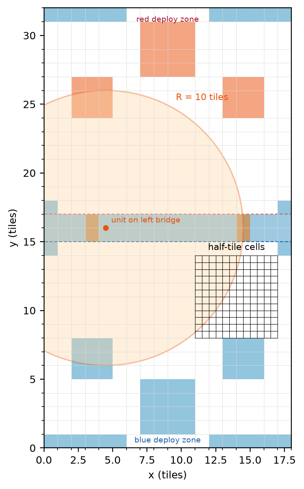
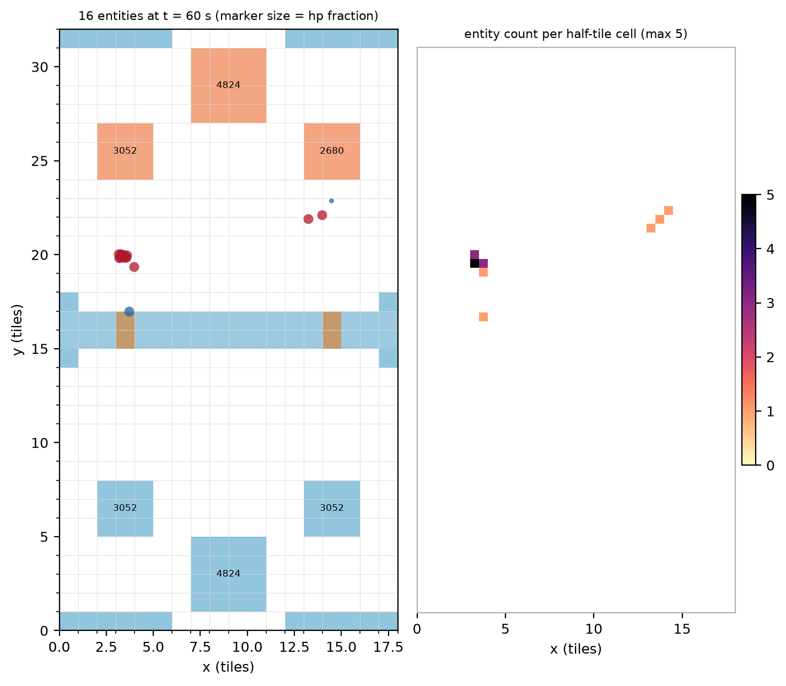
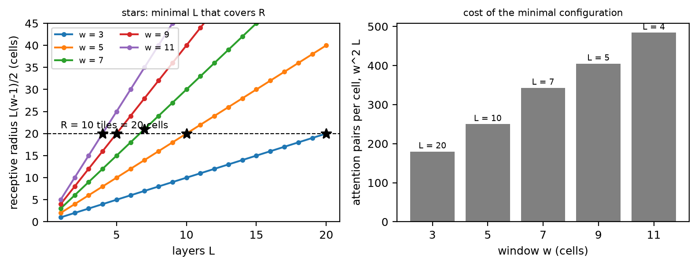
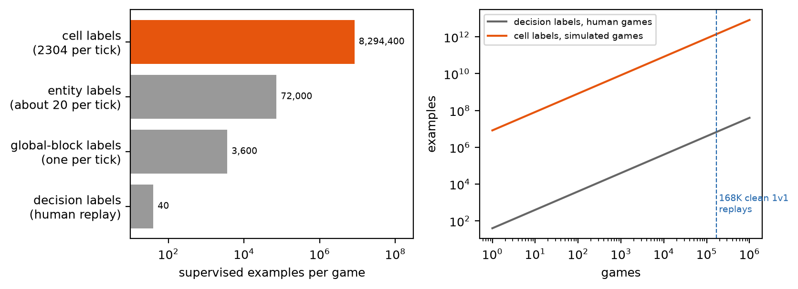
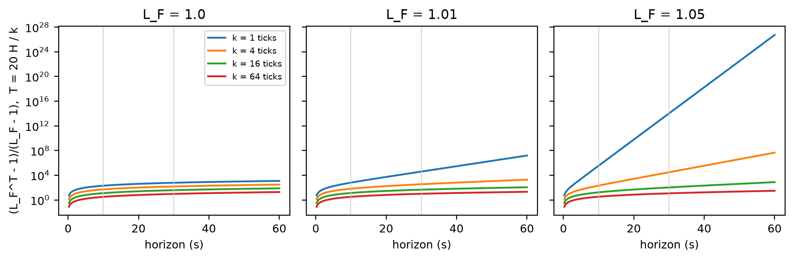

# Grid learning: a world model for Clash Royale with the structure the game has

## 1. Purpose

CR-234 is a Clash Royale playing bot, but the bot is the instrument rather than the goal. The question is how a learned system comes to hold a model of a world it only partly observes, and whether committing to the structure the world actually has makes that model cheaper to learn, easier to inspect, and better to plan with than a model that must discover the structure on its own. Clash Royale suits the question. Its rules are fixed and deterministic to first order, its state is continuous in position and discrete in almost everything else, a player sees most but not all of it, and we hold an executable copy of the rules, so the true hidden state is available as ground truth for every claim.

The repository is laid out to match. `sim/` is the Python simulator (20 Hz tick, 18 by 32 tile arena, 1000 game units per tile, about 24K ticks per second on one core, 656 tests). `data/` builds the single-schema `cards.json` from ClashStrategic stats and RoyaleAPI patch notes for all card levels. `train/` holds the behavior-cloning transformer over placement sequences and the proximal policy optimization (PPO) code. The RoyaleAPI replay scraper and the official Supercell API client live in a separate private repository, since collection details stay private. `docs/` holds this text and `figures.ipynb`, which produces the figures.

This document presents the derivation behind the approach, which we call grid learning, then the comparison arms, the data and fidelity work, and a roadmap.

## 2. The game as a dynamical system

A match runs 3 minutes of regulation and up to 2 minutes of overtime at 20 ticks per second. Elixir accrues at one unit per 2.8 s, doubled after the first two minutes and tripled in the final minute of overtime, capped at 10. Each player has an 8-card deck, holds 4 in hand, and a played card goes to the back of a deterministic cycle. Each side has two crown towers and a king tower. As of September 2026 there are 122 cards plus 4 tower troops, 42 evolutions, 16 heroes, and champions with activatable abilities.

We treat the match as a discrete-time dynamical system. The state s_t holds an entity multiset, where each entity carries type, team, level, continuous position, hit points, attack cooldown phase, current target, status effects, and any per-mechanic counters; a low-dimensional global block holding time, both elixirs, both hands and queues, tower hit points, king activation, and the pending deploy queue; and the two players' actions a_t^b and a_t^r. Randomness in the real game is minor (spawn jitter, a small deployment delay), so to first order

s_{t+1} = F(s_t, a_t^b, a_t^r),

and the simulator is an executable F that can be queried without limit. At 24K ticks per second, one core runs roughly 24K regulation-length games per hour.

A player does not see s_t. The observation is o_t = H(s_t), where H drops the opponent's elixir, hand, and queue, quantizes hit points to bars, and hides cooldown phases. The hidden part is nevertheless recoverable. Opponent elixir is a deterministic function of elapsed time and the opponent's observed plays: it starts at 5, accrues at the known rate, is capped at 10, and each visible deployment subtracts a known cost. The cap makes the map from history to elixir saturating but not ambiguous. Every played card is visible and goes to the back of the queue, so after the opponent's eighth distinct card the deck is known and the queue order is the play order of the last four cards; the hand is exactly determined from then on. The one wrinkle is that a deployed champion leaves the cycle while it lives, which is itself an observed event. Cooldown phases are fixed by the first observed attack of each unit. In control-theoretic terms the system is observable: two different states produce different observation sequences within finite time, and an observer, a dynamical system that consumes observations and known inputs and outputs a state estimate, can converge to the true state in finite time. The linear theory is Luenberger's (1971); the nonlinear analogue whose structure we borrow is the Kazantzis and Kravaris (1998) observer, and Bernard, Andrieu and Astolfi (2022) survey the design space.

The world learner in this program is therefore two learned objects: a nonlinear observer that turns the observation stream into an estimate of s_t, and a transition kernel that approximates F. Both are trained supervised, because the simulator supplies the hidden state for every tick. This is the main departure from the world-model literature in reinforcement learning, where MuZero (Schrittwieser et al. 2020), DreamerV3 (Hafner et al. 2023), IRIS (Micheli et al. 2023) and TD-MPC2 (Hansen et al. 2024) learn a latent state that has no ground truth and is judged only by the return it supports. Here the latent is the state itself, and every part of it can be checked.

## 3. The structure the transition rule has

Grid learning builds in three properties of F. The first is locality. Per tick, an entity's update depends only on the entities within its sight range, which lies between 5.5 and 9.5 tiles across all cards, and on its current target, which it acquired within that range. Spells act within a bounded radius of at most about 5.5 tiles. Movement per tick is at most 0.1 tile (the fastest unit moves 120 tiles per minute), and collision radii are about half a tile. So F is a local rule with a finite interaction radius R of about 10 tiles, and the locality is exact: nothing farther than R can affect a cell within one tick. The only non-local quantities are the small global block and, through it, the position of the tower a unit is walking toward, which is static geometry together with an alive flag. Figure 1 draws R to scale: centered on the left bridge it reaches both crown towers in that lane but neither king tower, a lane rather than the field.

*Figure 1. The 18 by 32 tile arena with river, bridges, tower footprints and deploy zones. The circle is the interaction radius R = 10 tiles around a unit on the left bridge; the mesh shows the half-tile raster.*

The second property is translation equivariance. The same rule applies at every location; what differs between locations is the static geometry (river, bridges, tower footprints, deploy zones, arena edges), which enters the rule as an input, not as part of it. This is what lets a uniform kernel learn the geometry of a finite world and generalize to changed geometry: a destroyed tower is a change in the geometry channel, and the same weights apply. A cellular automaton rule (Mordvintsev et al. 2020) and a Neural GPU (Kaiser and Sutskever 2016) generalize to configurations and sizes they were never trained on by the same mechanism, and the graph simulators of Battaglia et al. (2016) and Sanchez-Gonzalez et al. (2020) make the same commitment on particles rather than cells.

The third property is a discrete symmetry. The arena is symmetric under left-right mirroring and under 180-degree rotation combined with a team swap, together the dihedral group D2. A rule that respects this symmetry can be enforced by weight sharing over the group, as in group-equivariant convolution (Cohen and Welling 2016), or by averaging predictions over the four transformed inputs. Either way, mirrored interactions are learned once.

A transformer trained on Othello move sequences forms an internal board representation recoverable by probes (Li et al. 2023), linearly in the right coordinates (Nanda, Lee and Wattenberg 2023). But the same kind of model can pass next-token tests while holding an incoherent world model that breaks under small perturbations (Vafa et al. 2024), and transformers trained to simulate automata learn shallow shortcuts that fail off-distribution (Liu et al. 2023). Grid learning is the opposite bet: give the model the locality, equivariance and symmetry the game has, so that capacity is spent on the content of the rule rather than on rediscovering its form, and what it learned is readable cell by cell.

## 4. Grid learning

### 4.1 Rasterization

The field is rasterized at half-tile resolution into 36 by 64 = 2304 cells. Each cell carries the static geometry channels and a permutation-invariant summary of the entities inside it: the sum of embeddings of (type, team, level, hit point fraction, sub-cell offset, status flags, cooldown phase). The sum-of-embeddings form is the Deep Sets construction (Zaheer et al. 2017) and lets a cell hold a bag of any size. The result is image-like, yet lossless for positions (the offset channels keep the continuous coordinates) and for stacking (a Skeleton Army that piles seven skeletons into one half-tile cell is represented exactly). Figure 2 shows a simulator state and its raster.

*Figure 2. Left: simulator entities at 60 s, a Giant and Musketeer push on the left met by a Skeleton Army and Knight, a Hog Rider against Archers on the right; tower hit points on the footprints. Right: entity count per half-tile cell. Seven skeletons share one cell; the per-cell bag keeps them all.*

### 4.2 The kernel

The transition kernel is a stack of local attention layers over the raster. Neighborhood attention (Hassani et al. 2023) lets each cell attend to the w by w cells around it, so after L layers the receptive radius is L(w-1)/2 cells. With R = 10 tiles = 20 cells, this needs L(w-1)/2 >= 20; Figure 3 marks the minimal configurations, for example w = 7 with L = 7 or w = 11 with L = 4. A few global tokens carry the global block, both hands and the step size k described next, and are read by every layer, so the small non-local part of F reaches every cell without breaking the locality of the rest.

*Figure 3. Left: receptive radius of a neighborhood-attention stack against depth for several window sizes; stars mark the minimal depth that covers R. Right: attention pairs per cell for each minimal configuration.*

The output at each cell is discrete: type, team, hit point bucket and offset bucket for each entity, emitted into a fixed number of slots in a canonical order with a count token, trained with cross-entropy. Discrete targets beat regression here because most of the state is discrete and the ambiguity that exists (which of two equidistant targets a unit picks) is a distribution over outcomes, not a mean.

Weights are shared across all 2304 cells. One tick of one game is therefore 2304 supervised examples, and a full regulation game is about 8.3 million. Figure 4 puts this against the roughly 40 decision labels a human replay yields; the entire clean human dataset of 168K 1v1 battles carries about as many decision labels as a single simulated game carries cell labels. Most cells are empty and the examples are correlated, so the effective count is lower, but the gap is orders of magnitude, and it is where minimal training comes from: a kernel with w = 7, L = 7 and width 128 has under two million parameters, and the data to train it is free.

*Figure 4. Left: supervised examples per game at four granularities. Right: cumulative examples against number of games for human decision labels and simulated cell labels.*

One training detail carries over from learned physics simulators: Sanchez-Gonzalez et al. (2020) found that small input noise during training is the main lever for stable long rollouts, because the model then sees the kind of slightly wrong state it will produce itself, and we perturb offsets and hit point buckets for the same reason. Rollouts are also evaluated on held-out geometry (a destroyed tower, a rarely used deploy position) to check that equivariance, not memorized position, is doing the work.

### 4.3 Step size and compounding error

Tick-level rollouts are too fine for planning over 10 to 30 s: a 30 s horizon is 600 compositions. The same kernel is conditioned on a step size k in {1, 4, 16, 64} ticks and trained on (s_t, s_{t+k}) pairs, with a consistency term that penalizes disagreement between the direct 2k prediction and the composition of two k predictions, which ties the scales together and gives the coarse kernel signal from the fine one.

The reason coarse steps help is the autoregressive error bound. Let F be the true k-tick map with Lipschitz constant L_F in some metric d on states, and let the learned map G satisfy d(G(s), F(s)) <= eps for all s. Write e_T = d(G^T(s), F^T(s)) for the error after T compositions, with e_0 = 0. By the triangle inequality,

e_{T+1} <= d(G(G^T s), F(G^T s)) + d(F(G^T s), F(F^T s)) <= eps + L_F e_T,

and unrolling gives

e_T <= eps (1 + L_F + ... + L_F^{T-1}) = eps (L_F^T - 1)/(L_F - 1),

which reduces to T eps when L_F = 1. For a horizon of H seconds with step k, the number of compositions is T = 20H/k. Figure 5 plots the compounding factor (L_F^T - 1)/(L_F - 1) against H for each k. The factor is exponential in T, and T is inversely proportional to k, so a coarse kernel wins whenever its one-step error eps_k grows more slowly with k than the compounding factor shrinks, which is by a large margin at any L_F above one.

*Figure 5. Compounding factor of the error bound against horizon for step sizes of 1, 4, 16 and 64 ticks at three values of L_F, held fixed across k; vertical lines mark 10 and 30 s.*

The bound also says where coarse steps are unsafe. L_F is a property of the dynamics and depends on k: in the worst case the k-tick map is as sensitive as k compositions of the tick map and nothing is gained. It is near one on a quiet field, where units walk in straight lines and towers do nothing, and large near an interaction, where a target switch or a death changes everything downstream. The planner therefore uses coarse steps where the field is quiet (no enemy within R of any unit, no pending deployment) and fine steps near interactions. Both eps_k and the effective L_F are measured on the simulator per k.

### 4.4 The observer

The observer is the same network with a predict-then-correct split, the structure of a Luenberger observer. One sub-step applies the transition kernel to the current estimate of the full state; the second attends over the new observation raster (hit point bars, no cooldown phases, opponent's global block masked) and corrects the estimate. It is trained with cross-entropy against the simulator's hidden state, so the per-cell loss on the corrected estimate is the observer error, and its convergence can be checked against Section 2: opponent elixir should be exact from the first tick, the opponent's hand exact after the eighth distinct card, cooldown phases exact after each unit's first attack.

## 5. Planning and measuring the planning gap

Decisions in Clash Royale are sparse (about 20 per player per game) and the action space is small after pruning. A player holds 4 cards, each playable on the feasible tiles of the deploy zone, and mirroring halves the count; in practice a handful of canonical placements per card (behind the king, at the bridge, in front of a tower, adjacent to the current threat) captures the decisions that matter. Inference-time experimentation is then a shallow beam search or Monte Carlo tree search in the sense of Kocsis and Szepesvári (2006) over two to three decisions, rolling the kernel forward from the current estimate under each candidate action sequence, with a value read from tower hit points and the elixir differential. At k = 64 ticks, a 30 s rollout is 10 kernel evaluations, so a beam of tens of candidates costs a few hundred forward passes per decision. The rollouts live in the raster, so a questionable decision can be inspected as a sequence of predicted boards rather than an opaque latent.

Because the oracle F exists, the planning gap is measurable: the same planner run with the true simulator and with the learned kernel as its model, against the same opponents, differs in win rate by the world-model error alone. The fidelity metrics feeding this are per-cell exactness of the k-tick prediction, tower hit point error at 10, 30 and 60 s horizons, and win prediction from mid-game states, each reported per step size and per data regime.

The data regimes, in order of cost, are unlimited simulator rollouts under scripted and behavior-cloned policies, which teach the rule; human replays replayed through the simulator, which supply the realistic state distribution; and the agent's own games, which supply the states its planning actually visits.

## 6. Comparison arms and evaluation

All arms share one evaluation: win rate in the simulator against fixed opponents (a rule bot, the behavior-cloned policy, and each other), plus next-action accuracy on human games with a battle-level split, so no battle appears in both training and evaluation.

Arm 1 is corrected offline reinforcement learning. Earlier results in this repository were contaminated by leakage between training and evaluation; the arm redoes them with the battle-level split, implicit Q-learning (Kostrikov, Nair and Levine 2022) or conservative Q-learning (Kumar et al. 2020) on the human data, then PPO (Schulman et al. 2017) self-play in the simulator.

Arm 2 is a zero-shot language-model agent through the xAI API (environment variable `XAI_API_KEY`, base URL `https://api.x.ai/v1`, OpenAI-compatible, default model `grok-4.5`; current names are at https://docs.x.ai/developers/models). At each decision point it receives a textual state (time, own elixir, hand, tower hit points, entity list with positions, the opponent's revealed cards) and returns a card and tile or a wait; about 40 calls per game make a few hundred evaluation games affordable. The same interface can ask the model for the opponent's elixir and next card, which scores its explicit world model without probes.

Arm 3 is a small open model, Qwen3 1.7B or Llama 3.2 3B, fine-tuned with low-rank adaptation (Hu et al. 2022) on serialized state-action pairs from the human data. Linear probes on its residual stream for opponent elixir and the opponent's next card test whether it forms an implicit world model, in the style of the Othello probes of Section 3; because the card cycle is a known finite state machine, the compression and distinction tests of Vafa et al. (2024) apply to it directly.

Arm 4 is the grid learner with the planner of Section 5.

Interpretability applies to arms 3 and 4. Probes for hidden variables measure what each model represents. Channel ablations (zeroing the geometry channel, the hit point channel, the opponent's global tokens) find which inputs carry each prediction. Distillation of the learned kernel per mechanic fits small symbolic rules, for example a decision tree for a unit's target switch as a function of the local distances, to the kernel's behavior on synthetic cells. And a loop feeds disagreements back into the simulator: where a kernel trained on human replays predicts something the coded rule does not, one of them is wrong, and the check of Section 7 decides which.

## 7. Data and fidelity

RoyaleAPI replays are rate-limited per egress IP, so the binding constraint on scraping is the number of IPs, not CPU; a compute cluster adds throughput only through proxies or several egress points. The official Supercell API gives battle outcomes and final tower hit points at scale from a single fixed-IP host, and both sources are keyed by player tag, so a battle's placements and its outcome join exactly. The earlier dataset of 33.2M placements over 479K battles (168K clean 1v1) predates the 2026 balance patches and the hero cards and stays in cold storage; collection restarts from the unified scraper with the current card set, and the old set serves only as a check that the scraper's output shape did not drift.

The fidelity program keeps the simulator honest. The single-schema `cards.json` is regenerated at each balance patch. The replay harness replays human placements through the simulator and compares crowns, final tower hit points, and the time of the first tower fall against the official battle log; these agreement metrics are tracked per patch and per card. Where the simulator and the record disagree on a stat, the game client's own data tables (the `csv_logic` files extracted from the APK) are the tiebreaker. The AlphaClash site, which shows simulator-replayed human games, is the qualitative view of the same harness.

## 8. Roadmap

Phase 0 starts collection with the unified scraper and the official API client, establishes the replay harness metrics, and runs arms 1 and 2, which are cheap and give the baselines.

Phase 1 trains the kernel at k = 1 on simulator rollouts under scripted policies, reports per-cell exactness and the geometry-generalization check, and trains the observer against hidden state.

Phase 2 adds the step-size conditioning and consistency term, measures eps_k and L_F per k, builds the planner, and measures the planning gap against the oracle.

Phase 3 moves the kernel to human replays, runs arm 3 with its probes, and starts the distillation loop.

Phase 4 trains on the agent's own games and runs the full comparison across the four arms.

## References

Battaglia, P. W., Pascanu, R., Lai, M., Rezende, D. J., Kavukcuoglu, K. (2016). Interaction Networks for Learning about Objects, Relations and Physics. NeurIPS 2016. https://arxiv.org/abs/1612.00222

Bernard, P., Andrieu, V., Astolfi, D. (2022). Observer design for continuous-time dynamical systems. Annual Reviews in Control 53, 224 to 248. https://doi.org/10.1016/j.arcontrol.2021.11.002

Cohen, T. S., Welling, M. (2016). Group Equivariant Convolutional Networks. ICML 2016. https://arxiv.org/abs/1602.07576

Hafner, D., Pasukonis, J., Ba, J., Lillicrap, T. (2023). Mastering Diverse Domains through World Models. arXiv 2301.04104; published as Mastering diverse control tasks through world models, Nature 640, 647 to 653 (2025). https://arxiv.org/abs/2301.04104

Hansen, N., Su, H., Wang, X. (2024). TD-MPC2: Scalable, Robust World Models for Continuous Control. ICLR 2024. https://arxiv.org/abs/2310.16828

Hassani, A., Walton, S., Li, J., Li, S., Shi, H. (2023). Neighborhood Attention Transformer. CVPR 2023. https://arxiv.org/abs/2204.07143

Hu, E. J., Shen, Y., Wallis, P., Allen-Zhu, Z., Li, Y., Wang, S., Wang, L., Chen, W. (2022). LoRA: Low-Rank Adaptation of Large Language Models. ICLR 2022. https://arxiv.org/abs/2106.09685

Kaiser, L., Sutskever, I. (2016). Neural GPUs Learn Algorithms. ICLR 2016. https://arxiv.org/abs/1511.08228

Kazantzis, N., Kravaris, C. (1998). Nonlinear observer design using Lyapunov's auxiliary theorem. Systems & Control Letters 34(5), 241 to 247. https://doi.org/10.1016/S0167-6911(98)00017-6

Kocsis, L., Szepesvári, C. (2006). Bandit based Monte-Carlo Planning. ECML 2006, LNCS 4212, 282 to 293. https://doi.org/10.1007/11871842_29

Kostrikov, I., Nair, A., Levine, S. (2022). Offline Reinforcement Learning with Implicit Q-Learning. ICLR 2022. https://arxiv.org/abs/2110.06169

Kumar, A., Zhou, A., Tucker, G., Levine, S. (2020). Conservative Q-Learning for Offline Reinforcement Learning. NeurIPS 2020. https://arxiv.org/abs/2006.04779

Li, K., Hopkins, A. K., Bau, D., Viégas, F., Pfister, H., Wattenberg, M. (2023). Emergent World Representations: Exploring a Sequence Model Trained on a Synthetic Task. ICLR 2023. https://arxiv.org/abs/2210.13382

Liu, B., Ash, J. T., Goel, S., Krishnamurthy, A., Zhang, C. (2023). Transformers Learn Shortcuts to Automata. ICLR 2023. https://arxiv.org/abs/2210.10749

Luenberger, D. G. (1971). An introduction to observers. IEEE Transactions on Automatic Control 16(6), 596 to 602. https://doi.org/10.1109/TAC.1971.1099826

Micheli, V., Alonso, E., Fleuret, F. (2023). Transformers are Sample-Efficient World Models. ICLR 2023. https://arxiv.org/abs/2209.00588

Mordvintsev, A., Randazzo, E., Niklasson, E., Levin, M. (2020). Growing Neural Cellular Automata. Distill. https://distill.pub/2020/growing-ca/

Nanda, N., Lee, A., Wattenberg, M. (2023). Emergent Linear Representations in World Models of Self-Supervised Sequence Models. BlackboxNLP 2023. https://arxiv.org/abs/2309.00941

Sanchez-Gonzalez, A., Godwin, J., Pfaff, T., Ying, R., Leskovec, J., Battaglia, P. W. (2020). Learning to Simulate Complex Physics with Graph Networks. ICML 2020. https://arxiv.org/abs/2002.09405

Schrittwieser, J., Antonoglou, I., Hubert, T., Simonyan, K., Sifre, L., Schmitt, S., Guez, A., Lockhart, E., Hassabis, D., Graepel, T., Lillicrap, T., Silver, D. (2020). Mastering Atari, Go, chess and shogi by planning with a learned model. Nature 588, 604 to 609. https://doi.org/10.1038/s41586-020-03051-4

Schulman, J., Wolski, F., Dhariwal, P., Radford, A., Klimov, O. (2017). Proximal Policy Optimization Algorithms. arXiv 1707.06347. https://arxiv.org/abs/1707.06347

Vafa, K., Chen, J. Y., Rambachan, A., Kleinberg, J., Mullainathan, S. (2024). Evaluating the World Model Implicit in a Generative Model. NeurIPS 2024. https://arxiv.org/abs/2406.03689

Zaheer, M., Kottur, S., Ravanbakhsh, S., Póczos, B., Salakhutdinov, R., Smola, A. J. (2017). Deep Sets. NeurIPS 2017. https://arxiv.org/abs/1703.06114
