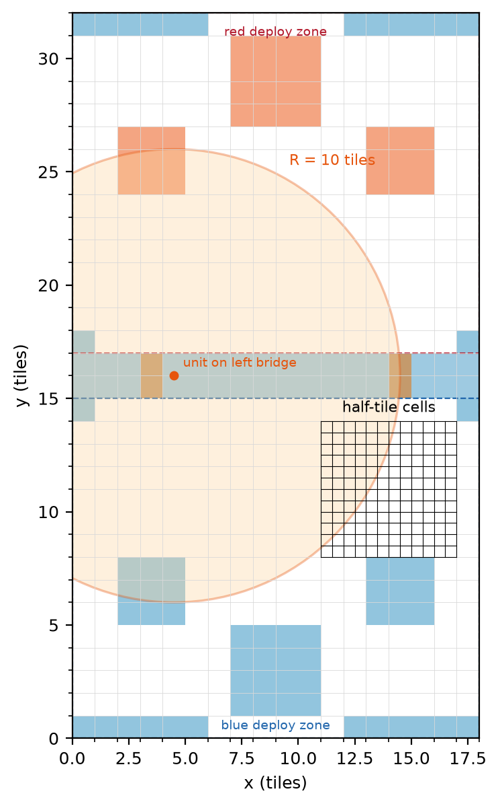
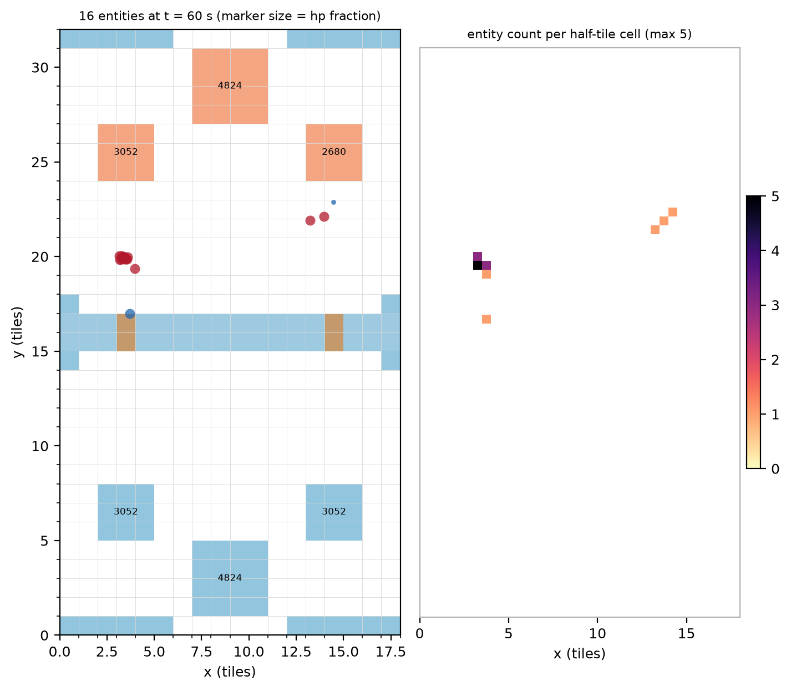
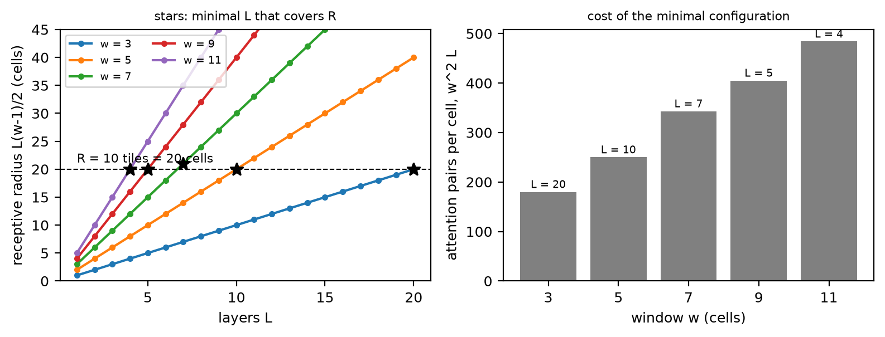
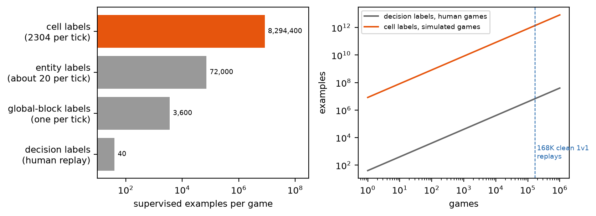
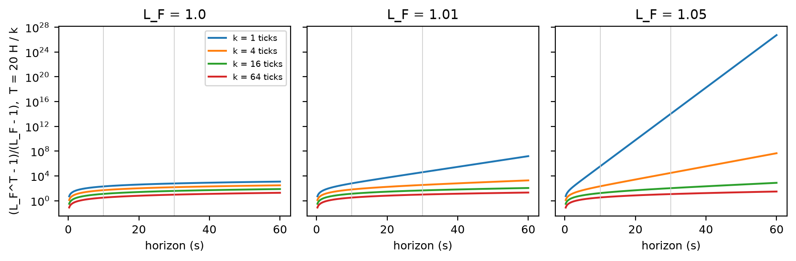

# Grid learning: a world model for Clash Royale with the structure the game has

## 1. Purpose

CR-234 is a Clash Royale playing bot, but the bot is the instrument rather than the goal. The question is how a learned system comes to hold a model of a world it only partly observes, and whether committing to the structure the world actually has makes that model cheaper to learn, easier to inspect, and better to plan with than a model that must discover the structure on its own. Clash Royale suits the question. Its state is continuous in position and discrete in almost everything else, and a player sees most but not all of it. The simulator exposes its own hidden state for controlled experiments. Agreement with the real game remains an empirical requirement; simulated hidden state is not ground truth for real matches.

The repository is laid out to match. `sim/` is the Python simulator (20 Hz tick, 18 by 32 tile arena, 1000 game units per tile), with regression tests in `tests/`. `data/` builds the single-schema `cards.json` from ClashStrategic stats and RoyaleAPI patch notes for all card levels. `train/` holds the behavior-cloning transformer over placement sequences and the proximal policy optimization (PPO) code. The RoyaleAPI replay scraper and the official Supercell API client live in a separate private repository, since collection details stay private. `docs/` holds this text and `figures.ipynb`, which produces the figures.

This document presents the derivation behind the approach, which we call grid learning, then the comparison arms, the data and fidelity work, and a roadmap.

## 2. The game as a dynamical system

A match runs 3 minutes of regulation and up to 2 minutes of overtime at 20 ticks per second. Elixir accrues at one unit per 2.8 s, doubled after the first two minutes and tripled in the final minute of overtime, capped at 10. Each player has an 8-card deck, holds 4 in hand, and a played card goes to the back of a deterministic cycle. Each side has two crown towers and a king tower. The current simulator contains 123 card definitions plus 4 tower troops, 42 evolution definitions and 17 hero definitions, alongside champions with activatable abilities. This is an implementation inventory, not a claim that every released mechanic or special-event card is fully verified.

We treat the match as a discrete-time dynamical system. The state s_t holds an entity multiset, where each entity carries type, team, level, continuous position, hit points, attack cooldown phase, current target, status effects, and any per-mechanic counters; a low-dimensional global block holding time, both elixirs, both hands and queues, tower hit points, king activation, and the pending deploy queue; and the two players' actions a_t^b and a_t^r. Randomness in the real game is minor (spawn jitter, a small deployment delay), so to first order

s_{t+1} = F(s_t, a_t^b, a_t^r),

and the simulator is an executable F that can be queried without limit. At 24K ticks per second, one core runs roughly 24K regulation-length games per hour.

A player does not see s_t. The observation is o_t = H(s_t), where H drops the opponent's elixir, hand, and queue, quantizes hit points to bars, and hides cooldown phases. The hidden part is nevertheless recoverable. Opponent elixir is a deterministic function of elapsed time and the opponent's observed plays: it starts at 5, accrues at the known rate, is capped at 10, and each visible deployment subtracts a known cost. The cap makes the map from history to elixir saturating but not ambiguous. Every played card is visible and goes to the back of the queue, so after the opponent's eighth distinct card the deck is known and the queue order is the play order of the last four cards; the hand is exactly determined from then on. The one wrinkle is that a deployed champion leaves the cycle while it lives, which is itself an observed event. Cooldown phases are fixed by the first observed attack of each unit. In control-theoretic terms the system is observable: two different states produce different observation sequences within finite time, and an observer, a dynamical system that consumes observations and known inputs and outputs a state estimate, can converge to the true state in finite time. The linear theory is Luenberger's (1971); the nonlinear analogue whose structure we borrow is the Kazantzis and Kravaris (1998) observer, and Bernard, Andrieu and Astolfi (2022) survey the design space.

The world learner in this program is therefore two learned objects: a nonlinear observer that turns the observation stream into an estimate of s_t, and a transition kernel that approximates F. Both are trained supervised, because the simulator supplies the hidden state for every tick. This is the main departure from the world-model literature in reinforcement learning, where MuZero (Schrittwieser et al. 2020), DreamerV3 (Hafner et al. 2023), IRIS (Micheli et al. 2023) and TD-MPC2 (Hansen et al. 2024) learn a latent state that has no ground truth and is judged only by the return it supports. Here the latent is the state itself, and every part of it can be checked.

## 3. The structure the transition rule has

Grid learning builds in three properties of F. The first is locality. Per tick, an entity's update depends only on the entities within its sight range, which lies between 5.5 and 9.5 tiles across all cards, and on its current target, which it acquired within that range. Spells act within a bounded radius of at most about 5.5 tiles. Movement per tick is at most 0.1 tile (the fastest unit moves 120 tiles per minute), and collision radii are about half a tile. So F is a local rule with a finite interaction radius R of about 10 tiles, and the locality is exact: nothing farther than R can affect a cell within one tick. The only non-local quantities are the small global block and, through it, the position of the tower a unit is walking toward, which is static geometry together with an alive flag. Figure 1 draws R to scale: centered on the left bridge it reaches both crown towers in that lane but neither king tower, a lane rather than the field.

*Figure 1. The 18 by 32 tile arena with river, bridges, tower footprints and deploy zones. The circle is the interaction radius R = 10 tiles around a unit on the left bridge; the mesh shows the half-tile raster.*

The second property is translation equivariance. The same rule applies at every location; what differs between locations is the static geometry (river, bridges, tower footprints, deploy zones, arena edges), which enters the rule as an input, not as part of it. This is what lets a uniform kernel learn the geometry of a finite world and generalize to changed geometry: a destroyed tower is a change in the geometry channel, and the same weights apply. A cellular automaton rule (Mordvintsev et al. 2020) and a Neural GPU (Kaiser and Sutskever 2016) generalize to configurations and sizes they were never trained on by the same mechanism, and the graph simulators of Battaglia et al. (2016) and Sanchez-Gonzalez et al. (2020) make the same commitment on particles rather than cells.

The third property is a discrete symmetry. The arena is symmetric under left-right mirroring and under 180-degree rotation combined with a team swap, together the dihedral group D2. A rule that respects this symmetry can be enforced by weight sharing over the group, as in group-equivariant convolution (Cohen and Welling 2016), or by averaging predictions over the four transformed inputs. Either way, mirrored interactions are learned once.

A transformer trained on Othello move sequences forms an internal board representation recoverable by probes (Li et al. 2023), linearly in the right coordinates (Nanda, Lee and Wattenberg 2023). But the same kind of model can pass next-token tests while holding an incoherent world model that breaks under small perturbations (Vafa et al. 2024), and transformers trained to simulate automata learn shallow shortcuts that fail off-distribution (Liu et al. 2023). Grid learning is the opposite bet: give the model the locality, equivariance and symmetry the game has, so that capacity is spent on the content of the rule rather than on rediscovering its form, and what it learned is readable cell by cell.

## 4. Grid learning

### 4.1 Rasterization

The field is rasterized at half-tile resolution into 36 by 64 = 2304 cells. Each cell carries the static geometry channels and a permutation-invariant summary of the entities inside it: the sum of embeddings of (type, team, level, hit point fraction, sub-cell offset, status flags, cooldown phase). The sum-of-embeddings form is the Deep Sets construction (Zaheer et al. 2017) and lets a cell hold a bag of any size. The result is image-like, yet lossless for positions (the offset channels keep the continuous coordinates) and for stacking (a Skeleton Army that piles seven skeletons into one half-tile cell is represented exactly). Figure 2 shows a simulator state and its raster.

*Figure 2. Left: simulator entities at 60 s, a Giant and Musketeer push on the left met by a Skeleton Army and Knight, a Hog Rider against Archers on the right; tower hit points on the footprints. Right: entity count per half-tile cell. Seven skeletons share one cell; the per-cell bag keeps them all.*

### 4.2 The kernel

The transition kernel is a stack of local attention layers over the raster. Neighborhood attention (Hassani et al. 2023) lets each cell attend to the w by w cells around it, so after L layers the receptive radius is L(w-1)/2 cells. With R = 10 tiles = 20 cells, this needs L(w-1)/2 >= 20; Figure 3 marks the minimal configurations, for example w = 7 with L = 7 or w = 11 with L = 4. A few global tokens carry the global block, both hands and the step size k described next, and are read by every layer, so the small non-local part of F reaches every cell without breaking the locality of the rest.

*Figure 3. Left: receptive radius of a neighborhood-attention stack against depth for several window sizes; stars mark the minimal depth that covers R. Right: attention pairs per cell for each minimal configuration.*

The output at each cell is discrete: type, team, hit point bucket and offset bucket for each entity, emitted into a fixed number of slots in a canonical order with a count token, trained with cross-entropy. Discrete targets beat regression here because most of the state is discrete and the ambiguity that exists (which of two equidistant targets a unit picks) is a distribution over outcomes, not a mean.

Weights are shared across all 2304 cells. One tick of one game is therefore 2304 supervised examples, and a full regulation game is about 8.3 million. Figure 4 puts this against the roughly 40 decision labels a human replay yields; the entire clean human dataset of 168K 1v1 battles carries about as many decision labels as a single simulated game carries cell labels. Most cells are empty and the examples are correlated, so the effective count is lower, but the gap is orders of magnitude, and it is where minimal training comes from: a kernel with w = 7, L = 7 and width 128 has under two million parameters, and the data to train it is free.

*Figure 4. Left: supervised examples per game at four granularities. Right: cumulative examples against number of games for human decision labels and simulated cell labels.*

One training detail carries over from learned physics simulators: Sanchez-Gonzalez et al. (2020) found that small input noise during training is the main lever for stable long rollouts, because the model then sees the kind of slightly wrong state it will produce itself, and we perturb offsets and hit point buckets for the same reason. Rollouts are also evaluated on held-out geometry (a destroyed tower, a rarely used deploy position) to check that equivariance, not memorized position, is doing the work.

### 4.3 Step size and compounding error

Tick-level rollouts are too fine for planning over 10 to 30 s: a 30 s horizon is 600 compositions. The same kernel is conditioned on a step size k in {1, 4, 16, 64} ticks and trained on (s_t, s_{t+k}) pairs, with a consistency term that penalizes disagreement between the direct 2k prediction and the composition of two k predictions, which ties the scales together and gives the coarse kernel signal from the fine one.

The reason coarse steps help is the autoregressive error bound. Let F be the true k-tick map with Lipschitz constant L_F in some metric d on states, and let the learned map G satisfy d(G(s), F(s)) <= eps for all s. Write e_T = d(G^T(s), F^T(s)) for the error after T compositions, with e_0 = 0. By the triangle inequality,

e_{T+1} <= d(G(G^T s), F(G^T s)) + d(F(G^T s), F(F^T s)) <= eps + L_F e_T,

and unrolling gives

e_T <= eps (1 + L_F + ... + L_F^{T-1}) = eps (L_F^T - 1)/(L_F - 1),

which reduces to T eps when L_F = 1. For a horizon of H seconds with step k, the number of compositions is T = 20H/k. Figure 5 plots the compounding factor (L_F^T - 1)/(L_F - 1) against H for each k. The factor is exponential in T, and T is inversely proportional to k, so a coarse kernel wins whenever its one-step error eps_k grows more slowly with k than the compounding factor shrinks, which is by a large margin at any L_F above one.

*Figure 5. Compounding factor of the error bound against horizon for step sizes of 1, 4, 16 and 64 ticks at three values of L_F, held fixed across k; vertical lines mark 10 and 30 s.*

The bound also says where coarse steps are unsafe. L_F is a property of the dynamics and depends on k: in the worst case the k-tick map is as sensitive as k compositions of the tick map and nothing is gained. It is near one on a quiet field, where units walk in straight lines and towers do nothing, and large near an interaction, where a target switch or a death changes everything downstream. The planner therefore uses coarse steps where the field is quiet (no enemy within R of any unit, no pending deployment) and fine steps near interactions. Both eps_k and the effective L_F are measured on the simulator per k.

### 4.4 The observer

The observer is the same network with a predict-then-correct split, the structure of a Luenberger observer. One sub-step applies the transition kernel to the current estimate of the full state; the second attends over the new observation raster (hit point bars, no cooldown phases, opponent's global block masked) and corrects the estimate. It is trained with cross-entropy against the simulator's hidden state, so the per-cell loss on the corrected estimate is the observer error, and its convergence can be checked against Section 2: opponent elixir should be exact from the first tick, the opponent's hand exact after the eighth distinct card, cooldown phases exact after each unit's first attack.

## 5. Planning and measuring the planning gap

Decisions in Clash Royale are sparse (about 20 per player per game) and the action space is small after pruning. A player holds 4 cards, each playable on the feasible tiles of the deploy zone, and mirroring halves the count; in practice a handful of canonical placements per card (behind the king, at the bridge, in front of a tower, adjacent to the current threat) captures the decisions that matter. Inference-time experimentation is then a shallow beam search or Monte Carlo tree search in the sense of Kocsis and Szepesvári (2006) over two to three decisions, rolling the kernel forward from the current estimate under each candidate action sequence, with a value read from tower hit points and the elixir differential. At k = 64 ticks, a 30 s rollout is 10 kernel evaluations, so a beam of tens of candidates costs a few hundred forward passes per decision. The rollouts live in the raster, so a questionable decision can be inspected as a sequence of predicted boards rather than an opaque latent.

Because the oracle F exists, the planning gap is measurable: the same planner run with the true simulator and with the learned kernel as its model, against the same opponents, differs in win rate by the world-model error alone. The fidelity metrics feeding this are per-cell exactness of the k-tick prediction, tower hit point error at 10, 30 and 60 s horizons, and win prediction from mid-game states, each reported per step size and per data regime.

The data regimes, in order of cost, are unlimited simulator rollouts under scripted and behavior-cloned policies, which teach the rule; human replays replayed through the simulator, which supply the realistic state distribution; and the agent's own games, which supply the states its planning actually visits.

The recorded outcome is the ground truth in all of this, even where the simulator disagrees, and the first learned component treats the simulator accordingly: as a witness whose trust is learned. `train/calibratedHead.py` fits a logistic head for the probability that the replayed side wins from the recorded decks, levels and tower troops together with the simulator's verdict, crown margin, end time and premature flag, on six assessed 2,000-game samples with the two most recent held out (about 8,000 training and 4,000 test games). On the held-out games the simulator's bare verdict is right 64.5% of the time but is not a probability (expected calibration error 0.345, log loss 1.64); a head on the verdict alone is right 63.8% with calibration error 0.030; the head with decks and verdict is right 65.0% with calibration error 0.019 and log loss 0.623, against 0.688 for decks alone, so the simulator carries most of the signal and the head makes it usable as a probability. The head's fitted weights say how it trusts the simulator: the crown margin carries the weight (1.40 per three-crown margin against 0.25 for the sign of the verdict), and a verdict from a game the simulator ended early is discounted by 0.58, so an early simulated ending is a weaker witness. Most telling, the per-card correction the combined head adds on top of the deck-only weights has rank correlation minus 0.54 with the per-card bias table (simulated minus recorded holder win rate) on the training games and minus 0.47 with the same table measured only on the held-out games: without ever seeing that table, the head discounts the holders of the evolved Inferno Dragon, the evolved Mega Knight, the Boss Bandit, the Golem and the evolved P.E.K.K.A, the cards the simulator over-favours, and credits Goblinstein, the Cannon, the evolved Tesla and the hero Ice Golem, the cards it under-favours. This is the calibrated-decision layer's job: the simulator remains the biased prior, the recorded outcomes are the labels, and the disagreement between them is itself a map of where the simulator most needs fidelity work. Three tests plant a simulator bias in synthetic data and check that the head's corrections recover it and that the combined model is better calibrated than the verdict alone; the report is `local/calibration/head1.json`.

The second learned component moves from the game to the decision. `train/decisionStates.py` wraps the shipped replay path (the judge's own `Game` class, patched for one run) and records, at every recorded card play, the state the acting player saw as `train/feats.featurize` sees it, the play, the recorded winner and the simulator's winner of the same replay: 102,429 decisions from the 2,000 games of one assessed sample, extracted in five minutes with two workers. `train/decisionHead.py` fits logistic heads for the probability that the actor wins the recorded game, held out by whole games (25%, 28,577 decisions): from the simulated board and the play alone, from the simulator's verdict alone with a weight per game phase, and from both, beside the bare verdict. The result is not what a planner would hope for. The simulated board at the moment of a decision predicts the recorded winner at 57% overall (54% in the first minute, 59% in the last minute of regulation, 58% in overtime) even with the actor's tower health lead and towers standing added as explicit features, while the simulator's terminal verdict, a constant per game, predicts it at 64%; adding the board to the verdict makes the held-out head slightly worse (63.0%, log loss 0.663 against 0.654), and the weight the joint head puts on the verdict falls from 0.61 in the first minute to 0.18 in overtime because the late simulated board already encodes the simulated ending. The witness table explains the gap: the simulated tower health lead at a decision predicts the simulator's own verdict at 51%, 63%, 74% and 71% by phase, so even inside the simulation the mid-game board decides little, and it predicts the recorded winner at 52%, 57%, 58% and 56%; a simulated crown lead, a tower already down in the simulation between two and three minutes in, is on the recorded winner's side only 60% of the time (16,766 decisions). The recorded games that are still running late are also the ones the simulator gets wrong most (verdict agreement 65% for decisions in the first minute, 61% in the last regulation minute, 59% in overtime). Two readings follow. For the planner, the simulator's value lies in its rollouts to the end, not in reading its intermediate board; a decision head must be trained on rollout outcomes and real outcomes, not on the reconstructed state, which is what the counterfactual-rollout step is for. For fidelity, an early simulated tower fall is the least trustworthy event the simulator produces, in line with the negative weight the game-level head gave to early endings, so the premature-ending rate is the metric most worth driving down. Seven tests cover the extractor on synthetic plays through the real replay entry point (one record per card play from the actor's side, drawn games unlabelled, the pre-play state) and the head on synthetic decisions with a planted late board signal and a planted verdict agreement (the earliest informative phase, the falling verdict weight, the witness table); the report is `local/calibration/decisionHead1.json`.

The third learned component is the one this testbed exists for: learning a policy directly from production traces whose feedback is evaluative. Every replay is one trajectory of a human policy through an environment nobody can recreate (the opponent was a person, the simulator is a biased model of the rest), and the only feedback is the recorded winner, so environment replay in the style of GRPO (rerun the policy from the recorded state, sample a group of plays, rank them) is unavailable in the real environment. `train/traceRl.py` compares the ways of turning the single recorded trajectory into an update, on 799,645 decisions from 15,999 games of eight assessed samples (the decision records now carry the replay's forced hand, so a play is one of the four cards in hand on one of 48 deploy cells), with 25% of the games held out whole (200,119 decisions): behaviour cloning (the outcome ignored); single-trajectory REINFORCE on the winner with the constant baseline one half (signed weights, no constraint); a one-sample-per-prompt clipped-ratio update whose advantage is the outcome minus a state-value baseline fit on real outcomes and whose ratio is anchored to the frozen behaviour policy; advantage-weighted regression with the same baseline; and environment replay in the world model, where `train/counterfactual.py` replays the recorded game with one play replaced (another hand card at the same tile, or the same card on another cell), scores the simulated result for the actor (crown difference plus tower health margin), and the group-relative advantages of 1,500 games' menus (37,314 groups, 149,256 full replays, 66 minutes on 30 devbox cores) drive the same clipped update, once with trust one and once weighted by the decision head's trust in the simulator per game phase. The evaluations on the held-out games are the winner gap (mean log-probability of the recorded play in won games minus lost games), agreement with winners' and losers' plays, the KL divergence to the behaviour policy, and a Q-eval, in which a P(win | state, play) model fit on real outcomes (56.3% held-out accuracy, log loss 0.688) scores each policy's play distribution over the plays with support in the data. Behaviour cloning has a winner gap of 0.014 (winners' plays are slightly more typical). The constrained single-trajectory updates widen it at small cost: the clipped-ratio update to 0.025 at KL 0.055, advantage-weighted regression to 0.036 at KL 0.203, both keeping 99.5% of their mass on supported plays and both closing the phase where the behaviour policy is most wrong-footed (the last minute of regulation, gap minus 0.031 for behaviour cloning, minus 0.016 and minus 0.001 after the two updates); their Q-eval rises by 0.0011 and 0.0014 in win probability, within the head's resolution. Unconstrained REINFORCE collapses (entropy 3.27 to 0.12, KL 8.7, agreement with the recorded card 51% to 23%, 30% of its mass off supported plays) and the direct-method Q-eval rewards the collapse (0.518 against 0.486 for behaviour cloning) because the policy concentrates on the head's argmax where the data cannot contradict it: the off-policy estimate is only meaningful where the constraint holds, which is the argument for the constraint. The world-model arm moves the policy as far as the constrained updates (KL 0.15) but in another direction: its winner gap stays at 0.013 to 0.014, its Q-eval matches the constrained updates (0.4873), and its agreement with the recorded plays falls for winners and losers alike (51% to 48%). The world model's judgement is not empty: the recorded play beats its group mean by more in games the actor won (advantage 0.073 against 0.029, and the recorded play is the best of its menu 41% of the time for winners and 36% for losers, chance 25%), but the correlation between that judgement and the real outcome is 0.03 per decision (0.05 in the first minute, 0.02 in the last minute of regulation, 0.07 in overtime), and the trust weighting changes nothing measurable because it only rescales phases the update already treats alike. The reading for the research question: from one trajectory per game and one bit of feedback, a value baseline plus a behaviour constraint extracts a small, consistent signal without recreating anything; the world model's counterfactuals at the simulator's current fidelity (65% winner agreement) carry a weakly correlated signal the real-outcome methods do not need, and their value is to be measured again on the same held-out games as fidelity improves. A first run with over-fitted heads (60 epochs, log loss above the constant predictor) gave the same ordering (behaviour cloning 0.018, clipped 0.029, weighted 0.039, world model 0.015). Six tests plant a decision rule the synthetic behaviour follows 60% of the time and draw the winner from the two players' shares of right plays: every outcome-driven update moves toward the right card, the constrained ones stay near the behaviour policy while REINFORCE drifts, an oracle world model's group advantages learn the rule, zero trust changes nothing, the rollout of the recorded play reproduces the plain replay exactly, and a relocated placement is one decision. Reports: `local/traceRlRound/traceRl2.json` and `local/traceRlRound/cfAgreement.json`.

The fourth step measures the world model's bias directly, in three ways, on the same 799,645 decisions (25% of the 15,999 games held out whole, 200,119 decisions of 3,976 games) and the same 1,500-game counterfactual set. First, `train/worldModelBias.py` iterates the clipped update with its anchor refreshed every five epochs, the iterated trust region a world model permits because it can be queried again, and evaluates each arm at 30, 60 and 90 epochs; the same iteration on the real-outcome advantages (two batch orders each for the world model and the clipped real update), advantage-weighted regression, and the clipped update on outcomes flipped for a random half of the training games (the noise floor) are the references. With a refreshed anchor the fixed advantages drive every clipped arm the same distance whatever they say: KL to behaviour cloning 0.5 to 1.2 at 30 epochs, 1.4 to 4.7 at 60 and about 11 at 90, where all of them, the noise arm included, have collapsed (entropy 3.27 to below 0.12, a third to two thirds of the mass off supported plays, winner gaps of plus 1.7 to 2.1 for the real update, minus 1.6 to 2.3 for the world model and minus 1.9 for noise), so the distance is set by the optimiser and only the direction carries information. At 30 epochs the world-model arm (KL 1.15 and 1.08) has a winner gap of 0.019 and 0.009 against 0.014 for behaviour cloning, agreement with the recorded card down from 51% to 37% for winners and losers alike, and a Q-eval of 0.4897, above the noise arm's 0.4861 and below the real update's 0.4919 at KL 0.56 and 0.4943 at KL 1.43; advantage-weighted regression, which has no ratio to re-anchor, reaches KL 0.36 and a winner gap of 0.072 at 90 epochs. The direction is read from the per-state preference shift, the log ratio of the policy to behaviour cloning over the menu of 192 plays on 20,000 held-out states, as the mean cosine between arms. At 30 epochs the world model agrees with itself across batch orders at 0.94 at the card level and the real update with itself at 0.78; the two real-outcome methods agree at 0.45; the world model agrees with the real update at 0.26 and with the noise arm at 0.14, which is also the real update's agreement with noise. Over the full menu the rank correlation is 0.09 for the world model against the real update, 0.04 to 0.05 against noise and 0.48 between the two real methods. By 60 epochs the shared collapse mode dominates (world model against real update 0.47, against noise 0.43) and by 90 every pairing of collapsed arms exceeds 0.65. So the world model's update direction is systematic, reproducible to 0.94 across batch orders, and mostly its own: its excess agreement with the real-outcome direction over the noise floor (0.12 at the card level) is a third of the excess between two real-outcome methods (0.32), and at the menu level it is barely above the floor. Second, `train/cardSplit.py` says what that direction is. For each of 115 card variants with at least 100 recorded plays among the 37,314 counterfactual groups, the mean world-model advantage of the recorded play (its return minus its menu's mean) is set against the mean real advantage (the outcome minus a value baseline fit on the 14,499 games outside the rollout set), both standardised over decisions. Across cards the two do not agree (Spearman 0.13, permutation p 0.16), and the per-card gap, world model minus real, has rank correlation minus 0.51 (p below 0.0005, 108 cards) with the per-card correction of the game-level calibrated head and 0.12 (p 0.21) with the raw holder bias table: the 21 cards the head discounts most have a mean gap of plus 0.29 and the 21 it credits most minus 0.11. The world model over-rates recorded plays of the evolved and plain Mega Knight (0.81, 0.72), the P.E.K.K.A (0.80), the Elite Barbarians (0.69), Sparky (0.60), the Inferno Dragon (0.58) and the Golem (0.46) and under-rates spells and cycle cards (Elixir Collector minus 0.58, Heal Spirit minus 0.56, Vines minus 0.48, Zap minus 0.46, Tornado minus 0.35, The Log minus 0.29), while the real advantages of those cards are flat: the card-level bias the calibrated head found at the game level is present in the counterfactual judgement of single decisions, and it is the systematic direction the first measure saw. Third, `train/jointQ.py` fits the decision-level P(win | state, play) head jointly on the real labels and on the rollout labels of the training games (111,868 rows in 27,967 menus), either as the simulated winner (a soft label about the level) or as the return relative to the menu mean (a constraint only on how a state's plays compare), with a trust weight per rollout row swept from 0.3 to 30, alone and scaled per game phase by the decision head's verdict weights, and reports the paired per-game log-loss difference to the real-only head over the 3,976 held-out games. The real-only head has log loss 0.6879 and accuracy 56.6% (a second seed 0.6877); no trust helps beyond seed noise (the best arm, relative labels at trust 0.3 with phase weights, minus 0.0006 plus or minus 0.0003, the seed-to-seed difference being 0.0000 plus or minus 0.0006), the winner labels hurt from trust 1 (plus 0.0021 plus or minus 0.0009, plus 0.015 at 3, plus 0.061 at 10) and the relative labels from trust 3 (plus 0.0037 plus or minus 0.0006, plus 0.011 at 10), and the phase weights soften the damage (0.737 against 0.754 at trust 10) without creating a gain. What the head does absorb is the world model's ranking: the real-only head's within-menu rank agreement with the simulator on the held-out menus is 0.03 (top play agreement 27%, chance 25%), the relative labels at trust 0.3 raise it to 0.27 (42%) and at trust 1 to 0.34 (47%) at no cost in real log loss. The three measures agree: the world model's counterfactual judgement is reproducible, orthogonal to what predicts the recorded outcome, and biased toward the cards the simulator already over-favours; at this fidelity it can be absorbed at low trust without harm but supplies no outcome signal, and the per-card gap table is the fidelity worklist. Twelve tests plant the structures: a card-only logit change is read back as the menu shift, flipped outcomes flip whole games, an oracle world model drifts in the real direction above the noise floor, planted per-card offsets rank with a planted head table, zero trust reproduces the real-only head to the bit, and an oracle's rollout labels improve the head on held-out real outcomes. Reports: `local/traceRlRound/worldModelBias.json`, `cardSplit.json` and `jointQ.json`.

The fifth step measures the recorded side of that table on a different scale. The official Clash Royale API serves battle logs (decks, levels, tower troops, crowns, tower health, winner) but no replays, and a polite collector has been streaming them since 2026-09-28; a snapshot of 6,454,828 rows on 2026-09-30 converts to 4,230,459 one-versus-one games, of which 3,826,119 are played with the players' own decks under standard rules (Ranked 1,370,807; trophy-road and legacy ladder 2,450,086; tournaments 5,226; draft, event-deck and modifier modes excluded). `train/streamDeck.py` fits the deck-only head of `train/calibratedHead.py` (the same one-hot deck difference, tower troops, level and king differences, no simulator terms because there are none) on the games of the days before 2026-09-29 (3,461,521) and scores the held-out day (347,393 games), beside a random split by battle key of the same size. At this scale the deck head reaches log loss 0.671 and 57.5% (0.663 and 59.0% on the random split, calibration error 0.012), against 0.688 and 55.3% for the same head fit on 8,000 replay-set games, and a matchup head that adds a full table of cross-side card pairs (antisymmetric) and same-side pairs (symmetric), its penalty chosen on the last training day, reaches 0.645 and 62.1% (0.634 and 63.4% random), on other games than the 64.5% of the simulator's verdict on the replay set. The gain sits on ladder games, where the mean card level difference (weight 0.73 per level) and the deck decide; on Ranked games at matched rating the deck head is worth 0.002 in log loss over the constant (53.3%) and the matchup head 0.027 (59.3%), and the same heads scored on the replay set's 11,998 games give 0.697 (no better than a constant) and 0.674 (58.4%). The per-card recorded holder win rate, the recorded half of the bias table, now has a standard error near 0.002 for all 178 cards. Over all standard modes it does not rank like the replay set's (Spearman minus 0.11 on 157 cards, 47 moved by more than three standard errors) because the ladder population holds different cards at different levels: the Barbarian Hut's holders win 33%, Three Musketeers' 38%, against 46% and 52% on Ranked. On Ranked alone (1,360,672 games) the ranks agree (Spearman 0.64) and five cards moved, Poison, Skeleton Army, Knight and Firecracker up and the evolved Elite Barbarians down after their 2026-09-08 nerf, where 0.4 false positives are expected. Replacing the replay set's recorded half by the Ranked stream rates leaves the bias table in order (Spearman 0.92 with the published table, 8 of the 10 most distrusted and 8 of the 10 most trusted cards unchanged, the head's correction still at minus 0.55 against it), and the reason is the spread: the simulated holder rates of the 156 cards run from 0.31 to 0.68 (standard deviation 0.081) where the real Ranked rates run from 0.44 to 0.55 (0.017), and the simulator's card ranking correlates 0.19 with the real one. The distrust list stands, the simulator exaggerates card-level outcome effects about four-fold, and the recorded half was never the noisy part that mattered. For the decision-level work the stream supplies a deck prior P(win | decks, levels), refit daily (a fit takes under a minute; the held-out day is 0.01 worse than the random split, the size of the drift), as the value baseline and as an input of the calibrated head in place of the deck block learned from 8,000 games; it cannot supply placements, hero variants or player ratings, so it labels nothing at the decision level and cannot separate a card's strength from its holders' without a rating column. Eight tests plant a card effect and a counter in synthetic battle rows and check the feature equality with the replay-set head, the day and key splits, the recovered weights and rates, the antisymmetry of the matchup head and the hero folding. Reports: `local/streamRound/streamDeck.json` and `streamRound.json`.

The sixth step returns to learning from the traces, now at the scale of the whole replay corpus and with the three single-trajectory recipes the research question named, whose papers have since appeared: FlashREINFORCE (Hu et al. 2026), SAO (Hou et al. 2026) and BPCO (Qi, Zhou and Lee 2026). `train/corpusStates.py` extracts decision states through the shipped replay path from every eligible game of the private corpus (285,372 one-versus-one standard-mode games with a replay, after removing the 100,256 ids of the frozen fidelity samples), in battle-time order, and adds per decision what the actor cannot see: the opponent's hand and next card in the replay's reconstructed cycle and, for the last 49,995 games, a ten-second no-play rollout of the simulator from the decision state (a copy of the game in which neither side plays; the copy must duplicate the projectile callbacks and restore the random state and unit counters, otherwise the replay itself changes). This gives 14,015,761 decisions of 285,323 games in about three hours on 30 devbox cores.

`train/singleTraj.py` implements the recipes at the decision level. A game is two trajectories, one per player; a decision is two tokens (a card from the forced hand, then a deploy cell given the card); the opponent's plays are observations that the skip-observation estimator steps over; the reward is the recorded outcome. FlashREINFORCE centres the outcome on the batch mean and weights token log-probabilities by importance ratios against the behaviour policy, admitting a whole trajectory only if its mean sampled-token Bernoulli divergence is below 0.003, with no critic and no clipping. SAO updates a critic twice per actor update, computes generalized advantage estimation (Schulman et al. 2016) over the actor's own tokens with the length-adaptive parameter 1 - 1/(1.5 T), and masks tokens whose ratio leaves (0.7, 6). BPCO masks tokens whose probability moved by more than 0.2 in the direction of the advantage (the binary total-variation rule of Qi et al. 2026), bounds the critic to the reward range with a scaled arctangent, regresses it on the Monte Carlo outcome, keeps advantages unnormalised and uses 1 - 1/(0.4 T); its critic may also see privileged inputs: the opponent's hand, the no-play rollout, or the simulator's verdict on the recorded continuation, which depends on the actor's own plays and is therefore not a valid baseline. Games before 2 September (43,598) fit the behaviour clone every arm starts from and pretrain the critics; the 217,370 games of 2 to 5 September are consumed once in time order, 64 games per batch and one actor update per batch; the 24,355 games of 6 September are held out (the corpus has no final week with volume), half of them fitting a real-outcome Q model (56.8% held-out accuracy, log loss 0.682 against 0.693 for the constant) and half scoring. The human behaviour probabilities were never stored, so every ratio and trust region uses a behaviour-cloning estimate, by default one fit on the other half of the stream games. The Q-eval is reported support-restricted, pessimistic (mass off the supported plays scored at the state's worst supported play) and direct, and an arm is flagged, by a rule registered before the first run, if the direct estimate gains more than 0.002 over the pessimistic one or support mass falls by more than a point; under the same registration, gains in the restricted or pessimistic estimate with support mass within a point of the clone's count as improvements.

The production-trace twist breaks FlashREINFORCE. At the start the estimate differs from the actor by a mean Bernoulli divergence of 0.010 per token, 3.3 times the threshold (0.15% of first-day trajectories would pass at the start), and by 0.021 on average over the first day as the actor drifts, so the gate admits 0.03% of trajectories on the first day and fewer later; the rare admitted trajectories still move the policy (KL 0.39 to the clone, because Adam normalises the sparse gradients to full-size steps) and lower the Q-eval by 0.0014, and the estimate fit on the same games, a temperature of 0.8 or 1.25, or a threshold of 0.005 change nothing (-0.0019 to -0.0039). Only with the actor's own starting point or an online clone as the estimate, the analogue of stored sampler probabilities, does the gate admit trajectories (15% and 12% on the first day), and it closes within a day (0.3% and 0.1% on the second) because nothing refreshes the sampler offline: the gate then caps the total drift from a fixed reference; the gain is 0.0034 to 0.0035. Without the gate the unclipped ratios collapse the policy onto the plays the Q model favours within the supported set (entropy 3.38 to 1.29), which the Q-eval rewards (+0.073). The registered rule counts that gain as an improvement (support mass 0.9996, the direct and pessimistic gains equal) and so misses the collapse; it shows only in checks added after the first runs: 21% of the policy's mass on each state's Q-argmax play against 0.3% for the clone, and 1.2 points of mass lost under a stricter support count (plays seen at least 100 times).

The token masks with a critic are insensitive to the estimate: over six estimates (cross-fitted, same games, the starting point, online, temperatures 0.8 and 1.25) SAO gains 0.019 to 0.022 and BPCO 0.028 to 0.031 in Q-eval, against a noise floor of at most 0.0024 from the same recipes on outcomes flipped for a random half of the games (one seed each; the thread count alone moves SAO's winner gap by 0.0013 and its Q-eval by 0.0001; five seeds of every arm and floor give the same verdicts, in the eighth step below), with support mass within 0.52 points of the clone and the pessimistic estimate within 0.0007 of the restricted one. SAO masks 47% of its tokens, sharpens (entropy 2.72, KL 1.41) and raises the winner gap from 0.034 to 0.148, partly by being sharper in states that look won (the entropy gap of -0.059 alone is about half the rise; the card token's winner gap also rises, from 0.017 to 0.058); BPCO masks 6%, moves further (KL 2.28) while its entropy rises to 3.42, and its winner gap falls to 0.022 (the card token's rises from 0.017 to 0.030, so the fall is in the cell token) while its Q-eval rises most, so the two offline measures disagree about what was learnt. Unconstrained REINFORCE collapses (entropy 0.94, 4.6 points of mass off support) and is the only arm the registered rule flags. On each next unseen day, before training on it, the ordering is the same (on 5 September the clone scores 0.515, FlashREINFORCE 0.514, SAO 0.534, BPCO 0.544, the flipped arms 0.513 to 0.516; the default estimate was fit on all four stream days, so a scored day's actions, though not its outcomes, entered the ratios beforehand, and the estimate fit before the stream gives the same ordering: 0.519, 0.533 and 0.543), and the gains grow with data: BPCO 0.0007, 0.0099, 0.028 and 0.029 after 1,000, 10,000, 100,000 and all 217,370 games, SAO 0.0005, 0.0081, 0.018 and 0.020. The opponent's hand and the recorded-continuation verdict make the critic predict the outcome better without changing the policy (held-out explained variance 0.039 for the plain critic, 0.045 with the hand, 0.095 with the verdict); the no-play rollout is no better (on the 17,640 rolled-out games 0.033 plain, 0.034 with the rollout in one run, 0.036 with both), and the Q-eval gains stay within 0.001 of the plain critic's. The world model as an environment fares no better: the earlier group arm, replaying the menus of 400 of those games in the simulator (39,548 full replays, 107 CPU-seconds per game against 1.7 for a game's no-play rollouts), moves the policy by KL 0.02 and the Q-eval by 0.0004, inside the noise floor. The reading: from one trajectory per game and a behaviour estimate instead of stored probabilities, a trust region defined against the stored probabilities cannot be used, while token masks with a learnt critic extract an outcome signal that replicates on a later day, grows with data and saturates near 100,000 games; that signal is an association the held-out Q model reproduces, not a measured causal improvement, and at the simulator's current fidelity the world model adds nothing to it either as a critic input or as an environment.

Twenty tests cover the extractor (the rollout leaves the replay unchanged and restores the random state it consumes, forecasts a hog rider's tower damage and stops on an empty field; the opponent's hand is the replay's cycle; the selection drops modes and excluded ids) and the learners on synthetic games with a planted rule, a hidden opponent card and a planted rollout lead (the advantage estimator; the three losses, including the trajectory-level gate on the behaviour-first divergence, batch-mean centring and SAO's ratio weight; the critic's update count, rate and Monte Carlo target and the raw against whitened advantages; the bounded critic; the time order, warm-up-only standardisation and the Q model's half; one-pass learning of the rule with flipped outcomes as a floor, the closing gate, the privileged critics' explained variance, the pessimistic Q-eval against an extrapolating model, an oracle world model for the group arm, and a mask bug in the shared policy class, found and fixed in this round, that dropped the first vocabulary card from short hands in 539 records of this corpus). The third and fourth steps ran with that mask: on their 799,645 decisions it hid archer_queen (the first vocabulary card) in 35 short menus, 3 of them the recorded play, all in training and none held out, so their numbers stand without a rerun. Reports: `local/traceRlRound/rlScale/`.

The seventh step asks whether a world model learnt from the same traces is a better environment than the hand-built simulator, and whether group-relative training inside it beats the single-trajectory recipes. `train/learnedWm.py` fits, on the warm-up and stream games only, a model at decision resolution along one player's trajectory. A decision state is encoded to a latent vector; the actor's play is followed by the opponent's first play before the actor's next decision (a card, its cell and its delay, or none, which is the case in 34% of intervals), and the dynamics map latent, play and opponent play to the latent of the actor's next decision. Heads read from a latent a summary of the state (time, the elixir rate, the opponent's elixir, since the replay tops the actor's own up to ten at every recorded decision, crowns, the six towers' health, unit counts by owner, lane and half, and unit health by owner and half), the opponent's play and delay given the actor's play, the actor's next delay and whether the game ends before it, the actor's own play given its hand, and the outcome: a value of the latent and a one-step Q of latent and play. Training unrolls four decisions along the recorded trajectories with both sides' recorded plays and pulls each unrolled latent toward the encoding of the recorded next state (the consistency loss of EfficientZero, Ye et al. 2021, without its projector and predictor heads). The outcome heads are fit on encoded recorded states only: fit on unrolled latents as well, as in MuZero (Schrittwieser et al. 2020), they learn which recorded plays preceded a win, and in a planted test that confound reversed the multi-step model's verdict. Five members differ in seed; four drive the arms and the fifth is kept out to check exploitation. A rollout alternates the actor's plays (from heads distilled from the current policy at every update) and the model's opponent plays for H decisions, shares every sampled play across members so that their spread is the models' own, cycles the hand as the game does, ends softly by the done probability and bootstraps with the value. On 20,000 held-out decisions the model beats persistence at every step (standardised squared error of tower health 0.069 against 0.091 one decision ahead and 0.267 against 0.430 four ahead; unit counts 0.45 against 1.04 and 0.59 against 1.62), predicts the opponent's next card at 3.21 nats against 3.65 for its frequency and its cell at 2.32 against 3.59, the two delays to within 1.8 and 2.6 seconds against 2.1 and 4.0 for the median, and the end of the game at log loss 0.084 against 0.170; its one-step Q reaches log loss 0.667 on half B, where the evaluation's Q model, fit on half A, reaches 0.682.

The arms ran in the same single pass as the merged recipes, whose rerun reproduces the sixth step to four decimals. The group arm samples eight plays from the policy at a quarter of each batch's states, rolls each four decisions in the model, takes its value minus the group mean, scales by the batch spread and applies BPCO's binary-TV mask against the frozen clone; a variant in the style of MOPO (Yu et al. 2020) subtracts from the value 0.56 times the ensemble disagreement (the weight that equalises the two spreads on warm-up states); the one-step variant uses the members' Q without dynamics (H = 0); the noise floor refits the value and Q heads on outcomes flipped for half the games. Registered before the first run: the floor F is the largest flipped-outcome gain, an arm improves if it gains more than 2F, and it beats another only by more than F. The group arm gains 0.0309 in the pessimistic Q-eval (0.0308 for a second seed, whose shift agrees at cosine 0.997) at KL 4.6 and with 2.3 points less mass on plays seen 100 times; BPCO gains 0.0291 and SAO 0.0197; the MOPO variant 0.0186 at KL 1.9 with no loss of support; the one-step variant 0.0378 by collapsing (entropy 0.31, KL 8.4, its own Q rating its plays at 0.81); one dynamics step 0.0220 with support down 1.25 points, which the registered rule flags. The learned model's floor is 0.0124 for one flip seed and -0.0010 for another (KL 3.7 and 3.0, the two drifts agreeing at cosine 0.18; the second seed was added after the first floor was seen, and since F is the largest flipped gain it could only have raised F): scaled by the batch spread, the flipped heads' near-constant values (spread 0.006 against 0.11 for the real heads) become full-size steps in a random direction, so the floor is fifteen times BPCO's (0.0008). Against it the group arm does not beat BPCO (by 0.00185), multi-step dynamics add nothing measurable over the one-step Q (-0.0069), and neither anchor to a fixed clone bounds the drift in one pass: the binary-TV mask lets plays below probability 0.2 be pushed to zero, and with the ppo1 ratio clip the one-step variant still reaches KL 4.9 (that arm was added after the registration, on seeing the collapse; the four-step arm with the same clip, registered as optional, stays at KL 0.012 and gains 0.0014). The verdict on BPCO depends on which flip seed sets the floor: the margin of 0.00185 lies below the first seed's floor (0.01239) but above the second's (0.00098) and BPCO's own flipped floor (0.00079), against either of which it would count as beating BPCO, and the two seeds differ by 0.013, seven times the margin, so the group arm and BPCO are indistinguishable within the floor's seed spread. "Improves" is close in the same way: BPCO and the group arm clear 2F (0.0248) by 0.004 and 0.006, so a third flip seed with a floor above 0.0145 would remove BPCO and one above 0.0155 the group arm as well; settling either needs more flip seeds, which the eighth step below supplies (the two are indistinguishable over five seeds, and both improve against their own floors set by five flip seeds). As an environment the learned model is no better than the simulator. On the simulator's own 9,887 menus with the same clipped update its values give 0.0005 after 30 epochs, the simulator's 0.0004; its menu advantages agree with the held-out real-outcome Q model at cosine 0.062, the simulator's at 0.045 and its flipped copy's at 0.041 (the one-step Q's at 0.276); on 20,000 held-out decisions the four-step advantages agree at 0.051 against 0.043 flipped, and two halves of the ensemble agree with each other at 0.16. The policies trained in the model move toward the real-outcome recipes about as far as the more aligned flipped copy does (shift cosine 0.50 with BPCO and 0.54 with SAO; flipped copies -0.17 to 0.47 and 0.07 to 0.44; the simulator's menu arm -0.07 and 0.19). The exploitation check, as registered, continues each rollout with the behaviour (the model's actor heads) and passes narrowly: the group arm's favourite plays are rarer in the data (median count 5,558 against 13,828 for the clone's), and its in-model gain on held-out states is 0.049 under the training members and 0.045 under the kept-out member against its held-out gain of 0.031 (1.6 times, the threshold two). Under its own distilled continuation, the one it trains with, the arm's in-model value on the stream states rises from the clone's level (0.514, where the clipped four-step arm stays) to 0.669, a gain of 0.155 or about five times its held-out gain. By the registered measure the one-step variant gains 1.85 times its held-out gain and is not flagged; its own one-step Q rates the gain 7.9 times, but the same one-step measure rates BPCO, which never saw the model, at 4.4 times and the group arm at 7.2 times, so most of that ratio is the scale of the model's one-step Q rather than exploitation peculiar to the arm. The arm with one dynamics step is flagged (2.96 times by the registered measure, 2.93 at its own horizon). The reading: a model learnt from production traces predicts the next decision's state, the opponent's reply and the end of the game better than persistence and frequency, but its multi-step counterfactuals carry little more of the real-outcome direction than a copy with flipped outcomes, so group-relative training inside it reaches the single-trajectory token masks without beating them and moves further from the data to get there; here as before the Q-eval gains are associations that a held-out outcome model of the same states reproduces, not measured causal improvements.

Seven of nine tests drive the shipped functions on planted-dynamics games in which a giant takes tower health two decisions after it is played while a hidden handicap makes weaker players play it more, so the recorded outcomes rate it below the other cards: the summary reads a featurised simulator board from both sides; the auxiliary targets match the generator's own record of every game (the opponent's first reply with ties broken by replay order, the delays, the plays in between and the queue's next cards); the model beats persistence; the one-step Q and one dynamics step rate the giant below the other cards and only two learnt decisions rate it above them (advantage -0.16, -0.15 and +0.05); rollouts cycle the hand through the queue and identical members disagree by nothing; inside the model the group arm raises the giant's probability from 0.11 to 0.71 while the one-step variant drops it to 0.0003 and the flipped heads move it by 0.02, the exploitation measure scores that policy above the clone two decisions ahead and below it at one step, and a persisted preparation is restored exactly from its saved half clones; menus hold the recorded play and three distinct alternatives. The other two drive the shipped rollout and the group arm's advantages with hand-built members: in one the opponent's card alone decides whether the next state is worth 0.8 or 0.2, and rollouts of one and two decisions follow the sampled reply, which members that disagree share; in the other each play's value is its state's offset plus its card's effect, and the group arm's advantages are the value minus its group's mean over the batch spread (a hand-built pair of groups where a batch-mean baseline or none gives different advantages), unchanged when the offsets change. Each of ten code mutations (rollouts without the dynamics step, dynamics blind to the actor's play, a constant bootstrap, the value head fit on unrolled latents, the advantage's sign flipped, a hand that never cycles, a spurious opponent play in the targets, the group mean replaced by the batch mean, no baseline, rollouts that ignore the sampled opponent play) fails at least one test. Reports: `local/learnedWmRound/`.

The verdicts of the sixth and seventh steps each rested on one training run per arm and one or two flipped-outcome runs per floor, and the seventh step's comparison with BPCO turned on which flip seed set the floor. The eighth step repeats them over seeds (`train/seedRobust.py`, registered before the runs as hive finding f5224) on the same split, clone, critics, behaviour estimate, Q model and held-out records, and with the same learned world model: its dynamics and real-outcome heads were fit once in the seventh step and every seed of the group arms uses that one fit (only the flipped outcome heads are refit, per flip seed). A training seed permutes the games within each stream day while the days stay in order and seeds the arm's own sampling (seed 0 is the recorded order: its reruns reproduce the earlier reports to the digit apart from the thread-count dependence of SAO, whose gain is 0.0001 lower, and of the one-step group arm, whose gain is 0.00005 lower and winner gap 0.012 higher, and the group arm's seed-0 runs are the earlier ones); a flip seed also draws which games have their outcome flipped and, for the learned model, refits its outcome heads on them. Five training seeds of each key arm (the online clone, FlashREINFORCE with and without its gate, SAO, BPCO, the group arm and its one-step variant, and on the rolled slice BPCO with and without the critic that sees the simulator's no-play rollout) and five flip seeds of every floor arm (FlashREINFORCE, SAO and BPCO on the full stream, BPCO on the rolled slice, the group arm and, new, the one-step variant) are scored on every held-out record, so each metric gets a t interval over seeds and a paired bootstrap over held-out games (2,000 resamples of the sample's 12,079 games, the same for every policy and the clone; the Q-eval's 30,000 records lie in 3,592 of those games, so for the Q-eval gains the bootstrap in effect resamples those 3,592, and resampling only them moves no interval end by more than 0.00006); the per-record scores rebuild every run's own metrics to within 0.00001 (except the simulator-menu reports' strict-support columns, which those reports computed without the strict mask). A floor is now the mean plus two standard deviations of a flip arm's five gains in the pessimistic Q-eval; an arm improves if the lower ends of both intervals of its gain clear its own recipe's floor, with support within a point of the clone's and no leave flag, and f5224 registers a second judgment of the same kind against the largest of all the floors; one arm beats another if the paired-by-seed difference has both intervals above zero and its excess over the two floors' means is above zero as well.

The floors are 0.0026 for FlashREINFORCE, 0.0005 for SAO, 0.0017 for BPCO (0.0011 on the rolled slice), 0.0159 for the group arm and 0.0363 for the one-step variant, whose flipped copies collapse as the real one does (entropy 0.12 to 0.33) and gain between -0.0125 and +0.0226. Against each recipe's own floor the sixth step's verdicts survive. SAO gains 0.0195 (95% interval over seeds 0.0192 to 0.0198) and BPCO 0.0301 (0.0290 to 0.0312), every seed above its floor, and BPCO leads SAO on every seed (by 0.0106 on average); gated FlashREINFORCE loses 0.0025 (-0.0035 to -0.0015), below its floor and below the online clone (0.0002) on every seed; the ungated arm's collapse gains 0.0739 (0.0728 to 0.0751) and the registered rule still counts it as an improvement. The critic that sees the simulator's rollout is now measurably, if slightly, worse than the plain one on the rolled slice (0.0168 against 0.0174, a difference of -0.0006 with interval -0.0007 to -0.0005, lower on every seed), with one pretrained critic of each kind: the seeds vary the data order and the arm's sampling but not the critics' pretraining, so this compares two critics each trained once. Against their own floors the seventh step's verdicts survive with one change. The group arm improves (0.0308, interval 0.0303 to 0.0312, all five seeds above its floor of 0.0159; its exploitation ratio is 1.57 to 1.61 on every seed, below the registered two), but it does not beat BPCO: the paired difference is +0.0007 with interval -0.0002 to +0.0016 (per seed +0.0019, +0.0004, +0.0002, +0.0010 and +0.0000, so the seed-0 margin the review questioned was the largest of five), and its excess over the two floors' means is -0.0019 (-0.0099 to +0.0061). The game bootstrap alone puts that difference at +0.0004 to +0.0010, so the training seed, not the held-out sample, is the noise that decides the comparison; the learned model's floor spans -0.0025 to +0.0124 over five flip seeds, and the seed-0 floor that set the earlier F was the largest of them. The one-step variant gains 0.0382 (0.0379 to 0.0385) and clears its own floor narrowly. The change is in what dynamics add: against the one-step variant the four-step group arm now gains measurably less (by 0.0075, interval -0.0080 to -0.0069), which the registered rule calls hurting, though not beyond the difference between the two arms' floors (excess -0.0022, interval -0.019 to +0.015), and the one-step arm's extra gain comes with its collapse (entropy 0.31, 3.9 points less mass than the clone on plays seen 100 times). As an environment the learned model gives a consistent but negligible edge over the simulator on the same menus (0.00050 against 0.00042 after 30 epochs, difference +0.00007 with interval +0.00004 to +0.00011, a seventh of the smallest floor), while its menu-advantage cosine with the real-outcome Q exceeds the simulator's by 0.010 against a floor of 0.055 for its flipped copies (whose cosines run from -0.031 to +0.041), so it is still not a better environment. Hive finding f5224 also registered a second judgment, against the largest floor of all (0.0363, set by the one-step variant's collapsing flipped copies): against it only that variant and ungated FlashREINFORCE improve, while SAO, BPCO (on either slice, with either critic) and the group arm fail it, so their improvements above hold against their own recipes' floors only. As a sensitivity check, against the larger of the seventh step's two floors (the group arm's 0.0159) SAO, BPCO, ungated FlashREINFORCE, BPCO on the rolled slice with either critic (the simulator critic narrowly, lower end 0.01598), the group arm and the one-step variant all improve. The reading is unchanged and now carries intervals: the critic-based token masks and the group arm extract a gain that every seed reproduces and that lies well above their own floors, the group arm and BPCO are indistinguishable, and these gains remain associations a held-out outcome model reproduces, not measured causal improvements; the training seed here covers the data order and the arms' sampling, not the clone, the critics, the behaviour estimate or the learned world model's members, which all seeds share, so Q2 and Q3 rest on one fit of that model.

Eight tests drive the harness: the per-record scores rebuild the held-out metrics of `train/singleTraj.evaluate` to within 0.00002 (evaluate rounds to five decimals; the Q-eval sample is not a multiple of the chunk size); the order seed permutes games only within days, and a batch built from a list of consecutive games equals the consecutive batch together with its privileged inputs, behaviour estimate and flipped outcomes; a run with an order seed sees every stream game once and keeps its seed's flipped games while two runs in the recorded order are identical; the t quantiles, the floor and the Welch degrees of freedom match their definitions; the bootstrap is paired (a constant per-record gain has an interval of zero width), an arm whose mean clears its floor but whose seed interval does not is not counted as improving, and a lead that holds on every seed but not beyond the floors' means is not a win; an arm whose seed interval clears its floor does not improve when its gain varies between games (+0.05 in half of them, -0.03 in the rest) enough to put the game bootstrap's lower end below the floor; an arm with both lower ends above its floor does not improve when it loses two points of support or its direct Q-eval gain exceeds the pessimistic one by 0.003 (the leave flags); and saved policies are named by arm and seed. Reports: `local/rlSeedsRound/`.

The ninth step asks whether those measures can be trusted at all. No policy trained on recorded games can be played in the real environment, so every verdict above rests on two proxies computed on held-out recorded games, the support-restricted Q-eval and the winner gap. The simulator can be played, so `train/simTruth.py` makes it the production world and repeats the procedure there (registered before any training run as hive finding f5369). The corpus clone, tempered to temperature 1.25 so that it explores, plays both sides of 78,000 games at decision resolution under rules shared by every policy: a player decides once a second has passed since its last play, a card is affordable, and its elixir has reached a threshold redrawn after each play or an enemy troop stands on its half; it picks a card from the affordable hand and one of the 48 deploy cells, with decks drawn from the 400 most played recorded decks. The games are written as corpus shards, one trajectory per player with the outcome as the only reward and the behaviour's probabilities stored beside them, and the shipped pack, prep and single-pass recipes train on them unchanged: 10,000 warm-up games, a stream of 60,000 consumed once, and 8,000 held-out games, half of them fitting the Q model. Because this world can be replayed exactly, environment-replay GRPO (Shao et al. 2024) is the upper bound: from one recorded decision of each stream game it restores the state, plays eight continuations to the end with the current policy against the behaviour, and weights every token of the actor by the outcome standardised within its group, with the simulated ticks the 60,000 stream games cost as its budget (it spent 0.49% more, because its last batch crossed the limit). Every policy then plays the same 10,000 seeded games (5,000 for floors, smaller volumes and references) against the behaviour and against a rule bot that beats the behaviour 64% of the time.

In this world the single-trajectory recipes work, and the Q-eval ranks them. The clone every arm starts from wins 48.9% against the behaviour; GRPO raises that by 17.7 points (95% interval 16.6 to 18.7) and was still climbing when its budget ran out (2.9, 4.9 and 9.5 points at an eighth, a quarter and half of it). Trained once through the traces with the estimated behaviour, ungated FlashREINFORCE gains 13.6 points, SAO 12.5 and BPCO 12.3, 70 to 77% of GRPO's gain for the same simulated ticks; gated FlashREINFORCE gains 4.6 (its gate admits about 30% of trajectories) and the online clone 0.7, inside its interval; the learned world model's four-step group arm gains 6.8 points and its one-step variant 20.2, more than GRPO, although its policy collapses (entropy 0.92). Against the bot the order is the same. The gains grow with the traces without saturating (BPCO 3.8, 8.8 and 12.3 points after 6,000, 20,000 and 60,000 games, SAO 2.0, 5.9 and 12.5), and per simulated tick BPCO is ahead of GRPO early (8.8 points after a third of the traces, against 4.9 and 9.5 for GRPO after a quarter and half of its budget) and behind at the end. Storing the behaviour's probabilities changes no recipe's gain by more than 1.6 points, because a clone estimates a behaviour of its own architecture closely (mean Bernoulli divergence 0.0018 per token from the stored probabilities, below the gate's 0.003, where on the corpus the estimate sat 0.010 from the actor's starting point); by the registered rule, a paired interval that excludes zero, it still matters in 4 of the 8 comparisons, all in favour of storing (SAO against both opponents, both FlashREINFORCE arms against the bot). Flipped-outcome copies gain nothing against the behaviour (minus 1.4 to plus 0.3 points) and lose 1.4 to 2.5 points against the bot. Over the 26 trained policies the gain in the support-restricted Q-eval has rank correlation 0.995 with the true gain against the behaviour (2.5th percentile 0.9747 in a game bootstrap over the 5,000 games every policy played) and 0.987 against the bot, its top policy is the true top, and the registered verdict built on it (a gain above twice the flipped floor with support kept) agrees with the true verdict for 24 of the 26, missing two true gains of 2 to 3 points; the winner gap moves the other way (rank correlation minus 0.58), falling most for the policies that win most. How far a policy moved already ranks them at 0.88 (KL to the clone), since nearly every outcome-driven arm moves in a winning direction; the flipped copies, which move without winning, are where the Q-eval earns its place. Two differences bound the transfer to recorded games: the synthetic outcome is far more predictable from the decision state (the held-out Q model is right 76% of the time against 57% on the corpus), so the Q-eval has more to rank with, and the behaviour is one fixed clone, easy to estimate, not a population of players. Two limits bound the comparisons themselves. Each arm was trained with one seed, and the eighth step found that the training seed can decide a comparison, so the one-step variant's lead over GRPO (2.6 points, 95% interval 1.6 to 3.6) and the two 2-to-3-point gains the registered verdict misses each rest on a single seed. GRPO's hyperparameters were fixed in advance, not tuned, so it is an upper bound only for this recipe at this budget. Seven tests drive the shipped functions: cells correspond across the two sides and land on deployable tiles, and an enemy troop on a player's half makes it decide below its elixir threshold; a game is reproduced by replaying its plays from the store's float32 times, past 32 s where they differ from the tick times by more than 1e-6, and a GRPO group starts from the recorded state with the recorded menu, the actor playing that side and the behaviour the other; an evaluation game seats the policy blue with the first deck on even seeds and red with it on odd seeds; the GRPO surrogate has the policy-gradient gradient at the sampling policy, and the paired interval spans 1.96 standard errors; the report applies the registered rules to hand-built win files and run reports with known answers (a flipped copy that sets the floor, a gain between the floor and twice it, a gain that loses support, known rank correlations, interval width and recovery ratio); in a planted world where the right card is written in the state and the winner is drawn from the two sides' counts of right plays, generation, pack, prep, the stored probabilities, run_arms, GRPO and the win-rate evaluation raise the true win rate by more than 8 points for BPCO, ungated FlashREINFORCE and GRPO while the critic-free recipe's flipped copy gains nothing (BPCO's flipped copy keeps part of BPCO's gain there through the critic pretrained on true warm-up outcomes); and games pair across agents and an interrupted evaluation resumes. Reports: `local/simTruthRound/`.

The tenth step asks the question a recorded corpus actually poses: could a world model learnt from the traces have stood in for the simulator in that evaluation? `train/wmOpe.py` evaluates the ninth step's 26 trained policies and their clone from the traces alone and checks every estimate against the true win rate against the behaviour, from the first decisions of the 16,000 held-out trajectories (registered as hive finding f5472 before any estimate). In the seventh step's learned world model, refit on the first 10,000, 30,000 or 70,000 games with ensembles of one, four or eight members, a policy makes its first play on the recorded state and its later plays through a copy distilled into each member's latent space (at most 0.042 nats from the policy), the model supplies the opponent, the timing and the end of the game, and the value after k decisions adds the model's value of the games still running, from k = 0 (the one-step outcome model) to 64 (a full game); the model has no hand, so the actor's recorded deck cycles and the menu holds the cards affordable at the recorded elixir. The four-member 70,000-game ensemble is the one the ninth step trained both of its learned-model arms in, the group arm through rollouts of four decisions and its one-step variant through the members' one-step outcome estimate (k = 0); the 10,000- and 30,000-game members were fit separately, but from the same initial weights as those four and on the first games of the same traces. Beside it run fitted-Q evaluation (Le, Voloshin and Yue 2019), which regresses the policy's value backwards through 32 rounds on the same traces, and importance sampling with its doubly robust forms (Jiang and Li 2016; Thomas and Brunskill 2016), using the behaviour's stored probabilities; in deep off-policy evaluation benchmarks the first two are among the strongest estimators (Fu et al. 2021; Zhang et al. 2021). Full rollouts in the 70,000-game model get the level right (the clone's win rate 49.1% against a true 48.9%) and rank the policies with Spearman correlation 0.947, but every gain comes out at about half its true size, and the four-step group arm is rated 12.2 points above the clone against a true 6.8 and ranked first, 13.4 points below the true best (its one-step variant), so the registered rule rejects the configuration. Three post hoc analyses (not registered) place that overrating: without the four-step arm the rollouts' gains are proportional to the truth (slope 0.50, mean error 0.7 points after rescaling); the arm's ratio of estimated to true gain grows with the rollout's length (0.2 at k = 0, 1.8 at 64); and against each evaluator's own scale, its slope over the other 25 policies, every one-step evaluator rates the one-step variant about two and a half times too high (the one-step model 2.64 times, fitted-Q evaluation's starting outcome model 2.81, the Q-eval 2.36) while rating the four-step arm like the rest or lower (0.66 to 1.02), and every evaluator of four or more decisions rates the four-step arm about three to five and a half times too high (2.65 to 5.74: model rollouts of 4 decisions, and of 64 in every volume and ensemble, and fitted-Q evaluation after 32 rounds, which is no world model, 3.13), while rollouts of 1 and 2 decisions and fitted-Q evaluation after 1 to 4 rounds rate it only 1.23 to 1.93 times. So a policy optimised against an evaluator of a given horizon is overrated by evaluators of that horizon, whichever class they belong to; the 10,000- and 30,000-game members overrate the four-step arm even more on that scale, so they are no independent check (members with new seeds alone were not evaluated). More traces mainly fix the level (44.8% for the clone at 10,000 games); more members do not improve the ranking (0.957, 0.947 and 0.946 with one, four and eight), but one member picks the one-step variant where four and eight pick the four-step arm; and the ensemble-disagreement penalty of model-based offline RL (Yu et al. 2020) at the weight its training arms used destroys the ranking (0.58), because disagreement accumulates over a game and grows with the distance from the behaviour. The one-step model ranks better (0.983) and picks the true best, at a fifth of the true gains. Fitted-Q evaluation ranks 0.87 to 0.90 with its gains about half size; importance weights over 30-decision games leave an effective sample under 40 of 16,000 for half the policies, and at 70,000 games the doubly robust estimates rank below 0.5 with the stored probabilities (0.57 and 0.66 at best at 10,000 and 30,000 games; 0.84 at best with an estimated behaviour, which trades that variance for bias). Only the secondary configuration, whose menus replay the recorded trajectory, passes the registered rule (at 32 and 64 decisions; at 64 it ranks 0.949 with a mean gain error of 2.1 points and picks the true best), so the registered overall verdict is that model-based evaluation helps, but only through that secondary configuration. It is fragile: a card the policy favours can recur, in a planted test it rates such a policy above both its true win rate and the full rollouts' estimate, and it still rates the group arm at 2.2 times its true gain. Nothing matches the Q-eval's 0.995. For the recorded corpus this means a learned model can supply what the Q-eval cannot, an absolute win rate for policies near the behaviour and gains in the right proportions though of unknown scale, but no learned evaluator tested here, world model or not, can be trusted with a policy optimised against a learned evaluator of its own horizon. Ranking with held-out one-step outcome models picked the true best here only because the policy they overrate, the one-step variant, really is the best (20.2 points against GRPO's 17.7, intervals disjoint); the evidence is two policies with one training seed each, and a policy trained in a learned model needs the simulator or real held-out play to be certified. The synthetic outcome's predictability (held-out accuracy 0.76 against 0.57 on the corpus) flatters every outcome-based evaluator here. Nine tests drive the shipped functions on planted worlds with known policy values: both doubly robust estimates are exact given the policy's exact Q and importance sampling is consistent; fitted-Q round k equals the binomial value of the policy for k + 1 decisions followed by the behaviour; a rollout's value at a mark equals the rollout cut there; the value at k = 0 is the members' one-step outcome estimate of the policy's own first play; the penalty weights each predicted decision's disagreement by the chance that the game reaches it (not at all when every game ends at the first decision, by one half to the power j + 1 at decision j when each ends with probability one half); recorded menus give decision k the menu of the k-th next recorded decision; the deck cycle and affordable menus behave as in the game; the registered comparison picks inside and outside the true best's interval; and in a planted world where a giant played now damages a tower later, full model rollouts and fitted-Q evaluation order the never, uniform and always-giant policies as their true win rates (0.39, 0.53, 0.60) while recorded menus rate the always-giant policy above its true win rate and above the full rollouts' estimate. Reports: `local/wmOpeRound/`.

The eleventh step asks how a policy trained on production traces could then be certified without the environment, given that a learned evaluator overrates a policy trained against a learned evaluator of its own horizon. `train/certify.py` tests certification rules, registered before any fit as hive finding f5520, on the same 26 policies and true win rates, from the first decisions of the 8,000 held-out B trajectories with a paired bootstrap over their games. Beside the tenth step's evaluators it fits new ones: world-model members with new seeds and fitted-Q evaluation on the held-out A games, which no policy, critic or training-time evaluator saw (and the same on half B, scored from half A, as a replication), the 70,000-game model's four other members, and the Q-eval per record. A combined rule divides each evaluator's gains by its mean gain over the 24 policies trained without a learned evaluator, which needs no truth, and leaves out an evaluator whose mean gain over them is not positive (this happened once, to the replication's fitted-Q evaluation at eight rounds, in its split mean); a policy is certified when its score minus 1.645 bootstrap standard deviations is positive; and the overrating ratio compares a policy's score with those 24 policies' scores relative to their true gains (1 means rated like them). No remedy removes the overrating by itself. Evaluators fit on the unseen half overrate the four-step arm at long horizons as much as its own training ensemble does (full rollouts 3.95 times, 4.94 in the replication; fitted-Q evaluation 2.57 and 2.53) and the one-step arm at one step (3.3 and 3.2 times, 3.0 and 1.5 in the replication; the Q-eval, itself fit on held-out games, 2.36), and new members on the same traces rate the four-step arm 4.06 times. The registered split fits reuse the 70,000-game step counts on a 4,000-game half and overfit (the outcome model under their fitted-Q evaluation has a log loss of .549 on half B and .515 on half A, against .473 for the ninth step's Q, also fit on half A, on the same half-B records), but fits stopped early, added as an exploratory check before any comparison with the truth (hive finding f5521), overrate the four-step arm as much (rollouts 4.84, fitted-Q evaluation 3.20). So the overrating is not exploitation of particular members or of noise in the shared traces but a bias that learned evaluators of the matching horizon share, and a policy optimised against one inherits it. A mismatched horizon helps only at the opposite extreme (from the B starts the one-step evaluators rate the four-step arm 0.43 to 1.82 times, those of 32 or more decisions the one-step arm 0.76 to 2.24 times, single members included), so leaving out only the training horizon changes nothing (2.87 and 2.07), and the one-step evaluators fit on half B overrate the four-step arm too (about 3 times). The minimum over model classes (one-step outcome models, full model rollouts, fitted-Q evaluation) lowers the ratios to 1.64 and 1.42 (1.64 and 1.33 from the A starts); with the split fits and the Q-eval in its one-step family it reaches 1.25 and 0.97, while the replication's version, which cannot include the Q-eval (fit on half A) and so is not the same rule, gives 2.85 and 1.15. The minimum over all fifteen same-data evaluators is the only registered rule that meets the registered certification criterion from both halves' start states, but these are the same 70,000-game members and fitted-Q fits scored from the B and from the A starts, so the second half is not an out-of-sample replication of the rule: it ranks the policies at 0.944 and 0.952, picks the true best, and certifies 17 of the 21 true improvers and no other policy, yet still rates the four-step arm 1.8 times; no registered rule both meets that criterion and avoids the overrating (a ratio of at most 1.5 for both arms). The Q-eval ranks best (0.995) and picks the true best, but certifies the online clone and FlashREINFORCE on 6,000 games, whose true gains (0.7 and 1.3 points) have intervals that include zero. A bootstrap over start states also cannot see an evaluator's own fitting error, which the overfit half-data fits enlarge, so they certify the flipped-outcome copies. For production traces this means that no learned evaluator tried here can certify a policy trained against a learned evaluator at its estimated size; the minimum over every horizon and class bounds the damage (the right pick, no false certificate, an overrating of 1.8 rather than 3 to 5) and is the screen to use, with the simulator or real held-out play for the claim, though this recommendation is in-sample (the tenth step's analysis of the same evaluators motivated the rule). The family rules were motivated by the tenth step's analysis of the same estimates, so only the new fits are out-of-sample evidence, and the evidence is two learned-evaluator policies with one training seed each. Eight tests drive the shipped functions: they pin the registered rule set as written in f5520, judge every registered rule on planted gains with known overrating, and include a planted world in which a policy trained against one trace half's outcome model is rated best by that half's evaluators at every horizon while it truly loses more often than the behaviour, and the clean half's evaluators and the minimum over both halves neither pick nor certify it. Reports: `local/certifyRound/`.

## 6. Comparison arms and evaluation

All arms share one evaluation: win rate in the simulator against fixed opponents (a rule bot, the behavior-cloned policy, and each other), plus next-action accuracy on human games with a battle-level split, so no battle appears in both training and evaluation.

Arm 1 is corrected offline reinforcement learning. Earlier results in this repository were contaminated by leakage between training and evaluation; the arm redoes them with the battle-level split, implicit Q-learning (Kostrikov, Nair and Levine 2022) or conservative Q-learning (Kumar et al. 2020) on the human data, then PPO (Schulman et al. 2017) self-play in the simulator.

Arm 2 is a zero-shot language-model agent through the xAI API (environment variable `XAI_API_KEY`, base URL `https://api.x.ai/v1`, OpenAI-compatible, default model `grok-4.5`; current names are at https://docs.x.ai/developers/models). At each decision point it receives a textual state (time, own elixir, hand, tower hit points, entity list with positions, the opponent's revealed cards) and returns a card and tile or a wait; about 40 calls per game make a few hundred evaluation games affordable. The same interface can ask the model for the opponent's elixir and next card, which scores its explicit world model without probes.

Arm 3 is a small open model, Qwen3 1.7B or Llama 3.2 3B, fine-tuned with low-rank adaptation (Hu et al. 2022) on serialized state-action pairs from the human data. Linear probes on its residual stream for opponent elixir and the opponent's next card test whether it forms an implicit world model, in the style of the Othello probes of Section 3; because the card cycle is a known finite state machine, the compression and distinction tests of Vafa et al. (2024) apply to it directly.

Arm 4 is the grid learner with the planner of Section 5.

Interpretability applies to arms 3 and 4. Probes for hidden variables measure what each model represents. Channel ablations (zeroing the geometry channel, the hit point channel, the opponent's global tokens) find which inputs carry each prediction. Distillation of the learned kernel per mechanic fits small symbolic rules, for example a decision tree for a unit's target switch as a function of the local distances, to the kernel's behavior on synthetic cells. And a loop feeds disagreements back into the simulator: where a kernel trained on human replays predicts something the coded rule does not, one of them is wrong, and the check of Section 7 decides which.

## 7. Data and fidelity

Replay collection and datasets remain in the private scraping repository. Evaluation uses recorded placements, card levels, deck variants, results, crowns, and final tower hit points. Samples must be matched to the balance period and game mode, with duplicate battles excluded across evaluation splits. Collection throughput and completeness require measurement rather than assumptions about service limits.

The fidelity program compares recorded human placements against simulated winners, crowns, final tower hit points, early endings, and nearby units at selected spell casts. These are separate diagnostic measures, not an overall accuracy percentage. Invalid recorded placements are reported as relocated or skipped; replay recovery must not fabricate tower destruction. Calibration logs carry content fingerprints for the engine, parser, card data, and replay inputs so results from different baselines cannot silently mix. Mechanics fixes require sourced behavior, regression tests, and before/after replay checks. Each main reassessment uses a new sample of exactly 2,000 eligible games, disjoint from all previous evaluation samples. Selection and eligibility are frozen before simulation, and both versions run on that same sample. A reported result requires all 2,000 unique games to complete with matching input hashes; smaller or card-filtered subsets are diagnostic only. Exact trajectory fidelity still requires measurements from recent gameplay recordings.

The reassessment at `59ba92b` completed all 2,000 games from a newly frozen sample, excluding every ID in the previous 2,256 selected games. The previous revision `9b5bdc5` and updated simulator used identical replay inputs and evaluator code. Winner agreement changed from 1,241/2,000 (62.05%) to 1,238/2,000 (61.90%); exact crowns from 824 (41.20%) to 821 (41.05%); premature endings from 1,009 (50.45%) to 1,015 (50.75%); normalized tower HP error from 0.2090 to 0.2082; and spell-aim agreement from 78.65% to 79.00%. The result is mixed, not an overall fidelity improvement. Earlier 1,927-game and 225-game results remain regression diagnostics, not substitutes for the full-size reassessment. The 100% fidelity goal remains unmet.

A subsequent Tower Princess first-attack experiment restored the three Dart Goblin hits visible in a September 1 recording, but was withheld after a separate paired reassessment completed all 2,000 fresh games. Winner agreement fell from 62.40% to 62.25%, exact crowns from 39.85% to 39.00%, and premature endings rose from 49.35% to 52.45%. The initial-period value is sourced, but the candidate's reacquisition and short-gap reset behavior remains uncertain. The experiment and video comparison are retained for diagnosis; production mechanics are unchanged by this experiment.

Revision `7155d4e` removes inherited parent projectiles from five known melee-spawn configurations. A separate paired sample completed 2,000/2,000 games per version, excluding all 6,256 previously selected IDs. Winner agreement remained 64.80%; exact crowns changed from 41.95% to 41.90%, premature endings from 47.85% to 48.00%, and normalized tower HP error from 0.2066 to 0.2062. These small mixed deltas are not evidence of overall accuracy improvement. Reconstructing a recent Goblin Barrel encounter exposed the ownership error, while the observed first tower-response mismatch remains unresolved.

Revision `bf7b382` repairs Goblin Barrel births inside blocked arena tiles, preserving legal samples and relocating only invalid ones. On another 2,000/2,000 paired sample, disjoint from all 8,256 previously selected games, winner agreement changed from 64.30% to 64.40%, exact crowns from 43.10% to 43.20%, and premature endings from 49.15% to 49.00%. Normalized tower HP error slightly worsened from 0.202368 to 0.202383. This validates the software's placement invariant and records small mixed replay effects; nearest-legal-tile relocation is a model policy, not measured reproduction of the game's exact formation.

Revision `e0579e4` uses Goblin Barrel's sourced 1.1-second spawn deployment delay instead of the ordinary Goblin's 1.0 second. Both versions completed another fresh, disjoint 2,000-game sample: winner agreement changed from 64.80% to 64.70%, exact crowns from 42.45% to 42.40%, premature endings from 48.60% to 48.30%, and normalized tower HP error from 0.201718 to 0.201837. The source-specific delay is corrected, but these mixed results do not establish an overall fidelity gain or resolve the observed tower-response discrepancy.

Revision `d529260` preserves a cloned troop's projectile speed and optional homing instead of defaulting ranged clones to instant damage. Both versions completed a new, disjoint 2,000-game sample: winner agreement changed from 63.35% to 63.40%, exact crowns and premature endings remained 40.40% and 48.30%, and normalized tower HP error changed from 0.204564 to 0.204518. This is one additional winner match, not a broad accuracy claim. Regression tests verify projectile delivery, but the inspected September 5 footage did not isolate an attributable ranged-clone shot; direct visual confirmation and special-attack clone behavior remain open.

Revision `6992e11` preserves an existing shield on a clone as one shield HP plus one body HP, without restoring broken shields. On a new paired sample of 2,000 games, disjoint from all 14,256 previous selections, winner agreement, exact crowns and premature endings remained 61.75%, 41.80% and 49.75%. Normalized tower HP error changed from 0.206802 to 0.206791 in a single affected replay. Tests verify the explicit shield rule; the inspected September 3 footage did not establish a tracked cloned-shield interaction, and evolved-Wizard clone shield callbacks remain unresolved.

Revision `a790a68` moves ranged recoil to projectile release, preserving the projectile's original launch position and leaving damage and other effects at impact. Native September 2 footage shows Firecracker retreating during flight before tower damage, supporting this phase correction, but not instantaneous movement or exact recoil duration. On a fresh paired sample of 2,000 games, winner agreement changed from 63.15% to 63.25%, exact crowns from 41.75% to 42.05%, premature endings from 48.65% to 48.45%, and normalized tower HP error from 0.203957 to 0.204094. Outcome counts improved slightly while HP error worsened slightly; secondary-effect geometry and full animation fidelity remain unresolved.

Revision `9b14de1` prevents ordinary Inferno Dragon, Inferno Tower and Mighty Miner from accumulating ramp damage without a valid in-range target. The evolution's separate retention path and existing phase durations are unchanged. Both versions completed a fresh paired sample of 2,000 games: winner agreement changed from 65.35% to 65.70%, exact crowns from 43.90% to 44.35%, premature endings remained 47.60%, and normalized tower HP error changed from 0.199221 to 0.199398. These are mixed effects, not proof of overall accuracy. The inspected video did not isolate an ordinary Inferno beam; evolution retention and escalating Crown Tower damage remain separate unresolved mechanics.

A subsequent current-phase Crown Tower damage candidate passed 881 tests but was withheld. Both versions completed 2,000 fresh games: winner agreement changed from 62.25% to 62.20%, exact crowns from 40.55% to 39.10%, premature endings from 48.70% to 50.30%, and normalized tower HP error from 0.203884 to 0.208736. A traced evolved Inferno Dragon applied fourth-tier damage while its configured 20-second threshold was unmet. The routing correction is source-supported, but exposes existing incorrect stage selection to towers; the combined behavior must be resolved before shipping. The previous simulator was restored and its 869 tests passed. Later September 1 footage showed crowded tower pushes rather than an isolated beam, so no direct video validation is claimed.

Revision `c4dcdd3` separates the evolved Inferno Dragon's fourth tier from its ordinary three-tier ramp and prevents the ordinary ramp from overwriting an active final stage. Stun and freeze invalidate that activation. All 2,000 games completed in a fresh paired comparison: winner agreement changed from 62.75% to 62.70%, exact crowns remained 41.35%, premature endings changed from 50.25% to 50.20%, and normalized tower HP error increased from 0.206716 to 0.207237. This is a configured-counter consistency correction, not verified physical beam-time accounting or an overall fidelity gain. Out-of-range accumulation, full retention, shared clone state and Crown Tower damage routing remain unresolved; the withheld tower-damage candidate is still not cleared for release.

Revision `ed66e3e` applies Firecracker's primary volley as separate shrapnel hits, so four level-11 pieces break an undamaged Dark Prince's shield and the fifth damages his body. Existing volley-level hooks and secondary-fan behavior are preserved. Both versions completed 2,000 new paired games, disjoint from all 24,256 earlier selections: winner agreement, exact crowns and premature endings remained 64.55%, 42.20% and 47.75%; normalized tower HP error changed from 0.202329 to 0.202321. Only eight replays changed. Integer remainder allocation is an explicit simulator policy; fractional transformed damage and Rune Giant bonus distribution remain outside this correction. The inspected September 5 footage did not isolate shield/body damage from one volley, so direct video confirmation remains open.

Revision `ad2b643` prevents Tornado from moving entities currently classified as buildings, including a transformed Cannon Cart; troops and mobile Carts retain their existing pull behavior. Both versions completed a fresh paired sample of 2,000 games: winner agreement changed from 63.50% to 63.35%, exact crowns from 41.05% to 41.00%, premature endings from 46.95% to 46.85%, and normalized tower HP error from 0.203360 to 0.203436. This corrects a source-defined movement invariant but does not establish an aggregate fidelity gain. The inspected September 8 footage did not isolate a spell overlapping a deployed building. Building damage, pull strength, mass handling and other Tornado mechanics remain unchanged and are not validated by this correction.

Revision `f82cd8b` applies Tornado's existing normal damage ticks to exposed ordinary buildings while preserving their immobility and reduced Crown Tower damage. [Supercell's May 2020 balance notes](https://supercell.com/en/games/clashroyale/fr/blog/release-notes/changements-d%C3%A9quilibrage-de-la-saison-11/) establish building eligibility; current reduced data and historical flags support the normal damage path, but the exact current multiplier remains an implementation inference without an isolated video measurement. All 940 tests pass. On a new paired sample of 2,000 games, disjoint from all 28,256 prior selections, winner agreement changed from 62.50% to 62.35%, exact crowns from 40.05% to 39.90%, premature endings from 48.10% to 48.05%, and normalized tower HP error from 0.207577 to 0.207845. Forty-two replays changed, with one winner correction and four regressions. The largest HP regression starts with two damage ticks on an ordinary Goblin Cage and a Brawler spawning 0.9 seconds earlier; the downstream combat mismatch remains unresolved. This is a source-supported rule correction, not an aggregate fidelity gain. Headless browser verification also exposed replay-only keyboard double-stepping, stale event history after seeking, and canvas state carried between frames, corrected in `fc8556b`. Desktop and mobile interaction checks pass, and a complete rerun confirms that those viewer repairs leave every combat result unchanged.

Revision `8186a97` removes evolved Tesla's damage and stun on destruction, matching [Supercell's explicit October 2024 removal](https://supercell.com/en/games/clashroyale/blog/release-notes/october-balance-changes/). The deployment pulse and its existing parameters are unchanged. All 955 tests and 300 headless browser assertions pass. Both versions completed 2,000 new paired games, disjoint from all 30,256 prior selections: winner agreement changed from 63.90% to 63.85%, exact crowns from 41.70% to 41.60%, premature endings from 46.90% to 46.85%, and normalized tower HP error from 0.201913 to 0.201976. Forty-five replays changed, with two winner corrections and three regressions. The largest regression follows removal of a death pulse that previously killed a low-health Valkyrie and stunned other defenders. This is a source-backed rule correction, not an aggregate fidelity gain. Recent destruction footage and partial reconstructions do not conclusively establish the evolution variant or per-target damage. Tesla hiding, repeated appearance pulses and the remaining pulse timing discrepancy are unresolved.

A separate timing audit confirmed that all 132,736 stored placements in that sample have finite, nonnegative integer timestamps. An independently published RoyaleAPI HTML capture from July 27, 2026 supports the existing conversion of 20 ticks per second as displayed timeline format, not current gameplay calibration. Instrumentation confirms that raw tick 201 submits a play at 10.05 seconds, places a normal unit at 10.10 seconds, and makes a one-second-deployment troop non-deploying at 11.05 seconds. This distinguishes scheduling from appearance and deployment-status expiry; it does not establish the source timestamp's exact lifecycle meaning or alignment with the in-game clock. A subsequent check matched Ian77 versus Wallace in the [September 5 official broadcast](https://www.youtube.com/watch?v=FKnS7I4oqj8&t=2330s) to its raw replay using both decks, ordered opening plays, card counts and all six final tower hitpoints. Three initial deployment-marker intervals, measured across frame-matched clips, differ from the recorded intervals by at most 0.134 seconds. Countdown rounding and deployment completion remain uncalibrated; no global timing offset was applied. The unchanged simulator wins 1–0 like the recorded game but ends at 235.95 rather than 300 seconds, leaving 42 of 123 recorded card plays unreached. This is one matched-encounter diagnostic, not a new main accuracy assessment or identification of the underlying cause. Valid timestamps and matching winner/crowns alone do not establish faithful battle behavior.

Revision `749a267` makes tiebreakers with a unique lowest-health tower drain that tower's remaining HP from every other living tower before resolving its destruction, matching the observed 191-HP loss across all six towers in the paired broadcast. Draws and same-team tied minima retain their existing behavior; simultaneous tied-minimum resolution remains unverified. All 969 tests, 372 headless browser assertions and four environment checks pass. On a fresh paired sample of 2,000 games, disjoint from 32,256 prior selections, winner agreement remains 65.05%, exact crowns 43.05%, and premature endings 47.20%. Only tower-health error changes, worsening from 0.201604 to 0.206825: 59 games improve and 165 regress. The rule correction reproduces the observed terminal-state control but exposes incompatible preterminal states in other replays. It neither establishes an overall accuracy gain nor reaches the >70% winner-agreement target.

Revisions `dd62ae8` and `3901aef` add explicit equipped heroes/evolutions to normal gameplay, per-player evolution charge, and per-side replay eligibility based on complete deck metadata rather than page-wide row flags. Royal Ghost's base/base/evolved cycle and two independently attacking Souldiers are tested. Hero Ice Wizard now arms its Snowman ability until a surviving primary slowing hit; exact secondary-target and Snowman edge behavior remain unverified. The implementation passes 1,078 tests and 299 actual headless browser assertions. On the same fresh paired 2,000 games, disjoint from 34,256 prior selections, winner agreement improves from 62.25% to 62.90%, exact crowns from 40.45% to 41.10%, premature endings from 47.15% to 47.05%, and normalized tower HP error from 0.212765 to 0.212270. There are 34 winner corrections and 21 regressions. This sample contains 290 games with evolved Royal Ghost but none with Hero Ice Wizard or Minion Giant, so its outcome score does not validate those new-card mechanics. The 70% target remains unmet. [Variant configuration and observation-schema changes](cardVariants.md) document the supported behavior and remaining limits.

Revision `98d9f61` removes the Souldier-summoning component from copies of evolved Royal Ghost and isolates cloned Stealth/Fade timers from their originals. It passes 1,090 tests, 352 headless browser assertions and four environment checks. A fresh paired 2,000-game sample, disjoint from 36,256 prior selections, gives identical before/after result rows: 64.30% winner agreement, 42.50% exact crowns, 46.70% premature endings and 0.205279 normalized tower HP error. The sample contains 30 Clone games but no same-side Royal Ghost/Clone or Suspicious Bush/Clone decks, so these aggregate results do not validate the corrected interaction or demonstrate progress toward 70%. Targeted controls verify the unintended summons and timer coupling are removed; exact clone initialization and broader clone mechanics remain incompletely validated.

The Mortar targeting correction excludes enemies inside its configured minimum range from ordinary locks, candidate selection and default-target fallbacks, rather than selecting an unattackable enemy and remaining idle. [Current community-wiki wording](https://clashroyale.fandom.com/wiki/Mortar?oldid=437360) supports nearby-troop non-distraction and lock release, but is not frame-accurate video evidence. Damage, timing, projectiles, explicit taunt precedence and existing distance conventions are unchanged; the differing tower-candidate and retained-lock distance calculations remain unresolved. All 1,125 tests pass. Both versions completed another fresh paired 2,000 games, excluding all 38,256 prior IDs: winner agreement remains 1,266/2,000 (63.30%), exact crowns fall from 833 (41.65%) to 830 (41.50%), premature endings rise from 940 (47.00%) to 942 (47.10%), and normalized tower HP error improves from 0.208581 to 0.208255. The composite diagnostic objective worsens from 1.481845 to 1.484808. Of 276 Mortar games, 174 result rows change, with 12 winner corrections and 12 regressions; all non-Mortar rows are identical. The worst HP regression first diverges when an ordinary Mortar releases a Knight inside its blind spot, then eventually changes a correctly predicted 1-0 victory into a 0-1 defeat. This identifies a targeting divergence, not the entire downstream causal chain. There is no winner-agreement gain or achievement of the >70% target. Existing evolved-Mortar Goblin spawning and precise boundary geometry are not validated by this correction.

A follow-up diagnostic confirms a separate evolved-Mortar delivery mismatch: its current generic timer creates Goblins near the building every four seconds, even without a target or while frozen and firing no shots. [Supercell's June 2026 notes](https://supercell.com/en/games/clashroyale/blog/release-notes/june-balance-changes-2026/) describe launched Goblins and explicitly increase their deployment delay from 0.2 to 0.5 seconds; the simulator instead inherits the ordinary Goblin's one-second delay. Thirty-two paired synthetic runs reproduce identical captured frames, logs, snapshots and terminal RNG state with and without instrumentation. Eight additional center-placement probes show why directly spawning at the projectile's tower-center destination is not a safe replacement: the existing collision path leaves the Goblin inside the tower, where it attacks. These probes are not a candidate implementation or real-game reconstruction. Exact legal landing placement, appearance timing and exceptional projectile behavior remain unresolved, and the sampled September 7 footage does not establish evolved delivery. No production change or new main assessment was made; all 1,125 existing tests still pass. The next prerequisite is an identified evolved shot with a visible landing, or resolved current projectile-spawn data, rather than an arbitrary landing offset.

The strict outcome-independence audit removes final-health inference from initial King levels and modifier eligibility, adds an outcome-blind sample selector, and corrects real per-card Hero/Champion activation and named replay ability submission. In a new frozen paired 2,000-game sample, both versions use identical declared starting inputs: winner agreement changes from 62.05% to 62.15%, exact crowns from 40.35% to 40.30%, premature endings from 48.05% to 48.10%, and normalized tower HP error from 0.211346 to 0.210700. Five winner corrections and three regressions remain. The baseline is 6fa81ef with shared outcome-blind initialization, so this is not a direct comparison to historical runs that inferred levels from ending HP. The 70% target and maximal-fidelity goal remain unmet. [Replay contract and remaining assumptions](replayContract.md) document the interpretation.

Evolved Skeleton descendants now retain a fresh replication component and their evolved identity, matching the official rule that each hit summons another Skeleton Evolution. Previously only the original three could multiply. Multigeneration and ordinary-card controls pass within the 1,315-test suite, with 296 headless browser assertions. A separately frozen, outcome-blind paired 2,000-game sample gives 62.75% to 62.65% winner agreement, unchanged 40.60% exact crowns, 46.90% to 46.80% premature endings, and 0.210860 to 0.210661 normalized tower-health error. Five winner gains and seven losses remain. The rule correction does not establish an overall accuracy gain; descendant mass and mixed-source population-cap behavior remain separate fidelity questions. The 70% goal is still open.

Spawned evolved Skeletons now inherit their parent's configured mass, and Clone copies retain mass, collision radius and sight range instead of generic constructor defaults. These are parent-parity corrections rather than newly calibrated physical constants. Twenty regression cases cover generational inheritance, collision parity and heavy-clone knockback; the full suite passes 1,335 tests. On another outcome-blind paired 2,000-game sample, winner agreement changes from 64.35% to 64.25%, exact crowns from 41.90% to 41.75%, premature endings from 48.05% to 48.15%, and normalized tower HP error from 0.206879 to 0.206944. Three winner corrections and five regressions remain; this is not aggregate accuracy progress. Current live-game hidden-mass calibration and other copied-state rules remain limitations.

Cloned periodic/death spawners now produce one-hit-point cloned offspring, including chained descendants, and cloned spawn timers no longer advance the original troop's timer. Damage and ordinary offspring remain unchanged. The 1,356-test suite and 296 headless browser assertions pass. A fourth new outcome-blind paired 2,000-game sample gives unchanged 63.25% winner agreement, exact crowns 41.85% to 41.80%, unchanged 48.45% premature endings, and normalized HP error 0.209377 to 0.209635. Seven records change with one winner gain and one loss. The largest regression traces to a cloned Furnace's formerly shared timer; this source-backed correction does not establish aggregate improvement. The 70% target remains unmet.

Spawn and Elixir Collector production clocks now pause under stun/freeze and follow the existing slow/Rage rate where source buffs define equal attack and spawn modifiers. Ram Rider's movement-only BolaSnare is represented separately from Ice Wizard slow and Earthquake movement slow. Building lifetime and already-released staggered waves are unchanged. The 1,385-test suite and 296 browser assertions pass. A fifth fresh outcome-blind paired 2,000-game sample worsens from 63.90% to 63.20% winner agreement and 41.30% to 40.90% exact crowns; premature endings remain 48.30%, and HP error changes from 0.210586 to 0.211010. Ten winner gains and 24 losses are retained and investigated. This source-backed clock correction is not an overall fidelity gain, and the 70% goal remains open.

Elixir Collector now uses the [officially specified 93-second lifetime and 13-second production interval](https://supercell.com/en/games/clashroyale/blog/release-notes/november-balance-changes-2/), with one Elixir on death. An undamaged Collector with available capacity produces seven regular Elixir plus the death payout. Completed production waits at capacity and can be collected while frozen; unfinished production still pauses. Real-deployment tests cover both teams, spending, capacity and one-time death credit. On a sixth new outcome-blind paired 2,000-game sample, winner agreement changes from 64.55% to 64.45%, exact crowns from 42.55% to 42.40%, premature endings from 49.20% to 49.15%, and normalized HP error from 0.209516 to 0.209678. Only 22 records change, all with Collector decks, with two winner regressions and no gains. In the largest HP regression a Collector survives until 100.10 rather than 95.60 seconds; at 96.55 a Furnace selects that surviving Collector instead of a Princess Tower. The simulation ends at 180 rather than 278.85 seconds. Disabling Collector credits while retaining the new lifetime reproduces the combat result, so extra Elixir is not its cause under forced replay budgets. The full downstream combat is not independently validated. The matched Ian77–Wallace recording has no Collector and retains its 64.05-second early simulated ending. This correction does not establish an overall accuracy gain or completion of the 70% goal.

Fire Spirit now stops being a targetable troop when it launches its jump projectile, preventing one suicide unit from launching twice before its first impact. The queued projectile still deals damage after body removal; direct, cloned and Furnace-spawned Spirits share the correction. A self-destructing cursed Spirit no longer creates a Mother Witch Hog, while pre-launch external deaths retain normal conversion. The [Fire Spirit](https://clashroyale.fandom.com/wiki/Fire_Spirit), [Mother Witch](https://clashroyale.fandom.com/wiki/Mother_Witch) and [Skeleton King](https://clashroyale.fandom.com/wiki/Skeleton_King) descriptions support these qualitative rules. Release-time body removal is the simulator's representation; exact live-game targetability, collision-removal and soul-credit timing remain unmeasured. The 1,421-test suite and 244 headless browser assertions pass. A seventh new outcome-blind paired 2,000-game sample gives 64.25% to 64.30% winner agreement, 42.25% to 42.40% exact crowns, 47.40% to 47.45% premature endings, and normalized HP error 0.213862 to 0.213287. There are six winner gains and five losses, too little to establish statistical improvement. The identified Ian77–Wallace full match loses six duplicate-launch cases but worsens from the correct winner at 235.95 seconds to the wrong winner at 195.45 seconds, versus the recorded 300-second tiebreak. Other combat errors remain, and 70% is still unmet. Other suicide units' death effects and Goblin Curse timing are outside this correction.

Skeleton King soul collection now processes eligible deaths from both teams instead of comparing only successive enemy rosters. Buildings, clones, ability Skeletons and intermediate forms are excluded, with the documented Goblin Giant exception; exclusion follows cursed and reborn descendants. The configured cap, cast/reset and summon parameters are unchanged. The [Skeleton King description](https://clashroyale.fandom.com/wiki/Skeleton_King) supplies qualitative eligibility, not exact cleanup-time ordering or verified geometry. All 1,459 tests and 266 headless browser assertions pass. The complete frozen paired 2,000-game sample gives 64.25% to 64.20% winner agreement, 41.65% to 41.55% exact crowns, 46.30% to 46.40% premature endings, and normalized HP error 0.208583 to 0.209049. One winner gain and two regressions remain; all 59 changed records have Skeleton King decks. In the largest HP regression, an unchanged ability cast at 59.60 seconds queues 16 rather than 15 Skeletons, followed by a different combat trajectory; this does not prove the full downstream cause. The matched Ian77–Wallace game has no Skeleton King and remains unchanged, including its wrong winner and early ending. The source-backed correction worsens aggregate metrics and does not meet 70%. Full clone semantics, post-caster-death summoning, edge-spawn legality and exact soul-credit chronology remain unresolved. After a process restart removed temporary results, both complete arms were rerun on the same intact frozen sample; lost partial rows were not claimed reproduced.

Skeleton King's summoned Skeletons now have one HP and clone identity, and Mother Witch conversion preserves that identity in their one-HP Cursed Hogs. Ordinary victims, including wounded one-HP troops, still produce ordinary Hogs. The source-defined correction changes only spawned instances, preserving damage, ability parameters and placement. All 1,476 tests and 452 actual headless browser checks pass. On a ninth new outcome-blind paired 2,000-game sample, winner agreement changes from 65.40% to 65.45%, exact crowns from 43.80% to 43.85%, premature endings from 50.45% to 50.40%, and normalized HP error from 0.202434 to 0.202356. Seven records change, with one winner gain and no losses; this single-game gain does not establish statistical improvement or 70% fidelity. The largest HP regression keeps the wrong winner but ends 43.25 seconds earlier; its unchanged cast first produces one-HP rather than 130-HP Skeletons at 51.10 seconds. The full downstream cause is not established. The Skeleton-King-free matched recording remains unchanged and incorrect. Post-caster-death continuation and summon geometry remain open.

An already-activated Skeleton King summon queue now completes after its caster dies. The continuation preserves the remaining count and timer, uses a fixed handoff position, and emits in the troop phase after spells and projectiles; pending or unfinished casts retain their existing cancellation/refund rules. Exact live-game anchoring and relative order within a team remain unmeasured. The 1,501-test suite and 660 headless browser assertions pass. On a tenth new outcome-blind paired 2,000-game sample, winner agreement stays 62.85%, exact crowns change from 40.45% to 40.50%, premature endings from 48.30% to 48.40%, and normalized HP error from 0.210177 to 0.209872. Twenty-five records change, with one winner gain and one loss. In the largest regression the King dies at 100.60 seconds with three summons left; the candidate emits them at 100.75, 101.00 and 101.25 seconds, while the previous queue stops. The downstream prediction flips from the correct red winner to blue, so this is a sourced lifecycle correction rather than aggregate accuracy progress. The matched recording remains unchanged and incorrect. The 70% target, exact summon geometry and broader combat fidelity remain open.

Skeleton King's summon radius now follows the [official October 24, 2025 reduction from 4 to 3.5 tiles](https://supercell.com/en/games/clashroyale/blog/release-notes/october-balance-changes-2/), with circular rather than square support and birth coordinates bounded to the arena. Uniform-area sampling and boundary clamping are explicit modeling choices, not a recovered client algorithm; obstacle legality and boundary density remain unverified. The generated card and derived unit radii agree. All 1,524 tests and 657 browser assertions passed, including raw pre-movement births at both arena edges, continued queues and five shared replay routes. On an eleventh new outcome-blind paired 2,000-game sample, winner agreement changes from 64.75% to 64.65%, exact crowns remain 40.00%, premature endings change from 47.40% to 47.30%, and normalized HP error from 0.210818 to 0.211267. There are three winner gains and five losses among 86 changed records. The worst health regression actually gains the correct winner while ending 120 seconds earlier and leaving 50 additional plays unattempted, illustrating why winner agreement alone is insufficient. A separate winner loss is traced from the first changed birth position. Both traces reproduce the original assessment and uninstrumented replay, but neither establishes every downstream cause. The full identified recording remains unchanged and incorrect. This fixes sourced geometry and bounds, not overall accuracy or the still-open 70% target.

Golden Knight's dash now excludes airborne troops, as specified by the current ground-target filter and [card description](https://clashroyale.fandom.com/wiki/Golden_Knight). Ground troops, hovering ground troops and buildings remain eligible; damage, range, dash limits and timing are unchanged. The real browser checks cover mixed ground/air, air-only and ground-only encounters plus five shared replay routes. On a twelfth new outcome-blind paired 2,000-game sample, winner agreement changes from 61.85% to 62.05%, exact crowns from 40.80% to 40.85%, premature endings from 47.60% to 47.50%, and normalized HP error from 0.208535 to 0.208375. Four winner gains and no losses occur among 28 changed records. This modest result does not establish general accuracy improvement or attainment of 70%. The largest health regression removes an illegal Electro Dragon dash at 46.15 seconds but ends 44.65 seconds earlier with worse crowns and health error. The identified full recording has one reached dash into a Princess Tower and no airborne dash, so it remains unchanged, including its wrong winner and early ending. Visibility, immunity, dash movement and the first Spirit discrepancy remain unresolved. The paired result was recomputed after a process restart erased the first run's outputs; the frozen sample was reused without reselection and the rerun reproduced every metric exactly. Review of the export found a pending speed buff when no eligible target is in range at activation, whereas the simulator spends the ability and idles; that gap predates this change and is the next check.

Ramped attackers now deal their current tier to Crown Towers. The Inferno Dragon, Inferno Tower and Mighty Miner ramps raised troop damage but left the separate Crown Tower damage at tier one, so a locked level 11 Inferno Dragon took 35 per hit from a tower while showing 422; the game data export carries no `crownTowerDamagePercent` for any of the three, the build's own rule treats that absence as full damage, and the wiki tables list no separate tower column, so every tier now lands in full on towers (the evolved fourth tier included). The candidate withheld in the earlier paragraph was blocked only by the evolved stage bug since corrected. Thirteen new tests derive their values from the tier tables (the Mighty Miner's first tier follows the export at 43 where the wiki still shows 40) with a reduced-damage Fireball and a plain Musketeer as controls; 1,552 tests and 410 real browser assertions passed, including rendered tower health steps of 35, 120 and 422. On a thirteenth new outcome-blind paired 2,000-game sample, 591 of whose games contain one of the three cards, winner agreement changes from 64.45% to 64.85% with 29 gains and 21 losses among 266 changed records, while exact crowns fall from 42.60% to 42.40%, premature endings rise from 47.65% to 49.15%, and normalized HP error rises from 0.203353 to 0.205283. Changed games now end 16 seconds earlier on average and produce more simulated three-crown finishes (113 against 94) than the recordings (64), so faster tower loss exposes weaker simulated defense rather than proving general accuracy. In the largest health regression a level 16 Inferno Dragon destroys a 4,178-health tower in 4.4 seconds of uninterrupted lock while the defending tower spends six of its nine shots on one-health summoned Skeletons; the recorded game kept that tower. Defender target selection around a locked ramp attacker is therefore the next check. The identified full recording contains none of the three cards and is unchanged.

The Golden Knight's ability now stays armed when no ground target is within dash range. The export's activation group carries a pending buff with a 200 percent speed multiplier and no duration beside the ground-only charge target, and the [card page](https://clashroyale.fandom.com/wiki/Golden_Knight) describes a movement speed boost until a unit is within 5.5 tiles that Log, Zap and Freeze cannot cancel; the simulator instead ended the single-use ability at once, wasting it. The candidate keeps the ability pending with a movement-only doubled speed, removes the boost when the first dash lands or the chain ends, and leaves attack speed, damage, range, dash count and the instantaneous dash unchanged. Whether airborne enemies inside 5.5 tiles should end the boost is ambiguous between the export's ground filter and the wiki's wording; the candidate follows the export. Twelve new tests measure path length against the sourced multiplier and cover stun, freeze, air-only enemies, buildings, towers and the training environment; 1,564 tests and 352 real browser assertions passed, with the rendered pending run covering 1.94 times the plain walk. On a fourteenth new outcome-blind paired 2,000-game sample, 223 of whose games contain the card, winner agreement stays at 62.40% with seven gains and seven losses among 88 changed records, exact crowns change from 38.55% to 38.40%, premature endings from 49.05% to 49.15%, and normalized HP error from 0.218759 to 0.219223. Changed games end eight seconds earlier on average. In the largest health regression a knight whose activation previously fizzled now runs on, dashes into a Ram Rider and then a Princess Tower at 84.7 seconds, and the simulated game flips from the recorded one-crown win to a two-crown loss. This is a sourced correction with a neutral aggregate effect, not evidence of general accuracy. The identified full recording's one activation had a tower in range and is unchanged.

Four spawned-unit records now follow the game data export's spawn characters instead of legacy sub-unit snapshots. An audit prompted by the Furnace's lowest per-card winner agreement compared every spawner's unit record with the export: the Furnace's Fire Spirit kept the pre-rework 1.0 second hit speed and 2.0 tile range while the export's `Furnace_rework_continuous_spawn` spawns the current Fire Spirit (0.3 second hit speed, 0.1 second load time, 2.5 tiles, identical to the card), so spawned spirits jumped 0.7 seconds later from half a tile closer; the Goblin Gang's goblins carried a 0.7 second load time where the export's `Goblin_Stab` has 0.5, the Goblin Drill's goblins 0.6 where the export's `Goblin` has 0.7, and the Suspicious Bush's goblins inherited the bush's own 0.3 where the export's `BushGoblin` has 1.1. A patched unit record replaces the scanned one in the build, so the Furnace, Goblin Gang and Goblin Drill patches carry whole records. Eleven new tests pin the export values and the spawned spirit's jump 0.2 seconds after reaching range with the Furnace removed, with the Furnace's own 1.7 second cadence as a control; 1,575 tests and 300 real browser assertions passed. On a fifteenth new outcome-blind paired 2,000-game sample, 613 of whose games contain one of the four cards, winner agreement changes from 64.95% to 65.10% with 23 gains and 20 losses among 418 changed records, exact crowns from 42.10% to 42.15%, premature endings from 49.75% to 50.05%, and normalized HP error from 0.207074 to 0.206686. The identified full recording now changes for the first time in this series: Ian's Goblin Drill goblins land their first hit 0.1 seconds earlier, first visible at 68.7 seconds, the trajectory diverges from there, and the simulation ends with his recorded one-crown win at 183.5 seconds instead of the wrong result, though the recorded game ran to a 300 second tiebreak; the earlier Fire Spirit divergence is untouched. The remaining wiki-versus-export disagreements on Bush Goblin health, Phoenix Egg health and the Doctor's damage keep their earlier adjudication.

Two card-level fields now follow the export where the ClashStrategic snapshot was stale: the Goblin Hut's lifetime is 30 seconds (export `lifeTime` 30000; the wiki history records the May 2025 increase from 29), and the Battle Ram carries its own range 0.5 and collision radius 0.75 instead of its death-spawned Barbarian's 0.7 and 0.5, so its edge reach changes only from 1.2 to 1.25 tiles while its body is wider for separation and pathing. A card-level audit of hit speed, load time, range, speed, deploy time, sight range, collision radius, level 11 health and damage, spell radius and duration, and building lifetimes found no other unexplained disagreement with the export. Eight new tests pin the values and the hut's decay to zero at 30 rather than 29 seconds, and an existing test that hard-coded 29 was corrected; 1,583 tests and 296 real browser assertions passed. On a sixteenth new outcome-blind paired 2,000-game sample, 481 of whose games contain either card, winner agreement changes from 62.50% to 62.65% with 29 gains and 26 losses among 350 changed records, exact crowns from 39.20% to 39.15%, premature endings from 49.45% to 48.90%, and normalized HP error from 0.210403 to 0.209921. In the first identified recording Wallace's Goblin Hut now stands one second longer and the simulated tower fall moves from 183.5 to 126.0 seconds; the winner stays correct but the ending is now 171 seconds early against the recorded 297 second fall. A second recording of the same players, game two of the same broadcast, is now aligned (game clock zero at broadcast 2828 s) and simulated: the simulation has Wallace's Fisherman and Monk remove about 2,600 tower health from Ian between 88 and 100 seconds and win 1-0 at 208.9 seconds, while the overlay shows Ian losing 483 health in that window, holding the left bridge with his Monk and barrel Barbarian, and winning 1-0 in overtime. Neither data change affects that game. The recording also showed that the raw replay frame is the broadcast mirrored left-right for both sides, which is harmless. Investigating that fight exposed the Monk's third combo hit dealing only base damage, corrected in the next increment.

The Monk's third combo hit now deals its combo damage. The export gives the Monk `damage` 55, `variableDamage2` 55 and `variableDamage3` 165 with `isMeleePushbackAll3`, which is 140, 140 and 422 at level 11 and matches the [card page's](https://clashroyale.fandom.com/wiki/Monk) combo damage and its statement that the third strike deals extra damage and knocks back even knockback-immune troops; the simulator applied the knockback but only 140. The combo total is now stored on the pushback skill (the same tiers were already carried, unread, under the ability), the component arms the raised damage after the second hit so the third lands as one blow that shields and reductions see once, and the knockback no longer moves buildings or towers and is skipped for air units. Nine tests derive their values from the export and cover both levels, towers, a knockback-immune P.E.K.K.A, a Cannon, a shield, a kill that does not reset the count and the absence of any ramp component; 1,592 tests and 295 real browser assertions passed. On a seventeenth new outcome-blind paired 2,000-game sample only 57 games contain a Monk: winner agreement changes from 65.90% to 65.80% with two gains and four losses among 48 changed records, exact crowns from 43.55% to 43.45%, premature endings from 49.45% to 49.55%, and normalized HP error from 0.207954 to 0.207836. The second identified recording, where both players field a Monk, now ends with Ian's recorded one-crown win, though through the 300 second tiebreak drain rather than the recorded overtime tower fall between 272 and 292 seconds, and its health error falls from 0.252 to 0.229; the first recording has no Monk and is unchanged. One aligned game is not evidence of general accuracy, and the aggregate effect on this small affected set is within noise.

The Berserker's range is now the [card page's](https://clashroyale.fandom.com/wiki/Berserker) Melee: Short 0.8 tiles. The export record has no range field and the ClashStrategic snapshot has none, so the engine used its 0.5 tile minimum; she was the only attacking troop with a missing range. Two tests pin the value and a hit from 0.7 tiles edge to edge without moving; 1,594 tests and 294 real browser assertions passed, including a 0.9 tile control that is not hit. On an eighteenth new outcome-blind paired 2,000-game sample, 395 of whose games contain the card, winner agreement changes from 65.05% to 64.95% with 12 gains and 14 losses among 267 changed records, exact crowns from 41.80% to 41.70%, premature endings from 50.35% to 50.40%, and normalized HP error from 0.210204 to 0.209851. The second identified recording, in which Ian plays the Berserker, now ends with Ian destroying Wallace's tower at 298.5 seconds in overtime instead of winning by the 300 second drain, and its health error falls from 0.229 to 0.136; the recorded fall was between 272 and 292 seconds. The first recording has no Berserker and is unchanged. Frame reads of that second game between 138 and 162 seconds still show Wallace's Monk held at the bridge by Ian's Furnace for several seconds where the simulation kills the Furnace in about three, so an engagement or targeting difference remains open there.

The evolved Royal Giant's recoil shockwave now follows the [evolution page's](https://clashroyale.fandom.com/wiki/Royal_Giant/Evolution) scope: damage in the radius and a one tile knockback of enemy ground troops, with air units immune to the recoil and knockback-immune or heavy units standing. The simulator had damaged and displaced every enemy troop in the radius by direct coordinate change, including air units, P.E.K.K.A-class bodies and buildings, without the knockback status that restarts a struck troop's swing; it now skips air units and shoves through the shared knockback rules. Seven tests cover an immune bat, a shoved Knight with a swing reset, a standing P.E.K.K.A and Prince, a damaged but stationary Tombstone outside the target and the unevolved control; 1,601 tests and 243 real browser assertions passed. The game data export's recoil record has radius 3000 where the card page and the ClashStrategic snapshot say 2.5 tiles, and the same export lists the evolved Valkyrie's tornado at 5000 against the page's 5.5, so area radii are left at the page values pending a rule for that unit difference; whether the recoil also damages the Giant's own target building is unsourced and unchanged. On a nineteenth new outcome-blind paired 2,000-game sample, 82 of whose games contain the evolution, only 18 records change: winner agreement moves from 63.45% to 63.40% with one gain and two losses, exact crowns from 40.75% to 40.70%, premature endings stay 47.50%, and normalized HP error from 0.210576 to 0.210581. The second identified recording, where Wallace fields the evolution, keeps its recorded winner and ending while its health error moves from 0.136 to 0.160; the first is unchanged. The recoil still fires when the cannonball lands rather than when the shot leaves, a separately prepared correction.

That recoil now fires when the shot leaves. The evolution page describes the shockwave as generated by each attack, so it follows the release like the Firecracker's recoil rather than the cannonball's landing about a third of a second later; one added test asserts the recoil precedes the impact on the target building. 1,602 tests and 243 real browser assertions passed. On a twentieth new outcome-blind paired 2,000-game sample with 82 evolved Royal Giant games, 24 records change: winner agreement moves from 64.35% to 64.30% with no gains and one loss, exact crowns from 42.05% to 42.00%, premature endings stay 48.10%, and normalized HP error from 0.209581 to 0.209639. The second identified recording keeps its recorded winner and ending with health error 0.160 to 0.149; the first is unchanged.

The Monk is now immune to any knockback, following the [Balance Changes of 12 December 2025](https://clashroyale.fandom.com/wiki/Version_History/2025) (the 24 November 2025 update had listed the pushes he was vulnerable to, the evolved Mega Knight's uppercut, another Monk's combo and corner hits of Fireball and Giant Snowball, and 12 December restored full immunity). The ClashStrategic snapshot carries no immunity for him and the game data export strips pushback flags, so the value is a sourced patch with two flags: ordinary immunity, which the shared knockback rules already honour for Fireball, Snowball, Bowler and the evolved Royal Giant's recoil, and immunity to the pushes that override ordinary immunity, the Monk's own third strike, the evolved Mega Knight's uppercut and the Log's roll, which the simulator applied by direct coordinate change. The Prince and other ordinarily immune troops are still shoved by those three, and the Fisherman's hook and Tornado still move the Monk because they are pulls. The independent review found two further paths: the evolved Executioner's close-quarters push also moved every target by direct coordinate change, and now goes through the shared rules as the [evolution page](https://clashroyale.fandom.com/wiki/Executioner/Evolution) describes (heavy and immune troops stand), and clones did not inherit their original's immunities. Twelve tests cover the duel, the Prince control, the three spells against a Knight and a Monk, the recoil, the uppercut, the axe against a Knight, a Monk and a Giant Skeleton, the cloned Monk, and the hook and Tornado pulls; 1,614 tests and 349 real browser assertions passed. In the second identified recording both duelling Monks keep their tiles through six third strikes between 140 and 145 seconds, the observation that prompted the search. On a twenty-first new outcome-blind paired 2,000-game sample, with 42 Monk games and 147 evolved Executioner games, 31 records change: winner agreement moves from 65.75% to 65.50% with no gains and five losses, exact crowns from 44.60% to 44.35%, premature endings from 49.20% to 49.05%, and normalized HP error from 0.206225 to 0.206150. The two losses traced begin exactly where a Log or an enemy Monk had displaced a Monk before. The second recording flips to the wrong winner: from 188.5 seconds its two Monks no longer shove each other, Ian's Monk walks on a tile and a half ahead and dies by 200 seconds, and the second half diverges to a 300 second tiebreak for Wallace instead of Ian's 298.5 second tower fall, with health error 0.149 to 0.265; the 140 to 160 second push that removes 1,544 from Ian's untouched tower is identical in both versions and remains that game's first unexplained divergence. The first recording is unchanged.

The Furnace now spawns its first Fire Spirit the moment its own deploy ends, then every five seconds. The game data export names the spawn as the character's starting action (`Furnace_rework_continuous_spawn`, interval 5000) but carries no first-delay field, so the timing rests on the second identified recording: Ian's Furnace placed at 122.10 seconds shows its deploy clock through 124.00 and a Fire Spirit with its own level badge stands at its feet at 124.25, the next two leave it at 129.5 and 134.5, and the evolved Furnace placed at 156.15 has its spirit beside it at 158.50, the frame after its deploy light fades; nothing leaves the Furnace in the 127 to 128 or 131 to 132 windows that a later first spawn would need. The simulator had waited a full interval, so every Furnace produced one spirit fewer in its first five seconds. That change exposed a placement defect: a spawner's forward spot two tiles ahead of a Furnace placed behind the King Tower lies on the tower footprint, and a ground unit born on a footprint, a fence, open water or outside the arena could never walk off it, which the independent review confirmed in the trace (a spirit immobile behind the King Tower from 17 to 146 seconds). Placement now moves such a unit to the nearest walkable tile centre; air units, buildings and valid positions are untouched. In 60 sampled games the rule moved 252 units, mostly Tombstone and Witch Skeletons, Goblin Drill Goblins, deployed Skeletons and Zappies whose group offsets landed on tower footprints (160), river tiles (58), fences (19) or beyond the arena edge (15), all of which had stood frozen before, so this is a general correction of shipped behaviour rather than a Furnace-only one. Seven tests cover the patch, the spawn on the tick that ends the deploy, the five-second cadence by unit id, the evolved Furnace, a Goblin Hut control, the spirit born behind the King Tower and a bat and Knight left in place; three older fixtures that had encoded the five-second first spawn were updated; 1,621 tests and 351 real browser assertions passed. On a twenty-second new outcome-blind paired 2,000-game sample, 239 of whose games contain a Furnace, 1,351 records change: winner agreement moves from 63.60% to 64.40% with 102 gains and 86 losses, exact crowns from 41.25% to 42.45%, crowns within one from 78.40% to 78.95%, premature endings from 48.60% to 49.40%, and normalized HP error from 0.214604 to 0.209965. The first identified recording keeps its winner with health error 0.094 to 0.101; the second stays wrong, now by a tower fall at 220.45 seconds instead of the 300 second tiebreak (health error 0.265 to 0.271), with the cursed Royal Hogs of 77 to 82 seconds and Wallace's Monk push of 140 to 160 seconds delivering tower damage that the recording does not show. An interim candidate that spawned the spirit but left it frozen behind the King Tower had returned this game's recorded winner, which shows how little the single matched game can arbitrate on its own.

The Mother Witch's Cursed Hog now carries the game data export's record. The export's `VoodooHog` has hitpoints 246 against the Witch's own 207, which on the card curve is 629 at level 11, the [card page's](https://clashroyale.fandom.com/wiki/Mother_Witch) Cursed Hog hitpoints; the ClashStrategic snapshot's level 11 value 529 had copied the Witch's hitpoints while its level 16 value 1006 sits on the hog's curve, and the legacy sub-unit record carried a 1.0 s hit speed and a 0.5 s load time where the export has 1200 and 950. The patch sets the hitpoints, the 0.95 s load time, the export's 0.2 s deploy time, its 0.6 collision radius and its river jump (jumpHeight 4000, jumpSpeed 160, the Royal Hogs' values), and the hog is now placed like any born unit, so it stands for its deploy time and never appears on a tower footprint. Five tests pin the record against the export and the wiki, the spawned hog's values beside the Witch's unchanged 529, the stand before the run, the footprint rule and the river crossing; one older pin moved from 529 to 629; 1,626 tests and 244 real browser assertions passed. The independent review confirmed the level curve (the Common multiplier maps 207 to 529 and 246 to 629, 21 to 53) and asked for the river jump and a targeting tie in one fixture, both addressed. On a twenty-third new outcome-blind paired 2,000-game sample, 357 of whose games contain the Witch, 276 records change: winner agreement moves from 63.20% to 63.45% with 20 gains and 15 losses, exact crowns from 40.75% to 41.10%, crowns within one from 80.55% to 80.05%, premature endings from 49.35% to 49.20%, and normalized HP error from 0.210469 to 0.209775. The second identified recording returns to its recorded winner and ending: Ian destroys Wallace's tower at 289.0 seconds in overtime (the recorded fall lies between 272 and 292) with health error 0.271 to 0.087, the lowest of the series, and the cursed hogs of 77 to 92 seconds now deliver 159 to Ian's tower against 1,368 before (the recording shows about 106 to 160 from two hogs). Two differences in that window stay open: the simulation still curses all four Royal Hogs where the recording produces two hogs, and its six Tombstone Skeletons land about 1,300 on the tower while the tower holds its lock on the hogs, where the recording's four Skeletons land four hits and die one per tower shot within three and a half seconds. The first recording is unchanged.

The Goblin Drill now travels underground from its owner's King Tower at burrowing speed 300 (the [card page's](https://clashroyale.fandom.com/wiki/Goblin_Drill) history, Balance Update of 7 June 2022, from 400; 6 tiles per second in the engine's convention, the one the Miner's 650 already uses) and, on arrival, deploys for the second the game data export gives its surfaced form (`spawnPathfindMorphData.deployTime` 1000); the burrowing form's own second overlaps the travel as it does for the Miner. The record carried no speed, so the drill surfaced one second after placement wherever it was put. In the first identified recording the drill placed at 96.85 seconds shows its trail leaving Ian's King Tower at 97.5, about three tiles per half second, and reaches Wallace's tower some 21.7 tiles away in the 100.5 frame, where the deploy clock stands until 101.5 with the arrival burst; speed 300 predicts 100.47 and the old 400 is excluded by the mid-lane trail at 99.5 and 100.0. An independent check on the first drill of the same game (placed 65.35) found the clock on the far tower at 69.0 and 69.5, gone at 70.0, and a Goblin beside the drill by 71.0, as predicted. A first draft also patched the first Goblin's delay to the 0.8 seconds the page's description still shows; the independent review pointed to the history's 6 October 2025 entry restoring 1 second, so that entry was dropped and the legacy second stands. Two engine details came with the round: a burrowing unit no longer receives the placement deploy status on top of its burrow, which in replays had left the Miner targetable in mid-tunnel because his burrowed status expired while his travel was still paused, and the Burrow acts first on the arrival tick so the spawn blast lands at the destination and the spawn timer starts when the surfacing deploy ends. Seven tests pin the record, the travel time, untouchability underground and targetability while surfacing, the first Goblin one second after the surfacing deploy, a near-King placement, the unchanged Miner rule under replay placement, and the evolved drill; five older fixtures that had encoded the one-second surfacing were updated; 1,633 tests and 298 real browser assertions passed. On a twenty-fourth new outcome-blind paired 2,000-game sample, with 100 drill games and 188 Miner games, 98 records change: winner agreement moves from 64.10% to 64.20% with 11 gains and 9 losses, exact crowns from 42.35% to 42.55%, crowns within one from 80.15% to 80.35%, premature endings from 49.10% to 48.30%, and normalized HP error from 0.214310 to 0.214392. In the first recording Wallace's tower now falls at 239.55 seconds instead of 163.7 (recorded about 297) with health error 0.101 to 0.104; the second recording contains neither card and is unchanged. The remaining lead in that game is the King Tower's activation at about 73 seconds by a drill Goblin that Wallace's Tornado pulls beside it: the Goblin now survives the Tornado but ends 2.2 tiles short of its centre under the engine's flat 3.6 tiles per second pull, where the recording needs at least 4.3 for this light unit and the card page says the pull depends on mass; no numeric source has been found.

The walkable-tile rule of placement now covers every unit that a spell or component adds directly to the field. The rule published with the Furnace round moved a ground unit born on a tower footprint, a fence or outside the arena to the nearest walkable tile, but only along the placement path; Graveyard Skeletons, clones, Goblin Curse and Royal Delivery spawns, Skeleton King summons, the evolved Goblin Drill's resurfacing Goblins and the other paths that append troops directly were still left standing wherever they appeared, and the review of that round listed them. Troop processing now settles each new unit once, before its first action, with the same rule; placed units are settled by placement itself. The review of this round corrected one premise: a walker born on open water was never stuck, because the engine's river fallback already walked it to a bank on its first step, so the water relocations are a changed approximation (the unit stands on the bank at once) rather than a repair, while footprint, fence and out-of-arena births were stuck. In 40 sampled games all paths together relocated 129 units (67 from footprints, 35 from water, 17 from fences, 10 from outside the arena), most of them through placement, so the extension itself touches few units. Four tests cover a Graveyard ringing the river with frozen Skeletons, a clone born on a footprint, the evolved drill's resurfacing Goblins on a tower, and a Lava Hound's pups (air, untouched); five older fixtures that had parked stationary dummies on the river rows were moved to the banks, and two that need a dummy on water or on a tower centre pin it explicitly; 1,637 tests and 347 real browser assertions passed. On a twenty-fifth new outcome-blind paired 2,000-game sample, 180 records change: winner agreement moves from 63.55% to 63.60% with 7 gains and 6 losses, exact crowns from 41.55% to 41.80%, crowns within one from 79.40% to 79.35%, premature endings from 51.50% to 51.45%, and normalized HP error from 0.208629 to 0.208662. Both identified recordings keep their winners and endings (the first moves from 239.55 to 239.6 seconds; the second is byte-identical).

Crowds now flow around each other toward the free perimeter of their target. The engine walked every body straight at its target and separated overlapping bodies along the line between their centres, so a late arrival pressing toward a target behind an earlier one was pushed straight back, stepped forward again, and never reached the ring in range; with the export's collision radii (Skeleton 500, Knight 500, P.E.K.K.A 750) and the Skeletons' melee range, the ring around a Knight has room for nine Skeletons and the ring around a P.E.K.K.A for ten, yet a Skeleton Army averaged 5.3 members in range of a Knight and 6.0 of a P.E.K.K.A, and five Barbarians averaged 2.6 in range of a Knight. A unit walking straight at its target that fails to close in for two steps is now treated as stalled: its next step runs along the ring around the target, away from the body ahead of it, and the collision resolver slides a stalled body along that ring rather than straight back, except when the pusher is the target itself (the review of this round caught a first version that redirected the target's own push and let bodies sink into it) and never when the unit is walking to a bridge waypoint or a detour node. Engagement is now 6.4 of 15 against a Knight, 7.8 against a Giant, 7.6 against a P.E.K.K.A and 4.6 of 5 Barbarians, with no body overlapping its target by more than 0.2 tiles; Goblin Gang, Minion Horde and three Skeletons were already fully engaged and are unchanged. The constants (two steps, thirty percent of the intended step, the tangent side) are engineering choices with no export source; the geometry is sourced. Six tests pin the rule as half of the ring's capacity for swarms larger than the ring, near-full engagement for a group that fits, no sinking, unchanged small groups and immobile buildings; 1,643 tests and 295 real browser assertions passed. On a twenty-sixth new outcome-blind paired 2,000-game sample, 1,456 records change: winner agreement moves from 64.50% to 65.25% with 76 gains and 61 losses, exact crowns from 41.75% to 42.35%, crowns within one from 79.75% to 79.55%, premature endings from 48.75% to 48.90%, and normalized HP error from 0.204913 to 0.205171. The first identified recording is unchanged; the second keeps its winner but ends on the 300 second tiebreak instead of the 289 second tower fall (recorded 272 to 292), with health error 0.087 to 0.160, and the review's falsifiable check on that game, hog hits on Wallace's tower at 77 to 81 seconds, still shows one simulated hit against six recorded, so the crowd rule does not explain that divergence.

The Royal Hogs now deploy on a horizontal line of four touching bodies, 1.2 tiles apart. The [card page](https://clashroyale.fandom.com/wiki/Royal_Hogs) states that their deployment is a horizontal formation (its history entry: the spawn formation was changed to a straight horizontal line), and the game data export gives the card a summonRadius of 1, a thousandth of a tile, with a collision radius of 600 and no formation field: the engine had read that radius literally, stacked the four hogs on the deploy point and let its collision resolution scatter them into a diamond with one hog a tile ahead and one a tile behind, so the lead hog reached the tower's range alone a second before the others. The spacing is the touching-bodies rule, twice the collision radius; the second identified recording brackets it rather than measures it: the deployments at 113.55, 204.55 and 255.15 seconds (evolved) and 70.7 (plain, read while already running) show four level badges on one row 12.8 to 13.7 pixels apart against 129.5 pixels for the 11 tiles between the Princess Towers, which with the tower scale taken on the camera's near side and the badges floating above the bodies allows about 1.0 to 1.25 tiles. The line's centre reads 0.3 to 0.5 tiles inward of the placement tile; floating badges project outward, not inward, so that is either an edge rule of the game or a calibration offset, and since every deployment in the recording is at the same edge tile no interior comparison can decide it, so no shift rule is added. In the frozen sample 845 of 1,390 recorded Royal Hogs plays sit on the bank row's lane tile, where the outer hog of the line is born on the fence corner: a plain hog is settled one tile inward by the walkable-tile rule, an evolved hog flies over it, and the independent review found that an evolved hog hurt during its deploy landed on the corner as a ground unit and stood there for the rest of the game, so a landing evolved hog is now settled like a born one (the pre-existing landing over a footprint had the same defect). The 113.55 second push is the recorded check: the tower's first arrows go to Ian's Electro Spirit a tile ahead of the hogs, Wallace's Fireball leaves all four hogs nearly dead, three reach the tower and land six hits of 74 (2256 to 1812) before the last dies about 6.4 seconds after the Fireball, eight tower shots; the simulator had shot the lead hog twice before the Fireball, so only three hogs remained and two reached the tower for three hits. With the line the simulated tower shoots the spirit first, the Fireball leaves four hogs at 149, three reach the tower and land six hits of 74 in the recorded pattern (two together, then four singles) within 0.4 seconds of the lag-corrected recorded times; what remains outside the 0.45 second broadcast lag is the tower's first arrow 0.75 seconds early and the Fireball 0.2 to 0.3 seconds late, tower acquisition and spell flight rather than the hogs. Eight tests pin the line for both variants and teams, the abreast river crossing through the shipped staggered deploy, all four hogs reaching a tower from three placements where the diamond left one wedged out of range for twenty seconds, the fence-corner settle of a plain and of a landing evolved hog, and the unchanged Barbarian circle, Royal Recruits line and Archer pair; 1,654 tests and 351 real browser assertions passed. On a twenty-seventh new outcome-blind paired 2,000-game sample, 328 of whose games contain Royal Hogs (282 in the evolved slot), 314 records change on at least one reported field (312 on winner, crowns, ending, health, premature ending or tower state), every one of them a game with the card: winner agreement moves from 65.15% to 65.00% with 19 gains and 22 losses, exact crowns from 40.55% to 40.50%, crowns within one from 80.45% to 80.10%, premature endings from 50.15% to 50.05%, and normalized HP error from 0.209149 to 0.209556. Within the 328 games with the card, agreement falls from 62.8% to 61.9%, crowns within one from 82.9% to 80.8%, premature endings from 52.4% to 51.8%, HP error rises from 0.1989 to 0.2014 and the mean ending comes 1.8 seconds earlier; in the 317 games where one side holds the card that side wins 51.7% of the recorded games but 33.4% of the simulated ones before and 36.6% after, so the line removes part of a large bias against the card while agreement in the affected games drops by about a point, and the two largest flips are early pushes whose Elite Barbarians and hogs now arrive together and take, or fail to take, a tower that the diamond's staggered arrival did not. The publication therefore rests on the source rule and the recorded engagement, not on the pair, which neither supports nor contradicts the change; the landing settle altered 21 of the 328 games against a first candidate arm without it. The first identified recording is unchanged; the second keeps its winner and returns from the 300 second tiebreak to a tower fall at 286.1 seconds inside the recorded 272 to 292 window, health error 0.160 to 0.148, with Ian's towers still ending far below their recorded health from Wallace's pushes. What the line does not fix: each hog walks at the tower's centre, so a line folds into a wedge on the way and its outer hogs reach the tower 1.7 to 2.9 seconds after the inner pair (at one probed placement one still stands a tile out of range for twenty seconds), where the recording's three survivors arrive within about half a second.

Assessed and not applied: the Tower Princess's first attack period. The engine lets a Princess Tower's cooldown run to zero while idle and fire on the tick it acquires a target; the [Tower Princess attribute table](https://clashroyale.fandom.com/wiki/Tower_Princess) gives a First Attack Period of 0.8 seconds, and a 1080p clip of the second identified recording shows the idle princess turning to the first Royal Hogs push at 35.55 seconds, releasing at 36.10 to 36.15 and hitting at 36.53: about 0.55 seconds from acquisition to release, then 0.42 seconds of flight. Read back through the hogs' speed the tower acquired the pack about 9.6 tiles from its centre, where the engine's edge-to-edge reach of 9.1 also acquires it (an earlier 480p reading of 7.5 tiles from the Electro Spirit frames had measured the release rather than the acquisition), so the reach stands. A candidate gave every tower troop the troop rule (the swing held at hit speed less load time while idle: 0.8 seconds for the Tower Princess, Cannoneer and Royal Chef, 0.5 for the King Tower) with five tests and seven re-timed ones, and was assessed on a new outcome-blind 2,000-game sample on a CPU devbox rather than this laptop: winner agreement 65.15% to 64.70% (156 gains, 165 losses), exact crowns 42.65% to 40.70%, crowns within one 79.85% to 76.90%, premature endings 47.45% to 52.50%, normalized HP error 0.210356 to 0.214641; simulated crowns rose from 3,785 to 4,030 against 3,266 recorded and three-crown games from 438 to 504 against 356; the second identified recording flipped to the wrong winner (Wallace's Fisherman takes Ian's tower at 208.6 seconds where the recorded towers never fell). The reason is in the same clip: the recorded arrow reaches its target 0.42 seconds after release where the engine's flies from the tower centre at the export's 12 tiles per second for 0.68 seconds, so the recorded first hit lands about 0.97 seconds after acquisition with the target about 7.3 tiles out, the engine's lands at 0.68 seconds with the target about 7.5 tiles out, and the candidate's at 1.48 seconds; half of the recorded mechanism, applied alone, moves every tower's first hit half a second past the recording and weakens towers that already fall too often. The first attack period is therefore held with the arrow's flight as one item: the projectile speed convention (value over 50 tiles per second, verified for walking speeds by the Monk's recorded 1.24 tiles per second) has not been verified for projectiles, and both recorded flights read so far, this arrow and the 115.9 second Fireball (about 0.6 seconds for 10 tiles against the engine's 0.84), run about 1.4 times faster than it; a second and third recorded flight decide it before a combined candidate is assessed. The candidate stays on the branch `tower-first-attack` (c6eafc7) with its tests; evidence in `local/towerFirstRound/`.

The Tower Princess arrow now flies at 17 tiles per second and the Fireball at 18, from the recorded flights, while the projectile speed convention stays. The engine reads every export speed as units per tick over 50, a convention verified for walking speeds, and the two flights of the previous round had put it in doubt for projectiles; five more flights read frame by frame in the 1080p clips of both identified recordings (single-frame extractions at the broadcast's 20 frames per second, launch and landing frames, and for the spells the known launch tower and cast tile, so no pixel scale enters) settle it. The rolling Log (export 200) covers its 10.1 tiles in 2.60 to 2.70 seconds, 3.7 to 3.9 tiles per second against the convention's 4.0; the Bomber's bomb (400) reaches an Electro Giant about 3.9 tiles away in 0.45 to 0.55 seconds against 8.0; the evolved Giant Snowball (base 800, the evolved projectile has no export record) flies 10.5 tiles in 0.55 to 0.65 seconds and 23.2 tiles in more than 1.2 seconds, 16 to 19 tiles per second against 16, while its shortest flight, 7.9 tiles in 0.35 to 0.40 seconds, reads one frame faster (19.8 to 22.6). The convention is therefore right for projectiles as such. The Tower Princess arrow and the Fireball, both 600 in the export and 12 tiles per second under it, are faster in every reading: the arrow to the first Royal Hogs of the second recording 6.8 to 7.3 tiles in 0.38 to 0.45 seconds and to the hero Knight of the first recording 6.6 tiles in 0.35 to 0.45 seconds (15 to 19 tiles per second in both), the Fireball of the second recording 17.6 tiles in 0.90 to 0.95 seconds (leaving the King Tower's cannon at 158.30 and bursting at 159.25, 18 to 20 tiles per second) and its 480p Fireball 10.1 tiles in about 0.6 seconds. Nothing in the export or the [card pages](https://clashroyale.fandom.com/wiki/Fireball), which repeat the export's numbers without a unit, explains the two exceptions, so their speeds are patched from the recordings, 17 for the arrow (the centre of its joint bracket, 14.7 to 19.2) and 18 for the Fireball (the value both readings admit within a frame: their nominal brackets, 18.5 to 19.6 and 15.5 to 18.4, meet only once the 0.05 second frame tolerance widens the 1080p flight to 18.0 to 20.1); Arrows' 1100, the Rocket's 350 and the troops' shots keep the export value unmeasured, and the King Tower's cannonball, airborne for two frames in the first recording, has no flight in the engine at all (its record carries no projectile speed, so the shot lands at once), an open item. Five tests pin the two records and the measured flights (a 6.8-tile arrow in 0.40 seconds and an 18-tile Fireball in 1.00 second, where the previous data gave 0.55 and 1.5) and hold the Log, the bomb, the Snowball, Arrows and the Rocket on the export and the King Tower's record without a speed; one older fixture, the Electro Giant's reflected tower shot, was re-timed because the second reflected hit now lands at 1.5 seconds instead of 1.6; 1,681 tests passed on the CPU devbox at the branch tip 6d92638, whose engine and data digest equals the assessed 15c9220. On a twenty-ninth new outcome-blind paired 2,000-game sample, 889 of whose games contain a Fireball and 1,993 a Tower Princess, 1,735 records change: winner agreement moves from 66.35% to 66.45% with 100 gains and 98 losses, exact crowns from 43.05% to 43.45%, crowns within one from 78.80% to 79.75%, premature endings from 47.55% to 48.35%, and normalized HP error from 0.208344 to 0.207131; simulated crowns fall from 3,839 to 3,787 against 3,327 recorded and three-crown games from 463 to 447 against 366; within the Fireball games agreement moves from 66.3% to 67.6%. The first identified recording keeps its winner and its 239.6 second ending with health error 0.104 to 0.086; the second flips to the wrong winner (health error 0.148 to 0.224): a cursed Royal Hog and Wallace's Mother Witch remove 930 from Ian's right tower at 208 to 218 seconds where the previous engine allowed 266, and Ian's last hog push at 279 to 283 seconds lands eleven hits instead of eighteen on Wallace's tower, which survives at 847 while Ian's falls to the 300 second tiebreak; both windows are hogs under Tower Princess arrows that now land 0.15 to 0.2 seconds earlier per shot, and the second follows a Fireball that lands 0.3 seconds earlier. The recording shows Ian's towers untouched from 94 seconds to the end, so the previous engine's correct ending rested on second-half pushes it already misjudged (Ian's towers ended at 322 and 1043 against the recorded 1904 and 1913), and its 115.9 second Fireball now lands within a tick of the lag-corrected recorded burst where it had been 0.2 to 0.3 seconds late; one matched game does not arbitrate a change sourced by five recorded flights, and it is written up in `local/projectileRound/match-comparison.md`. The plan's combined candidate, these speeds together with the tower troops' first attack period (branch `tower-first-attack`), was assessed on the same frozen sample as a second arm: winner agreement 66.35% to 65.15% with 132 gains and 156 losses (137 and 163 against the speeds alone), exact crowns 40.60%, crowns within one 76.70%, premature endings 51.90%, HP error 0.212821, simulated crowns 4,048 and three-crown games 520, and the second recording's tower falls at 213.65 seconds. The first attack period therefore stays unapplied a second time. The reason is now measurable, and it revises the previous paragraph's conclusion that the reach stands: the engine acquires a target at 9.0 to 9.1 tiles from the tower centre (range 7.5 plus the tower's collision radius 1.0 plus the target's 0.5 to 0.6) and the recording shows the princess turning at 9.6 to 9.9, so the engine's immediate shot with the slow arrow and the game's late turn, 0.55 second hold and fast arrow land the first hit at nearly the same target distance (about 7.5 tiles), while a 0.8 second hold added to the engine's acquisition lands it 0.5 seconds late; a faithful version needs the acquisition distance as well, which one turn frame does not fix. Evidence in `local/projectileRound/`; the branch `projectile-speed` (ed18b1c) holds the combined candidate.

Checked and left unchanged: the Princess Tower's acquisition distance. The previous paragraph's premise, a princess turning at 9.6 to 9.9 tiles from her tower's centre where the engine acquires at 9.0 to 9.1, was a back-projection of the release position through 0.56 seconds of running at 2.4 to 3.2 tiles per second that the hogs, which had landed and were crowding toward the Tombstone, did not do (the old pixel scale moved the release position itself by under a tenth of a tile); read directly, at the turn frame, on five lone approaches in the 1080p clips of both identified recordings (the first Royal Hogs push, the hero Knight of game one, a Berserker crossing the bridge alone, Wallace's Monk walking at Ian's tower after the bridge fight, Wallace's Bowler in overtime), the target's feet are 8.0 to 9.0 tiles from the tower centre when the princess begins her attack (Berserker 8.0, hogs and Monk 8.5, Knight 9.0, Bowler 9.2 to 9.7 against the engine's 9.25 for its 0.75 collision radius), at or after the target's crossing of the engine's edge-to-edge distance (range 7.5 plus the tower's collision radius 1.0 plus the target's) within the 0.2 to 0.3 tile reading error, the Knight and the Bowler on the line and the others 0.2 to 0.5 seconds after it, never clearly before it, and a Monk held on the far half of the bridge at 10 tiles drew no shot. The calibration itself was corrected for the reading: the tile lines drawn on the sand and the tower bases put integer rows at screen y = 900 - 20.6 * raw y and columns at x = 731.5 + 25.4 * (18 - raw x), 0.3 tiles from the projectile round's grid in both axes (its flights, being differences of positions, move by less than a frame; the Knight's first hit re-reads at about 7.5 tiles rather than 6.6, and with this round's earlier release frame that flight alone reads 14.5 to 16.7 tiles per second before the frame tolerance, so the patched 17 rests on the hog arrow's bracket). The export gives the record range 7500, sightRange 7500 and collisionRadius 1000 with no loadTime, so neither the recording nor the data supports a longer reach, and the [wiki's history](https://clashroyale.fandom.com/wiki/Princess_Tower) (7.5 shown from 8.5, effective range unchanged) is the edge-of-tower measurement the engine already makes. The same frames settle the timing that the two failed candidates were meant to fix: the first arrow leaves 0.72 to 1.07 seconds after the target crosses the acquisition distance (hogs 0.72 to 0.77, Monk 0.75 to 0.85, Knight 0.75 to 0.85, Berserker 1.0 to 1.07) and lands 1.15 to 1.47 seconds after it, brackets that carry the position error (0.2 to 0.3 tiles is 0.17 to 0.25 seconds at the Knight's speed and 0.11 to 0.17 at the Berserker's), where the engine's immediate shot lands at 0.5 seconds, 0.65 to 0.95 seconds early on every approach; the assessed 0.8 second first attack period would land the first hit between on time and about a quarter of a second early (1.20 to 1.29 seconds after the crossing) and never late, so the earlier explanation of its regression (the hold landing the hit half a second late) is withdrawn: the hold is faithful for the Tower Princess on these approaches, and the regression of the two pairs comes from errors elsewhere that the early shot offsets (both pairs pushed simulated crowns further above the recorded count, 3,785 to 4,030 against 3,266 and 3,787 to 4,048 against 3,327) or from the King Tower's 0.5 second hold, which these frames do not test; the crown over-production is the next diagnosis. No engine or data change; no pair was run. Readings in `local/lcqGameTwo/findings.md`, frame grids, badge tracks and the two small tools in `local/acquisitionRound/`.

The Inferno Dragon, Inferno Tower and Mighty Miner now climb one damage stage every two seconds instead of every 1.5. The simulator produces too many crowns (3,828 against 3,275 recorded on the latest baseline sample, with premature endings near 49%), so every point of Crown Tower damage in 10,000 frozen games was traced to the card that dealt it, and the per-side excess of simulated over recorded terminal tower damage and crowns was regressed on the attacking deck with game-clustered errors. The head of the excess is the Mega Knight (0.32 extra crowns per game against the average deck card, standard error 0.06), the Inferno Dragon (0.29, 0.06), the Royal Recruits, the Mighty Miner (0.22, 0.05), the P.E.K.K.A (0.20, 0.05), the Giant Skeleton and the Bandit, while spells and building-targeting win conditions under-produce (Royal Hogs minus 0.17, Battle Ram minus 0.16, Goblin Barrel minus 0.15), the same cards the calibrated head distrusts; with the tower troops' first attack period the added damage comes from fast and swarm deliveries (Goblin Barrel, Hog Rider, Elite Barbarians) and the Inferno Dragon moves to the top. The two identified recordings contain none of these cards, so the sources are the data: every ramping record carried a stage time of 1.5 seconds from ClashStrategic, which gives that value to all five ramp records including the Monk's combo (which counts hits, and whose record the engine does not read), while RoyaleAPI's extraction of the client data ([cr-api-data](https://github.com/RoyaleAPI/cr-api-data), last updated 18 October 2023) gives the Inferno Dragon and the Inferno Tower 2,000 milliseconds per stage, the [Inferno Dragon](https://clashroyale.fandom.com/wiki/Inferno_Dragon) and [Inferno Tower](https://clashroyale.fandom.com/wiki/Inferno_Tower) pages give two seconds per stage with no change in either history, and the [Mighty Miner](https://clashroyale.fandom.com/wiki/Mighty_Miner) returned to two seconds on 8 January 2025 after seventeen months at 2.25. The Inferno Tower is changed on the source alone: it deals no Crown Tower damage and its deck coefficient is 0.04 (0.04). No defect was found for the Mega Knight or the Bandit, whose jumps and dashes onto Crown Towers (a third to a half of their tower damage) are documented. Eleven tests pin the records and the stage onsets on real beams (all fail before), 23 older fixtures were re-timed to the two-second boundaries, and 1,700 tests passed on the CPU devbox. On a thirtieth new outcome-blind paired 2,000-game sample, 584 of whose games hold one of the three cards, 498 records change, all inside those games: winner agreement moves from 64.15% to 64.00% with 37 gains and 40 losses, exact crowns from 40.85% to 41.45%, crowns within one from 81.30% to 81.05%, premature endings from 49.00% to 47.95%, and normalized HP error from 0.204936 to 0.203987; simulated crowns fall from 3,828 to 3,813 and three-crown games from 436 to 423 (329 recorded). The identified recordings are unchanged. The correction removes only 15 of the 553 excess crowns, and the three ramp cards finish 637 of the 7,327 crowns the simulation takes beyond a side's recorded count in the traced games (8.7%, and 17% of the damage excess); the rest stays open: the Mega Knight, P.E.K.K.A, Royal Recruits, Bandit and Giant Skeleton have no sourced defect, and the overtime tiebreak alone finishes 601 of those crowns, as many as the ramp cards. One hypothesis for the head is open-loop replay, where a push the recorded defence answered in the recorded state gets through once the simulated state has drifted, since tower damage is convex in that; it is untested.

The tower troops' first attack period is now applied as well. An idle tower troop's first shot comes hit speed less load time after it acquires a target, the troop rule, instead of on the acquisition tick: 0.8 seconds for the Tower Princess, Cannoneer and Royal Chef, which is the wiki's First Attack Period for all three, and 0.5 seconds for the King Tower from RoyaleAPI's load time. Against the five lone approaches of the acquisition check above, the hold lands the first hit on time or up to a quarter second early, where the immediate shot landed it 0.65 to 0.95 seconds early on every approach. The code is the earlier candidate's (`ed18b1c`), assessed as a second arm on the same sample together with the ramp correction and published under the rule registered before the sample was drawn, which applied it if its winner agreement was at least the ramp correction's: 66.05% against 64.00% (181 gains and 140 losses; 190 and 152 against the baseline), exact crowns 41.60%, crowns within one 80.30%, premature endings 52.50%, HP error 0.206269, simulated crowns 4,076 and three-crown games 498 against 3,275 and 329 recorded. That gain is not an established improvement: the four fresh paired samples that have tested a first attack period moved winner agreement by 3, 9 and 26 games the other way and 41 games this way, about 3 games in 8,000 (a fifth, earlier test on the older fixed 1,927-game evaluation set, outside the fresh-sample protocol, `d065f72`, fell from 61.5% to 60.2%, about 25 games, and was reverted), while premature endings rose in all four (3.1 to 5.05 points) and HP error, simulated crowns (by 245 to 263 per 2,000 games) and three-crown games (by 66 to 75) in the three that report them, so the mechanic moves the crown over-production further from the recordings. The King Tower's 0.5 second hold (no wiki first-hit value, no recording) and the reset of the hold after a short gap between targets (one idle tick lifts the swing back to 0.8 seconds) are not verified, and stay open with the crown excess. In the first identified recording the winner is kept but Wallace's tower falls at 163.7 seconds against about 297 in the recording (239.6 before), HP error 0.086 to 0.112; in the second Ian's right tower falls at 213.65 seconds, finished by Wallace's Mother Witch after his Monk and Fisherman had taken 2,568 of its 3,052 hit points (with 172 from a Fireball), where the recording shows Ian's towers untouched from 94 seconds, so the winner stays wrong as it was at the baseline's 300 second tiebreak, HP error 0.224 to 0.188. The earlier paragraphs that held the mechanic back stay as its history. A pre-existing test, the spawned Fire Spirit's jump timing, fails at random from run to run at `cfa262b` and in both arms, and is filed as an open test defect. Evidence in `local/crownRound/`.

Checked and left unchanged: open-loop replay as the carrier of the crown excess. The replay places every recorded card at its recorded time and tile whatever the simulated board shows, so once the simulated game has drifted a recorded defence could answer an attacker that is not where the recording had it and let the push through. This was tested on the three latest frozen samples (6,000 games at `c55be1a`, traced on a CPU devbox, the traced rows equal to the judge's) with definitions registered before any outcome split: a defensive play is one placed on the player's own half within 15 seconds after a recorded opponent unit, walking at its card speed, would have come within four tiles of the river (recorded information only, so the class does not depend on the simulated board); it engages if one of its units or its spell damages an enemy unit, or an enemy unit targets one of its units, within three or six seconds; and a game diverges at the first tick at which a tower's simulated damage exceeds its recorded terminal damage or a side's crowns exceed its recorded count. Of 214,555 defensive plays, 82.7% engage within six seconds (68.4% within three); after the first divergence the rate is 81.95% against 83.5% before, 0.8 points lower (standard error 0.3) with game and time-bucket effects, and the nearest simulated enemy at the placement is no farther away (median 5.2 tiles after against 5.35 before). The two identified recordings calibrate the rule: the 86 defensive plays their matched replays reach were read from five frames each, the last two taken 3.3 and 6.2 seconds after the play. With the simulated windows aligned to those frames, 85.9% of the 78 decidable plays engage within 6.2 seconds in the recording and 85.9% in the simulation (69.7% and 65.8% of 76 within 3.3 seconds), the simulation misses three recorded engagements at 6.2 seconds and six at 3.3, all after the divergence, and before it the two disagree on one of the 15 decidable plays at either window. With the registered six and three second windows the simulated rates are 84.6% and 61.8%, with three and eight misses, two of the eight engaging in the simulation within the 0.3 seconds before the recorded frame. Open-loop replay therefore costs some engagement timing but not a large share of defences. Every simulated Crown Tower hit was classed by its attacker's history: 70.1% of the tower damage and 3,661 of the 4,852 crowns taken beyond a side's recorded count come from attackers that had met a defending unit or spell (damage or targeting either way) before the hit, 9.7% of the damage and 426 crowns from attackers that no defender touched although a recorded defensive play was placed during their life, and 10.9% and 301 from attackers met by no defensive play at all; the hit that first carries a side past its recorded damage is of the first kind for 78% of the 7,432 diverging sides. Missed defences can account for at most 18% of the damage excess, and their share of the damage is no higher on sides with excess than on sides without (9.5% against 10.1%). Two exploratory measures (not registered) point the same way: sides whose defences miss more often carry less excess rather than more (correlation -0.09 across sides), although the miss share is highest where the rule counts plays that answer nothing, such as the Monks and the Royal Giant placed behind the King in the second recording, which may also be where attack pressure, and so excess, is low; and a surplus crown of the wrong simulated winner is finished by a missed-defence attacker in 206 of the 2,065 wrong-winner games, 3.4 points, the most that removing those crowns alone could recover (a judge that re-anchored the recorded defences would also change the engaged fights and the attacks, so this does not bound it). The crown round's heavy units take 88% of their tower damage after meeting a defender, having lost on average 29% of their health to defenders before their first tower hit, although 29% of them, and 48% of all engaged attackers, had lost none (exploratory measures). The data therefore point to defences that engage but lose rather than to defences that miss; the outcome of engaged fights, compared with the recorded fights of the two games, is the next diagnosis. No engine or data change; evidence in `local/openLoopRound/`.

Checked, with one sourced correction: why engaged defences lose. The open-loop round left the crown excess with attackers that met the recorded defence and still reached a tower, so every such meeting was traced as a fight on the same 6,000 games at `e1f029c` (the engine of `c55be1a`; traced rows equal the judge's) with definitions registered before any outcome split: a fight is an attacking troop and a recorded defensive play (the open-loop rule) that made contact, from the first contact to the attacker's death, its first Crown Tower hit or 30 seconds, and each defending unit's damage to the attacker is compared with its sourced output, its export damage per attack over its hit speed times the seconds it was deployed and alive in the fight. Of 882,050 fights (489,306 attackers), 79.9% end with the attacker dead, 16.0% with a tower hit first and 4.0% with neither; for the crown round's heavy units the shares are 69.1% and 24.0%. Defenders deliver 30% of their sourced output to the attacker over the whole fight but 94.6% of their sourced rate while they target it within range (103.9% against the heavy units, ramps included), and for 97 of the 100 defending units with at least 30 plays that release an attack the median time from first targeting in range to the first release equals hit speed less load time to within one 0.05 second tick (the other three, Prince, Battle Ram and Ram Rider, release on their 0.4 second charged swing), so attack cadence is not where fights are lost: defenders spend 25.2% of their fight time in range of the attacker, 15.3% closing on it, 32.7% on other enemy units and 24.5% targeting a building or tower. The same defenders do as well against the heavy units as against ordinary attackers (a Knight against a Mega Knight delivers 65% of its sourced output, 97.5% while in range, with 18% of its time spent closing; against a Knight 58%, 94.5% and 22%); the heavy units win on their sourced hitpoints and on splash, spawn and jump damage, delivering 1.46 times their single-target rate to the defending play's units (the Mega Knight 2.71) against 1.16 for other attackers. Of the two registered candidate rules, the ten largest shortfalls in fights the attacker won named swarm and multi-unit targeting and air attackers met by ground-only melee, none of them a defect. The rule for pairs under 80% of the sourced rate in range flagged 1,391 of the 5,774 attacker-defender pairs with at least 30 fights (18.2% of all in-range time): kamikaze defenders and one-hit overkill (the attacker's health at contact no larger than one attack) account for 48% of those pairs' in-range time and attackers finished in two or three hits another 21%, while 237 flagged pairs stay below 0.8 after removing those cases (for example a Cannon against a Battle Ram, or Elite Barbarians against an Ice Golem) and were not examined one by one. One defect surfaced from the release counts, 31 to 47% of the Ice Spirit's releases at the heavy units being followed by another release before any damage: the Ice Spirit and the Heal Spirit launch themselves at their target and are destroyed on impact ([Ice Spirit](https://clashroyale.fandom.com/wiki/Ice_Spirit) and [Heal Spirit](https://clashroyale.fandom.com/wiki/Heal_Spirit) pages; export `kamikaze`), and at 8 tiles per second the jump outlasts their 0.3 second hit speed from about 2.4 tiles centre to centre, so the engine launched a second jump before the first landed and both landed, each Ice Spirit jump with its damage and the freeze and each Heal Spirit jump with its heal; the Fire Spirit's earlier correction had retired its body at launch by name only. A launched kamikaze unit now cannot launch again before its impact (the Fire Spirit is unchanged); 15 new tests, 11 failing before, and 1,720 tests passed on the CPU devbox. On a thirty-first new outcome-blind 2,000-game sample, 606 of whose games hold an Ice or Heal Spirit, 397 records change, all in those games: winner agreement moves from 63.75% to 64.15% (19 gains, 11 losses), exact crowns from 40.85% to 41.50%, crowns within one from 78.70% to 79.05%, premature endings from 51.85% to 51.75%, HP error from 0.209317 to 0.208773, and simulated crowns from 4,084 to 4,083 against 3,297 recorded. A one-side holder of the base Ice Spirit wins 46.0% of the recorded games and 36.8% to 35.1% of the simulated ones, so the correction moves that card further from its recorded rate while the Heal Spirit moves closer (48.7% recorded, 60.0% to 59.1%); the net eight games are not an established gain, and the publication rests on the source. Neither identified recording holds either card, and both replay byte-identically. An exploratory measure (not registered) finds a gap in King Tower activation: the simulated King is hit before any princess tower falls on 7.0% of the 12,000 sides, while recorded Kings were damaged with both princess towers standing all game on 1,343 sides (26.6% of the sides whose towers stood), and of 784 Tornados placed by a defender within 6.5 tiles of its own idle King, 18% are followed by a simulated King hit within six seconds where that side's recorded King was damaged in 93%. Most of the excess, however, lies on sides whose recorded King was never touched (0.45 surplus crowns per side), and the likely carrier, the Tornado's pull (a flat 3.6 tiles per second against recorded readings of at least 4.3 for a deploying Goblin and about 2.9 for a heavier walking unit), has no numeric source, so nothing is changed there. Engaged fights are therefore lost in the simulation on the attackers' sourced strength and on the defenders' targets and positions, not on defenders falling short of their sourced damage; with damage, cadence and first hits matching the export, the remaining excess points back to where and when the recorded defenders meet the simulated attackers, which only the recordings can show. Evidence in `local/fightRound/`.

The two tower timings left open above were then read from the 1080p recordings, frame by frame at 0.05 seconds (`local/towerResetRound/findings.md`, reviewed). In the first identified game Wallace's King is first hit at 72.70 seconds and fires its first cannonball at 76.70, 4.00 seconds later, which is the engine's activation wait; once active and idle it fires 0.32 seconds (plus or minus 0.22 across the readings) after the target crosses the engine's reach, against the engine's 0.5 second hold, consistent within the reading's spread. One short gap between princess targets could be read, in the second game: the tower released 1.40 seconds after its previous arrow and stood idle for 0.6 seconds with an ordinary hog already within reach, later than both the engine's reset rule and the alternative in which the running cooldown continues, which predict the same release. The rule registered for this check needed two such windows on ordinary units before a change, and the eight scanned clips contain no second clean one, so the engine is unchanged and the late release stays recorded as an open observation. The same recording also shows what the engine misses before any of these timings matter: the King is activated at 72.70 by a Goblin that Wallace's Tornado pulled next to it, and the simulated King is never hit until a princess tower falls; that activation is the next item.

Two follow-ups of the single-jump correction, both from the card pages and the export. First, a jumping spirit "no longer counts as a troop; it becomes similar to a projectile" (the [Ice Spirit](https://clashroyale.fandom.com/wiki/Ice_Spirit), [Heal Spirit](https://clashroyale.fandom.com/wiki/Heal_Spirit) and [Fire Spirit](https://clashroyale.fandom.com/wiki/Fire_Spirit) pages and the [evolved Ice Spirit's page](https://clashroyale.fandom.com/wiki/Ice_Spirit/Evolution)), and the engine had retired only the Fire Spirit's body at launch. The Ice and Heal Spirit bodies now leave the field when their jump launches, so in flight they can no longer be targeted, cloned or struck by spells, and a cursed spirit no longer turns into a Mother Witch hog when it is spent; the queued jump still lands with its damage, its freeze and its heal (the Heal Spirit's jump deals its damage as well as the heal, which a test now states). Second, the evolved Ice Spirit's delayed Ice Blast never fired: the component queued itself, at the body's death point, on a list that nothing read. The evolution page says "When 3 seconds have passed after it hits an enemy, it will deal the same stun and damage to the enemy for 1.1 seconds", with a 2-tile radius and an Ice Blast damage equal to the jump's at every level, and the export's `IceSpiritsAOE_EV1` gives a 3,000 ms hit interval, a radius of 2,000, an 1,100 ms freeze and the jump's level 1 damage of 43. The jump now infuses its target, and 3 seconds later the blast deals the jump's damage and a 1.1 second freeze to enemy troops, buildings and towers within 2 tiles of the target, or of the place where it fell. The centre follows the page's advice that the blast moves with the infused target and stays put when the jump kills it, rather than the impact point; how a live blast tracks a moving target is unmeasured. The card data had the blast at 43 damage at level 11 instead of 110, because the ClashStrategic source lists the unscaled 43 as the level 11 value; a dated patch puts it on the card curve. Of 26 new tests, 21 fail before, and 1,766 tests passed on the CPU devbox (a first run failed one Mighty Miner test that also fails in about half of isolated runs at the baseline). On a thirty-second new outcome-blind 2,000-game sample, 223 records change, all among the 551 games that hold an Ice or Heal Spirit: winner agreement moves from 64.25% to 64.15% (10 gains, 12 losses), exact crowns from 40.20% to 40.30%, crowns within one stay at 78.10%, premature endings move from 49.85% to 49.95%, HP error from 0.208242 to 0.207197, and simulated crowns from 4,082 to 4,072 against 3,297 recorded. A one-side holder of the base Ice Spirit wins 50.0% of the recorded games and 37.0% to 37.2% of the simulated ones, the 23 holders of the evolved Ice Spirit stay at 26.1% against 39.1% recorded, and Heal Spirit holders move from 60.0% to 59.2% against 53.3%. The net loss of two winners is not an established change in either direction, and the publication rests on the sources. In the three largest HP regressions and the two largest gains, the first difference is a base Ice Spirit's body leaving the field at launch. Neither identified recording holds either card, and both replay byte-identically. The [Electro Spirit](https://clashroyale.fandom.com/wiki/Electro_Spirit) page carries the same sentence, but this round was limited to the Ice and Heal Spirits, so the Electro Spirit keeps its body until impact; the evolved jump's own splash radius (the page's "splash radius 0.5 tiles larger", against an export projectile that lists no radius) is also unchanged. Evidence in `local/spiritRound/`.

The Electro Spirit, left open there, now follows the same rule. Its [page](https://clashroyale.fandom.com/wiki/Electro_Spirit) carries the same sentence and adds that it "is immediately sacrificed when it attacks", and its export record has the same kamikaze fields as the other three spirits (kamikaze, a 300 ms hit speed, a 100 ms load time and a range of 2,500), so its body now leaves the field when the jump launches. The jump still strikes its target and chains from it to up to eight more enemies, each within 3 tiles of the last, each struck for the full damage and stunned for 0.5 seconds (the export's `ElectroSpiritProjectile` lists nine chained hits and a 500 ms stun; the 3-tile reach is the August 2026 balance change, against the page's older 4). The chain starts at the target, never at the body, so retiring the body does not move it; a cursed Electro Spirit no longer turns into a Mother Witch hog when it is spent. Of 14 new test cases, 10 fail before; the chain's count, stuns, reach and tower link, checked without the body assertions, pass before and after. The round also made a flaky test deterministic: the test of the Mighty Miner's escape from a P.E.K.K.A failed in about half of all runs because the ability delay is drawn from an unseeded Gaussian with a 0.15 second mean, and the escape landed only when the draw was at most 0.15 seconds, just ahead of the P.E.K.K.A's killing hit at 4.1 seconds. The test now pins the delay at its mean and casts at 2.5 seconds, so the escape lands at 3.6 seconds, 0.2 seconds before the test reads the reset damage and 0.5 seconds before that hit; it passes for any fixed delay up to 0.35 seconds and still fails with the escape disabled (under 200 random seeds the old form failed 101 times, the new one never; the replay judge seeds its generator before each battle and was not affected). 1,779 tests passed in each of three runs on the CPU devbox; the reviewer's six further runs each failed one or two of three other tests (two hero Ice Wizard tests and the Furnace spirit timing test) on unseeded random draws. A tests-only round then pinned those three and three more that a per-test seed scan found (the Golem death damage, the hero Dark Prince dismount and the Mighty Miner escape ramp reset): each now passes 200 of 200 seeds and still fails when its mechanic is disabled. The scan used 50 to 200 seeds per test, so tests that fail on fewer than about one or two percent of draws could remain. It also showed that the engine detonates the Mighty Miner's escape bomb at once, where the wiki and the export give a 1 second fuse, and that its 0.45 tile blast radius is the bomb building's collision radius rather than a sourced value; the escape test now holds for either, and the fuse is the next item. On a thirty-third new outcome-blind 2,000-game sample, 137 records change, all among the 445 games that hold an Electro Spirit: winner agreement moves from 65.55% to 65.65% (7 gains, 5 losses), exact crowns from 39.55% to 39.75%, crowns within one from 80.35% to 80.25%, premature endings from 50.60% to 50.70%, HP error from 0.209862 to 0.209489, and simulated crowns stay at 4,041 against 3,309 recorded. A one-side holder of the card wins 46.0% of the recorded games and 40.6% of the simulated ones in both arms. The net gain of two winners is not an established change in either direction, and the publication rests on the sources. In the three largest HP regressions and the three largest gains, the first difference is an Electro Spirit's body leaving the field at launch. The first identified recording replays byte-identically; the second holds an Electro Spirit and keeps its result, towers and log, while its snapshots differ from that spirit's launch on. Evidence in `local/electroRound/`.

The Tornado's King Tower activation is now reproduced. The [Tornado](https://clashroyale.fandom.com/wiki/Tornado) page says that "for most melee troops, placing the Tornado on the tile directly in front of the King's Tower and two tiles into the defending lane will cause an activation", and the first identified recording shows it: Wallace's Tornado lands on exactly that tile at 70.80 seconds, and the drill Goblin it pulls hits his King at 72.70. The engine reproduced none of it: with one attacker of each of 21 melee cards walking to a princess tower and the Tornado landing on that tile, no King was hit. The targeting was not the cause, since a tower target is held only while in range and a displaced troop then picks the nearest target in sight, the King included; the pull was. The engine moved every troop at a flat 3.6 tiles per second (the card record's pull strength of 360, RoyaleAPI's attract percentage, divided by 100, with no source for the unit) for the spell's 1.05 seconds, at most 3.8 tiles, while a melee attacker at the princess tower stands about 5.2 tiles from the tile and must end within about a tile of it for the King to be the nearer tower. In the recording, the Goblin's level badge, tracked frame by frame, does not move until the Goblin has landed (about 71.17 seconds), then crosses the 4.75 tiles from the princess tower to the Tornado's centre in 0.48 to 0.53 seconds, 9.0 to 9.9 tiles per second on average, a lower bound since it arrives as the ring fades at about 71.69, where the simulated Goblin stopped 1.36 tiles short and walked back to the princess tower. Under the same recording's 261.55 second Tornado, Ian's Bomber (speed 60), standing and throwing at the crowd, moved 5.0 tiles toward the centre in 1.10 seconds, about 4.5 tiles per second, and Ian's hero Knight (the only red badge with the hero crown) moved about 2.9 tiles per second in a crowd, probably walking. The card page's list of troops that are "relatively light, so the Tornado will displace them further" (Hog Rider, Lumberjack and Mini P.E.K.K.A against Valkyrie, Giant and Golem) follows the cards' speeds (120, 120 and 90 against 60, 45 and 45) and not the export's masses (the Hog Rider's 8 against the Valkyrie's 5); the [placement guide](https://clashroyale.fandom.com/wiki/User_blog:GrandWiz05/Tornado_Placement_for_King_Tower_Activation) the page links says light melee troops "move fast and are therefore easier to be pulled by the Tornado" and calls activations with the Knight or the Valkyrie "extremely inconsistent"; and RoyaleAPI's extraction of the Tornado buff gives a push speed factor of 100 and a push mass factor of 0, field names without a published formula. The rule registered before it was tested is that the Tornado pulls each troop at 360% of its own walking speed (8.64 tiles per second for a Goblin, 4.32 for a Knight, 3.24 for a Giant), not of a charge or a wind-up, and never past the centre; the page's sentence that the Tornado "works more efficiently the slower the target troop is" goes against it, while a troop walking away still resists by its own speed. Both recorded units fit the rule: the Goblin's 9.0 to 9.9 tiles per second is within about 10% of its 8.64, and the Bomber's 4.5 is close to the rule's 4.32 for a 1.2 tile per second unit, which excludes a flat 3.6 (3.96 tiles in the 1.10 seconds) and a flat 7.2 (360 divided by 50, which would have brought it to the centre in 0.75 seconds). The two units' masses (2 and 4 in the export) are in the same ratio as their speeds, so these readings cannot by themselves tell a speed rule from an inverse-mass one; mass is excluded by the export's push mass factor of 0 and the light-unit list, not by these readings. The pull also reached only troops whose centre lay inside the radius, while the same spell's damage reached any body touching it; the export's Tornado damage belongs to the buff the pull comes from, so the pull now reaches the bodies the damage reaches. With both, 11 of the 21 melee cards activate the King on either lane, all the guide's light troops among them and not the Knight or the Valkyrie; ten new tests fail before, and 1,776 tests passed on the CPU devbox. On a new outcome-blind paired 2,000-game sample, 400 records change, all among the 612 games that hold a Tornado: winner agreement moves from 63.05% to 62.75% (33 gains, 39 losses), exact crowns from 40.15% to 40.40%, crowns within one from 78.50% to 78.65%, premature endings from 52.15% to 51.65%, HP error from 0.207672 to 0.207106, and simulated crowns from 4,057 to 4,008 (three-crown games 505 to 498) against 3,318 (349) recorded. On the measures registered before the sample was drawn, a simulated King hit follows within six seconds 67.2% of the 268 Tornados that defenders placed within 6.5 tiles of their idle King in the baseline (66.7% of the 243 still idle in the candidate), against 14.6% before, and the simulated King is hit before any princess tower falls on 10.0% of the 4,000 sides against 7.05%. On the same 268 plays the recorded King was damaged with both princess towers still standing at the end on 50.4% of the sides, against 10.4% in the baseline and 44.4% with the candidate (damaged at any time: recorded 91.0%, baseline 59.0%, candidate 82.8%), so the candidate closes most of that gap without overshooting it. In the first identified game the Goblin reaches the centre at 71.5 seconds and hits the King at 72.50, against the recorded 72.70, taking it to the recorded 4,699, and the final winner flips because this recorded activation now happens. Wallace's active King then defends his princess tower, so regulation ends 0-0 as in the recording (no tower falls until about 297 seconds); the baseline's right winner, Ian's 1-0 at 180.0, came from a premature fall of that tower at 163.7 seconds that the recording does not have. The wrong winner is decided in overtime, when Wallace takes Ian's tower at 236.0 seconds (in the recording Ian's towers survive and Wallace's falls at about 297), and the HP error goes from 0.112 to 0.274. The counterfactuals confirm it: the King activation with the old pull gives the same 236.0 ending, and the faster pull without the activation gives the baseline's. One mismatch stays open: the engine pulls the Goblin from 70.85 while it is still deploying, and the recording moves it only after landing (about 71.17), so the simulated Goblin reaches the centre and hits the King about 0.2 seconds early; the baseline does the same, so it predates this rule. The second game holds no Tornado and replays byte-identically. Of the five largest HP regressions on the sample, three come from the faster pull alone (08PY89LJVJLY, 029YPCUGVJ0R, 08UPPVGJVPGG), one from the reach alone (08VPPVU8GCG2) and one only from both (00VYPQG2CL9L). The net loss of six winners is not an established change, and the publication rests on the recording and the sources; how mass enters the pull and how a troop's own walking combines with it remain unmeasured. Evidence in `local/kingRound/`.

The Mighty Miner's escape bomb now goes off one second after the escape, blasts 3 tiles around the spot he left and knocks back what it hits. The [card page](https://clashroyale.fandom.com/wiki/Mighty_Miner) says he "drops a bomb in the position he originally was prior to using the ability, dealing medium area damage to enemies around it after 1 second. His bomb affects both ground and air units and will also knock them back 1.8 tiles" (the maintenance break of 21 April 2022 set the exploding time to 1 second from 3), and the game data export's `MightyMinerBomb` is a bomb building like the Balloon's, Giant Skeleton's and Bomb Tower's bombs, with deployTime 1000 and collisionRadius 450. The engine detonated it in the escape tick, within 0.45 tiles of the old spot, and stored the knockback without applying it; the 0.45 was the bomb's collision radius, the mislabel already corrected for those three bombs. The page gives no radius. RoyaleAPI's extraction of the client data ([cr-api-data](https://github.com/RoyaleAPI/cr-api-data), last updated 18 October 2023, with no radius change in the page's history since) gives the building death_damage_radius 3000 beside collision_radius 450, deploy_time 1000 and death_push_back 1800, and gives the same 3000 for the three sibling bombs whose 3 tiles the wiki confirms. The bomb is now a timer at the old spot that, like the death bombs, hits the enemy troops, air or ground, whose bodies the 3 tiles reach and the enemy towers whose collision circle the 3 tiles reach, and pushes each with the engine's knockback rule, which spares towers, buildings, troops immune to knockback such as the Monk, and troops of mass 10 and up such as the P.E.K.K.A; the bomb goes off even if the miner dies first. The fuse is read from the export by the data build; the radius, which had been ClashStrategic cs2.4.0's mislabelled collision radius (the record's default source; the legacy snapshot gives no bomb radius), and the knockback distance, which had come from the unverified legacy snapshot, are now a dated patch. Five tests pin the record, the blast at exactly one second, the reach (bodies 2.5 and 2.7 tiles out are hit, one 4 tiles out is not), the knockback with a Monk, a P.E.K.K.A and a Cannon standing, and the bomb outliving the miner; four fail before, and removing the fuse, the radius or the knockback alone fails the test written for it. On plain main 1,798 tests passed on the CPU devbox, and with the change 1,803 passed in each of two runs. On a new outcome-blind paired 2,000-game sample, 55 records change, all among the 106 games that hold a Mighty Miner: winner agreement moves from 64.25% to 64.35% (4 gains, 2 losses), exact crowns from 40.55% to 40.70%, crowns within one from 78.15% to 78.20%, premature endings from 52.55% to 52.50%, normalized HP error from 0.212872 to 0.212971, and simulated crowns from 4,075 to 4,065 against 3,379 recorded. Within the Mighty Miner games agreement moves from 59.4% to 61.3% and HP error from 0.2017 to 0.2035, and a one-side holder of the card wins 41.9% of the recorded games against 24.8% and then 28.6% of the simulated ones. The three largest HP regressions and the three largest gains all first differ at an escape, where the bomb no longer goes off at once. The net gain of two winners is not an established change, and the publication rests on the sources. Neither identified recording holds the card, and both replay identically in the two versions. A first pair of the fuse and radius alone, against the previous main and before the knockback was added, had moved agreement on the same sample from 63.85% to 63.70% (1 gain, 4 losses); it is superseded. Evidence in `local/mmBombRound/`.

Goblinstein now follows the balance update of 4 August 2026 and its card page. Supercell's [August Balance Changes](https://supercell.com/en/games/clashroyale/blog/news/final-august-balance-changes-826/) post raised the Doctor's damage from 92 to 135 and cut Lightning Link's damage per second from 214 to 188, and the [card page](https://clashroyale.fandom.com/wiki/Goblinstein)'s history records the same +47% and -12% under that date. The engine had kept 92 since a patch of 3 September that set aside the game data export's level 1 shot of 53 (135 at level 11) as uncorroborated, because the page's level table and the legacy snapshot both gave 92; both predate the update (the table still gives the Monster 2,393 hitpoints, not the 2,240 of 26 August, and the snapshot still has the 17 second cooldown the August update removed), while the export postdates it (its Monster hitpoints are the 26 August value), so that adjudication is reversed and a new patch sets 135. The 214 is the snapshot's 107 per 0.5 second tick, so a tick now deals 94; no source says whether the update also changed the link's crown tower damage (46, against the page table's 23, a conflict the snapshot leaves open), and it is unchanged. The page describes the link as running between the Doctor and the Monster and shocking targets up to 2 tiles away every 0.5 seconds, running instead to an antenna the Monster drops if it has fallen, and says that killing the Doctor removes the ability; the export lists the ability on the Doctor's character. The engine gave the ability to the Monster and hit a 2 tile circle round it, so neither the Doctor's end nor the length of the link hit anything, and the link died with the Monster but outlived the Doctor. The Doctor now carries the ability, and each tick hits every enemy body, air or ground, and every enemy tower within 2 tiles of the segment from the Doctor to the Monster, or to the spot where the Monster fell, the reach measured to the body as for the engine's other area effects. Eight tests pin the two values, the holder, the segment (bodies beside the Doctor, the midpoint and the Monster of a 7 tile link), the body reach, a tower beside the link's middle, the antenna and the Doctor's death; all eight fail before, and each of six mutations (the old damage, the old tick, the old holder, a circle at the holder, centre distance, an antenna that follows the corpse) fails the tests written for it. On plain main 1,803 tests passed on the CPU devbox, and with the change 1,811 passed in each of two runs. On a new outcome-blind paired 2,000-game sample, 172 records change, all among the 180 games that hold a Goblinstein: winner agreement moves from 65.60% to 66.10% (21 gains, 11 losses), exact crowns from 41.50% to 42.15%, crowns within one from 78.95% to 79.10%, premature endings from 49.50% to 48.80%, normalized HP error from 0.212237 to 0.210063, and simulated crowns from 3,949 to 3,934 against 3,242 recorded. Within the Goblinstein games agreement moves from 58.9% to 64.4% and HP error from 0.2167 to 0.1925, and a one-side holder of the card wins 60.1% of the recorded games against 31.2% and then 43.9% of the simulated ones. Diagnostic arms on the same sample with the data alone place the winner change on the Doctor's damage (66.20% with it alone, 15 gains and 3 losses), while the holder and the segment added to the data are flat on winners (9 gains, 10 losses) and lower premature endings and HP error; with the Doctor holding the ability, 211 of the sample's 326 recorded activations are carried out instead of 128, 75 of them to the antenna. The six largest HP changes all first differ at a Doctor shot. The net gain of ten winners is not an established change (sign test p about 0.11), and the publication rests on the sources. Neither identified recording holds the card, and both replay identically in the two versions. Still open: the Doctor stands 3.5 tiles behind the Monster at deployment (the export's summon radius), where the page and the snapshot put him one tile toward the other side of the arena, and the cast delay (the export's 1.25 seconds against the page's 1 second, which the engine uses). Evidence in `local/goblinsteinRound/`.

Three small timing corrections from the second per-card audit followed, each on its sources. First, a ramping attacker now restarts its ramp when its own hit breaks a shield: the [Inferno Tower](https://clashroyale.fandom.com/wiki/Inferno_Tower), [Inferno Dragon](https://clashroyale.fandom.com/wiki/Inferno_Dragon), [Dark Prince](https://clashroyale.fandom.com/wiki/Dark_Prince), [Guards](https://clashroyale.fandom.com/wiki/Guards) and [Cannon Cart](https://clashroyale.fandom.com/wiki/Cannon_Cart) histories record that the update of 12 December 2017 made the two infernos' "damage would now reset after breaking a shield" (a fix first shipped on 9 October 2017 and reverted two days later), and the Guards page adds that the Inferno Tower, Inferno Dragon and Mighty Miner "will reset their charge after they destroy a shield", the only source for the Mighty Miner, which shares the engine's ramp. The engine had kept the second or third stage after breaking a Dark Prince's or a Guard's shield. The sources speak only of the attacker's own hit breaking the shield, so the engine reads them narrowly: a shield removed by something else between two hits leaves the ramp running. The evolved Inferno Dragon keeps its stage, as its [evolution page](https://clashroyale.fandom.com/wiki/Inferno_Dragon/Evolution) says shielded troops "are also unable to reset its charge damage". Second, the Royal Delivery box lands, deals its damage and drops its Recruit 2 seconds after the cast instead of in the cast tick. The game data export, current by its landing damage (the 4 August 2026 value), gives the delivery area a lifeDuration and a hitSpeed of 2,000 ms, RoyaleAPI's extraction gives the delivery area a life_duration of 2,000 and a spawn_initial_delay of 2,050 (and the box's building record a deploy_time of 2,000), and ClashStrategic gives a duration of 2.0. The [card page](https://clashroyale.fandom.com/wiki/Royal_Delivery) says 3 seconds instead: its "3 sec" deploy time dates from the page's creation on 2 March 2020 and its "3 second delay" line from 18 March 2020 (revision 349340), during the card's Trophy Road early access, and no balance entry has touched the delay since. The 2 seconds rest on the three game-file extractions, which agree. The Recruit now deploys in 0.25 seconds after the landing, where the engine had added it with no deploy at all: RoyaleAPI's spawn_character_deploy_time of 250 ms on the delivery projectile and the page's Royal Recruit Deploy Time of 0.25 seconds agree, and the patch says so. Third, the [Earthquake](https://clashroyale.fandom.com/wiki/Earthquake)'s 50% slow is now the area buff the export describes, given every 100 ms to the ground enemies inside for 1,000 ms within the spell's 3,000 ms life (RoyaleAPI: capped to the area's life), so a troop is slowed as it walks in and for up to a second after it walks out; the engine had slowed only the troops inside at its three damage ticks, which keep their timing. The landing time and the buff's duration and interval are read from the export by the data build. Of 15 new tests, 10 fail before (the 5 that pass are controls: the unbroken and the stripped shield, the evolved dragon, and the Earthquake's ending and damage ticks), reverting any one of the three changes fails only that change's tests, four older Royal Delivery fixtures now wait for the landing and a fifth expects the Recruit's 0.25 second deploy, and 1,818 tests passed in each of two runs on the CPU devbox (1,803 on plain main). On a new outcome-blind paired 2,000-game sample, 113 records change, all in games one of the changes can touch: winner agreement moves from 64.90% to 65.10% (9 gains, 5 losses), exact crowns from 40.00% to 40.35%, crowns within one from 78.40% to 78.50%, premature endings from 51.95% to 51.75%, normalized HP error from 0.209619 to 0.208761, and simulated crowns from 4,063 to 4,054 against 3,359 recorded. Of the 105 games with a Royal Delivery 93 change (agreement 70.5% to 73.3%, HP error 0.169 to 0.158), and a one-side holder of the card wins 47.6% of the recorded games against 35.0% and then 39.8% of the simulated ones; of the 181 Earthquake games 62 change (65.2% to 64.6%), but only 9 of the 93 in which neither of the other changes can act, because the old engine re-slowed the troops inside at each damage tick for a second, so only a troop that walks in between ticks or out near the end is treated differently (in the two traced games the casts landed on buildings and towers that no troop walked into or out of during the spell); of the 180 games in which an inferno card faces a shield card 25 change (63.9% to 65.0%). The three largest HP regressions first differ at a Royal Delivery landing, the largest gain where an Inferno Dragon breaks a Guard's shield (the Guard now survives), and the next two at a landing. The net gain of four winners is not an established change, and the publication rests on the sources. Neither identified recording holds an inferno card, a Royal Delivery or an Earthquake, and both replay identically in the two versions. Evidence in `local/smallFixRound/`.

The evolved Cannon's deploy barrage, the card with the largest significant bias in the second audit (its holders' simulated win rate 0.211 below the recorded one on 10,000 games, while the base Cannon's was not significant), now lands where the text sources put it. The [evolution page](https://clashroyale.fandom.com/wiki/Cannon/Evolution) says the cannon "shoots 9 cannonballs in 2 rows, 5 on the top row and 4 on the bottom", with a 2 tile radius, and its card text says it "barrages both sides of the Arena"; RoyaleAPI's Cannon Evolution post of November 2024 adds that the row of 5 lands 7 tiles in front of the cannon and the row of 4 is aligned with its front, that the rows move with the cannon's y, that the barrage hits air and ground, and that a unit where several circles overlap takes damage once. The post refuses automated fetches, so its content was read from web-search summaries and not worked round; [Theria Games' guide](https://theriagames.com/guide/clash-royale-cannon-evolution/), fetched directly, closely paraphrases a Sportskeeda article of 29 October 2024 that cites RoyaleAPI, so it repeats the same text rather than confirming it independently; it gives five rings in front of the cannon and four aligned on its sides, the air and ground targeting and the single hit. No game file has the geometry: the export names the action `Cannon_EV1_barrage` with no fields, and RoyaleAPI's cr-api-data predates the card. The engine had put 5 balls 2.5 tiles ahead and 4 balls 4.5 tiles ahead, ground only, and let every circle that covered a unit hit it, so one unit could take five balls (1,410 damage at level 11 instead of 282). The near row of 4 now lands through the cannon's front edge (its 0.6 tile collision radius ahead of its centre) and the far row of 5 lands 7 tiles ahead of its centre; the barrage hits air and ground troops and towers, and each enemy takes only the nearest ball that reaches it, with that ball's damage (282 at level 11, 89 to crown towers) and its 1 tile knockback (which ball's knockback applies is the engine's choice; the sources say only that the unit is hit once). The sources also say the x positions are fixed and span the arena's width wherever the cannon stands, but none gives them, and the evolution page's 239 by 147 pixel preview animation, the only recording found, never shows the full width; the reviewer's reading of two of its frames against the river's stone pillar and the left bridge puts the rings at fixed arena positions about 5 tiles apart on the near row and about 4 apart on the far row (by eye, about half a tile either way), so the engine's spread, 2 tiles apart and centred on the cannon and unchanged by this round, is contradicted and too narrow; a calibrated reading of those positions is the next item for this card. The row count and distance and the targets are a dated patch. Of 8 tests (7 new, and the old barrage test moved to the new rows), all 8 fail before; restoring the old rows, ground-only targeting or the repeated hits on its own each fails the tests written for it; 1,833 tests passed in each of two runs on the CPU devbox (1,826 on plain main). On a new outcome-blind paired 2,000-game sample, 144 records change, all among the 261 games that hold an evolved Cannon: winner agreement moves from 64.30% to 64.25% (9 gains, 10 losses), exact crowns from 41.50% to 41.55%, crowns within one from 79.95% to 79.85%, premature endings from 51.55% to 51.35%, normalized HP error from 0.200545 to 0.200665, and simulated crowns from 3,963 to 3,962 against 3,318 recorded. A one-side holder of the evolved Cannon wins 43.3% of the recorded games against 30.8% and then 33.6% of the simulated ones (the base Cannon's holders stay at 38.2% against 51.8%). In all six of the three largest HP regressions and three largest gains, the first difference is an evolved Cannon barrage that now hits an air troop, hits a unit once instead of twice, or reaches a row it did not reach before. The net loss of one winner is not an established change, and the publication rests on the sources. Neither identified recording holds the card, and both replay identically in the two versions. Evidence in `local/evoCannonRound/`.

The Evolved Goblin Drill now submerges as its sources describe. The game data export gives the evolved drill a relocate action that hides it for 1,000 ms at 66% and 33% of its hitpoints (`GoblinDrill_EV1_relocate`); the [evolution page](https://clashroyale.fandom.com/wiki/Goblin_Drill/Evolution) says it then resurfaces, leaving Goblins behind, in the same spot or, if it was deployed next to a Crown Tower, 90 degrees around that tower, and its history records that the update of 8 October 2024 removed the damage and pushback of the two submerges and gave the Goblins they leave a deploy time (the [2024 version history](https://clashroyale.fandom.com/wiki/Version_History/2024) lists the same). The engine had never hidden or moved the drill and fired its 84 damage spawn blast again at both thresholds, as the page's strategy section, written before that update, still describes. The drill now leaves its two and then one Goblins, deploying for a second, where it went down, and is immune for the hide while its 10 second lifetime runs on. Crown Towers and troops that can attack troops drop it as a target within the tick, but it is not untargetable to everything: defender buildings and building-targeting troops (in the review's scenario a Cannon, an Inferno Tower and a Giant) keep aiming at the hidden drill for the whole hide, because the building branch of `Game._find_target` has no `hidden()` check, a gap older than this round that also lets defender buildings keep aiming at an invisible Royal Ghost. Adding the check changes no winner on this sample (64.90%, the same seven losses), so it is left to its own round. No source gives the direction of the quarter turn, so it was read from the first identified LCQ recording, whose three evolved drills were all placed on the inner side of the same princess tower: in the 1080p window the drill vanishes for 1.0 second and reappears in front of the tower, its health bar displaced by (2.95, 1.95) tiles where a quarter turn of its offset about the tower centre predicts (3.0, 2.0), and in the 480p clip an earlier one goes inner, front, then outer, each hide lasting a second. Because the replay mirrors coordinates game by game, a fixed clockwise sense would not be a fixed sense in the real arena, so the rule is mirror symmetric: the turn carries the tower's inner side toward the river and keeps that sense, so a drill placed in front goes to the outer side and then behind the tower, an extrapolation the recording does not show (beside the King Tower the drill's own side counts as inner). "Next to" is read, as an interpretation, as the 2 tile range the export gives the evolved building alone (the base record has none and the drill never attacks), measured edge to edge, and the nearest enemy Crown Tower within it is the one the drill turns round, so the King is chosen whenever it is the nearer tower, even beside a princess tower (in game 022YYGQQC2UV a drill 1.0 tile from the King and 2.1 tiles from a princess tower turns round the King). Eight new tests fail before and pass after, one-part reverts of the relocation, the blast and the Goblins' deploy each fail only their own tests, two older fixtures were re-based (one asserted the repeated blast, one checked the Goblins while the drill was still travelling), and 1,842 tests passed in each of two runs on the CPU devbox (1,834 on plain main). On a new outcome-blind paired 2,000-game sample, 42 records change, all among the 54 games whose deck holds the evolved drill: winner agreement moves from 65.25% to 64.90% (no gains, 7 losses), exact crowns from 41.35% to 41.15%, crowns within one from 78.45% to 78.40%, premature endings from 50.50% to 50.35%, normalized HP error from 0.207744 to 0.208037, and simulated crowns from 4,090 to 4,082 against 3,368 recorded. Within those games agreement falls from 70.4% to 57.4%, and a one-side holder of the evolved drill wins 53.7% of the recorded games against 35.2% and then 29.6% of the simulated ones, so the change moves a card the audit already found under-rated further from its recorded rate. That extrapolation decides most of the sample's turns: of its 112 quarter turns (109 round a princess tower, 3 round the King), 68 use transitions the recording never shows (48 from the outer side to behind the tower, 17 from behind to the inner side, and the 3 round the King), only 2 of the 109 come from drills deployed on the recorded inner side (74 from drills deployed in front, 22 on the outer side, 11 behind), and every one of the seven lost games involves a turn to or from the back of a tower or round the King. Diagnostic arms on the evolved-drill games, each one edit to the candidate and exact over the 2,000 games, split the loss: with neither the hide nor the relocation (the blast removed and the Goblins deploying) agreement is 65.15% (0 gains, 2 losses), with the hide and no relocation 65.10% (1/4), with the relocation and no hide 64.90% (1/8), with the relocation only for the two recorded turns 65.00% (0/5), with the relocation round princess towers only 64.95% (0/6), and with the candidate 64.90% (0/7). The relocation is the largest single part of the loss, about four games on top of the hide and five without it, and alone it raises the holder's simulated rate to 40.7%; the hide alone costs about one game and is what lowers that rate (35.2% to 29.6%); the blast removal and the Goblins' deploy cost about two. No narrower change does better, and every difference is a few games out of the 55 that can change (the 54 above and one whose drill plays are marked evolved), so none can be chosen on these metrics. The round's other arms give 64.90% with the old blast kept, 64.85% with the Goblins deploying at once, 65.05% with the spawn timer running on underground and 65.10% with the lifetime paused underground, and every arm stays below the baseline. The seven losses point one way (sign test p about 0.02) but are not an established change, and the publication rests on the sources. The first recording holds the evolved drill: its game result is unchanged, and the simulated drill placed at 119.70 seconds takes the recorded inner, front, outer path; the second recording replays identically. Still open: whether the spawn timer pauses underground, which way a drill placed in front of or behind a tower turns, and why the evolved drill stays under-rated. Evidence in `local/evoDrillRound/`.

The evolved Cannon's barrage now lands on fixed arena columns: the near row at x 1.5, 6.5, 11.5 and 16.5 and the far row at x 1, 5, 9, 13 and 17, wherever the cannon stands. RoyaleAPI's post (through search summaries) says the spread is fixed and covers the arena's width but gives no positions, so they were read from the [evolution page](https://clashroyale.fandom.com/wiki/Cannon/Evolution)'s 239 by 147 pixel preview animation, calibrated frame by frame on flat arena features rather than by eye. In every frame the lane path and the left bridge, both centred on x 3.5, give the offset (their centres agree within a pixel, and the path keeps its width and its x over 65 pixels of height, so the view shows no perspective); in the second barrage the left bridge's right edge and the right bridge's left edge, mirror images about the arena centre, give the scale, 14.2 to 14.3 pixels per tile depending on how the bridges' shadow pixels are counted, and the centre of the river's stone pillar then sits within 0.03 tile of the centre of column 0. Ring centres were taken from the vertical white strokes at the left and right of each indicator ring, or from one stroke and the ring's half-width where a unit, the pillar or the emote covers the other, in frames 232 to 237 (first barrage, with the camera panning) and 366 to 375 (second barrage): near rings at 1.45 to 1.47, 6.56 and 11.58 to 11.60, far rings at 0.95 to 0.99, 4.97 to 5.02, 9.02 to 9.08 and, from one stroke at the frame border, 12.96. The two barrages agree within 0.06 tile although the cannon stands 1.0 tile further right in the second; every ring read is within 0.15 tile of near 1.5 + 5k and far 1 + 4k at either bridge-based scale (0.26 at the first barrage's own pillar-to-bridge scale, 14.0), and the pattern is centred on the arena's middle within 0.1 tile. The fourth near ring and the fifth far ring are off frame in both barrages and are set by that symmetry. This confirms the reviewer's reading by eye, although its pixel anchors were off by several pixels in a way that cancelled. The 5% evolved Cannon damage cut of 6 April 2026 is not applied to the barrage: the evolution page's entry, "decreased the Evolved Cannon's damage by 5%", was added by the same editor 50 seconds after the identical entry on the [Cannon](https://clashroyale.fandom.com/wiki/Cannon) page, every barrage change on the evolution page names the barrage, the export's shot damage (79 at level 1, 202 at level 11, against the page's unrevised 212) already carries the cut, and Supercell's [April 2026 balance note](https://supercell.com/en/games/clashroyale/blog/release-notes/april26-balance-changes/) (through search summaries) lists only "Cannon, Damage: 212 to 202" with no evolved Cannon or barrage line, so the barrage stays at 282. The columns are a dated patch. Of 12 tests (4 new; four older geometry tests moved their dummies off the old centred spread and the record test checks the new constructor), 6 fail before; putting both rows, or either row alone, back on the centred spread fails 4 or 3 of them; 1,845 tests passed in each of two runs on the CPU devbox (1,841 on plain main). On a new outcome-blind paired 2,000-game sample, 85 records change, all among the 252 games that hold an evolved Cannon: winner agreement moves from 65.50% to 65.70% (4 gains, no losses), exact crowns from 41.70% to 41.80%, crowns within one stay at 78.85%, premature endings move from 50.25% to 50.15%, normalized HP error from 0.206542 to 0.206612, and simulated crowns from 4,028 to 4,029 against 3,258 recorded. A one-side holder of the evolved Cannon wins 42.3% of the recorded games against 27.2% and then 28.0% of the simulated ones, so the columns explain little of the card's bias. All of the three largest HP regressions and three largest gains first differ at an evolved Cannon barrage that now reaches a unit in the far lane, misses one beside the cannon, or pushes a unit from a different ball. The gain of four winners is not an established change, and the publication rests on the calibrated reading and the sources. Neither identified recording holds the card, and both replay identically in the two versions. Evidence in `local/evoCannonRound2/`.

Hidden units are now untargetable on every targeting path, which closes the gap the evolved drill round left open. The [Royal Ghost page](https://clashroyale.fandom.com/wiki/Royal_Ghost) says that while he is invisible "he will not be targeted by opposing units, but can still be hit by area damage or spells", that "An Electro Dragon or Electro Spirit's attack can also chain onto him", that "any projectiles that have already been fired to target him will deal damage to him", and that when he hides "enemy troops will stop chasing him"; the [Archer Queen](https://clashroyale.fandom.com/wiki/Archer_Queen) is "untargetable by enemy troops" under her Cloaking Cape, the [Suspicious Bush](https://clashroyale.fandom.com/wiki/Suspicious_Bush) is "completely untargetable to opposing troops", and the Ghost's and the Queen's histories record a fix of 8 April 2022 after which invisible units take splash damage. For a unit underground the [Tesla page](https://clashroyale.fandom.com/wiki/Tesla) states the rule (it "cannot be targeted by any troops" and is "invulnerable to any damage-dealing spell except for Earthquake"), and the [Little Prince](https://clashroyale.fandom.com/wiki/Little_Prince) history records a fix that stopped his Royal Rescue hitting troops underground. Neither drill page says in words that the submerged evolved drill cannot be targeted: the export calls the submerge a hide, and the evolution page only notes that its resurfaces make the Crown Towers retarget. The engine counts a unit as hidden when it is invisible (the Ghost, the cloaked Queen, the Bush, the Boss Bandit after her grenade, the evolved Lumberjack's ghost, the evolved Minion Horde's veil and the evolved Skeleton Army's shadows) or burrowed (a travelling Miner or Goblin Drill and the submerged evolved drill). Crown Towers and troops already ignored hidden units, but the held-target branch of `Game._find_target` that serves defender buildings and building-targeting troops did not, so a Cannon, a Tesla, a Mortar or an Inferno Tower kept firing at an invisible Ghost and a Giant or a Balloon kept aiming at the submerged drill. That branch now drops a target that hides, and every attacker forgets it instead of taking it up again when it reappears. The attacks that choose their own target passed over nothing: the Electro Wizard's second target, the Goblin Machine's rocket, the Golden Knight's dash, the Little Prince's rescue, the hero Giant's hurl, the hero Mega Minion's warp, the hero Balloon's cadets, the hero Valkyrie's whirlwind and the evolved Goblin Cage's trap. They now pass over hidden units, and the Bandit drops a dash target that hides during the wind-up; reading "not targeted by opposing units" as covering these choices is an interpretation. Chain bounces (Electro Dragon, Electro Spirit, the evolved Electro Dragon's bolt) are the exception the page names: they still jump onto invisible units and now skip only units underground. Lightning and Vines, which pick the highest-hitpoint bodies in their radius, likewise skip units underground but still strike invisible ones (the [Lightning page](https://clashroyale.fandom.com/wiki/Lightning) says it "can hit the Archer Queen even with her ability active"). Area damage is unchanged: splash, spells and death blasts hit invisible units, burrowed units stay immune, and a projectile or a dash already under way still lands; the evolved Bomber's bounce is left as it is, since in the game it is a forward area blast rather than a choice of target. Of 46 new tests, 38 fail before and 8 controls pass before and after (troops and Crown Towers dropping a hidden target, a Knight beside the submerged evolved drill, area damage on invisible and underground units, a shot fired before the cloak, a chain bounce onto an invisible unit). Changing the chain rule either way (passing over invisible units again, or bouncing onto units underground) fails only its own test, and reverting Lightning or Vines fails only its own; the reverts of the building check and of the forgetting overlap, since the building revert also fails the forgetting test's two Cannon cases (13 failures) and the forgetting revert also fails the target checks inside the building tests (10). With main merged, 1,899 tests passed in each of two runs on the CPU devbox (1,853 on plain main). A first sample measured the version that also stopped chains at invisible units (65.15% to 65.05%, 5 gains and 7 losses, HP error 0.201233 to 0.200937), and the review's one-line check restoring the chains on it gave 65.10% (4 gains, 5 losses, HP error 0.201178); both are superseded. On a new outcome-blind paired 2,000-game sample, disjoint from every earlier selection, 57 records change, all among the 1,168 games whose decks hold a card the engine can hide: winner agreement moves from 64.40% to 64.35% (1 gain, 2 losses), exact crowns from 43.50% to 43.60%, crowns within one from 80.95% to 80.85%, premature endings from 50.40% to 50.35%, normalized HP error from 0.201100 to 0.201481, and simulated crowns from 3,891 to 3,892 against 3,220 recorded. The pair validator's disjointness check flags 24 of these games, shared only with a lock-on round sample that froze six minutes later without sight of this one and has since been abandoned (that round re-selected excluding both); none of the 24 changes, and the 1,976 others give 64.42% to 64.37% (the same 1 gain and 2 losses) and HP error 0.200999 to 0.201385. On the first sample, one-file arms put 46 changed records on the `_find_target` change (its forgetting part changing none) and traces put 44 of them on an attacker holding a hidden unit, 43 of them defender buildings. A one-side holder of the evolved drill wins 40.3% of the recorded games against 18.1% of the simulated ones in both versions, a holder of the Archer Queen 58.2% against 52.1% and then 51.4%, and a holder of the Royal Ghost 54.4% against 57.2% in both. Both identified recordings replay identically in the two versions. Neither the net loss of one winner nor the slightly worse HP error is an established change; the publication rests on the sources. Evidence in `local/hiddenRound/`.

Targeting now keeps a target only while it is in attack range. The [Basics of Battle](https://clashroyale.fandom.com/wiki/Basics_of_Battle) page says troops engage the nearest enemy in sight and "once engaged, the troop will automatically follow and attack that target as long as possible"; on that sentence the engine held a troop target at any distance for as long as it lived and stayed visible, while buildings, building-targeting troops and any unit aimed at a tower already kept their target only while it was in range. The card pages describe the limit of "as long as possible": the [Mega Knight](https://clashroyale.fandom.com/wiki/Mega_Knight) page says "similar to the Bandit, the Mega Knight will re-target onto any troop placed nearby him if his original target ends up being farther away than the newly spawned troop", a sentence about his target in the moment before his jump (the page goes on to advise a cheap troop "in front of him right before he is about to jump"), the Mini P.E.K.K.A page that he "may retarget" onto Skeletons or Goblins accompanying a Hog Rider, the [Battle Ram](https://clashroyale.fandom.com/wiki/Battle_Ram) page that slower chasers "will eventually lose sight of the Battle Ram and will not be kited the whole way", and the [Little Prince](https://clashroyale.fandom.com/wiki/Little_Prince) page that Spear Goblins "locked onto the Little Prince can be pushed out of range by the Royal Rescue knockback, causing them to retarget", while the [Inferno Dragon](https://clashroyale.fandom.com/wiki/Inferno_Dragon) page says a Tornado "will not retarget" it while its target stays in range. Short engine scenarios showed the three contradictions (a walking Mega Knight, P.E.K.K.A or Prince kept a troop 2.6 tiles ahead with Skeletons touching him; a P.E.K.K.A chased a charging Battle Ram 8 tiles away until it died; a Knight knocked 2 tiles back kept the farther of two troops) and agreement elsewhere: troops walking to a tower take Skeletons in sight, a unit hitting a troop or a tower keeps it, stun and freeze make it choose again, a Cannon or Bomb Tower at the wiki's spot 4 tiles from the river and 2 from the tower pulls a Hog Rider, Giant, Battle Ram and Mega Knight, and an Ice Golem kites slow chasers across the river within their sight. The two tournament recordings contain no kite and no Bandit; the one 1080p reading of a unit holding a troop out of reach while another stood beside it (a Baby Dragon at 104 to 107 s of the first game) agrees with the new rule but does not separate the two. Every held target now holds only while it is in attack range (between the unit's minimum and maximum range, including while its first swing loads), and out of reach a unit takes the nearest target in sight each tick, which keeps its target while it stays the nearest, ends a chase out of sight and hands the unit to a nearer troop; the unsourced calibration knobs for a kiting drop were removed. Composed with the hidden-target rule above, the hold is one condition for every attacker: a target is kept while it is in attack range and not hidden, and a target that hides is forgotten. Eighteen tests pin the rule, five of which fail on the old engine; with main merged, these 18 and the hidden-target round's 46 pass, and 1,924 tests passed in each of two runs on the CPU devbox (1,906 on main). The published code, which composes the rule with the hidden-target change, was measured against main on a new outcome-blind 2,000-game sample, disjoint from every earlier selection: winner agreement moves from 65.05% to 64.50% (148 gains, 159 losses, two-sided sign test p 0.57), exact crowns from 42.80% to 42.05%, crowns within one from 79.45% to 79.15%, premature endings from 50.10% to 51.05%, normalized HP error from 0.2070 to 0.2032 (paired difference -0.0037, standard error 0.0023, z -1.65), and simulated crowns from 3,963 to 3,973 against 3,237 recorded; 1,856 records change. This is within noise, and its winner moves the opposite way from the measurement of the rule alone. The rule alone, measured before the merge on a fresh 2,000-game sample (re-selected after the first draw shared 24 games with a concurrent selection), moved winner agreement from 65.15% to 65.55% (162 gains, 154 losses), exact crowns from 42.80% to 43.45%, premature endings from 51.80% to 50.35%, HP error from 0.2044 to 0.2027, and simulated crowns from 3,991 to 3,960 against 3,321 recorded; 1,844 records change. That pair is within noise as well (two-sided sign test p 0.69; paired HP error difference -0.0017, standard error 0.0023, z -0.73). The bias pattern that motivated the round barely moves on that rule-alone sample: of the fourteen cards named, ten holders' gaps between simulated and recorded win rates shrink (Mega Knight +0.244 to +0.199, Bomb Tower -0.154 to -0.108), Skeletons (-0.186) and Bandit (+0.219) are unchanged and three grow, none established at these sample sizes, and both matched tournament games keep their wrong winner with a larger HP error (0.274 to 0.294 and 0.188 to 0.285; the published code replays both exactly as the rule alone does). Traced to its first divergence, game one splits at 36.1 s: Ian's Knight, walking to Wallace's Goblin Hut 4.39 tiles away, takes a Spear Goblin 3.29 away, kills it and the hut as early as before with 81 more health, and lives to hit Wallace's screen-left Princess Tower once for 202 at 44.9 s. The 480p recording's labels on that tower (2923 at 40 s, 2881, 2860 and 2839 at 42 to 44 s, 2794 from 60 s) equal the old engine's values, and the Knight is gone by 44 s, so the recording contradicts the consequence; the frames cannot show whether the real Knight hit the Spear Goblin first, and the margin is thin (81 health). Game two splits at 41.05 s, where a Tombstone Skeleton flips back and forth between two Royal Hogs; one hog dies before its fourth hit, and Wallace's screen-right tower ends the push at 2830 (three hog hits) against 2756 before (four) and 2904 recorded (two), one hit closer to the recording. Its later loss of HP accuracy, built at 85 to 100 s, is a chain of earlier errors rather than a rule decision the recording contradicts: a Mother Witch standing 0.16 tile nearer a tower than before stays on it, and a Fisherman that has already hooked himself to a tower in both versions, while the recording has him still at the bridge, turns from a Barbarian to that tower. The rule also makes targets flicker. Over the first 300 games of the rule-alone sample, quick back-and-forth switches (from A to B and back to A within a second while A lives) rise from 451 to 2,220, troop-to-troop ones from 62 to 500, and those turning the unit by more than 90 degrees from 55 to 107 (about 0.36 per game). Most of the increase comes from ranged units whose sight equals their reach (Goblinstein's Doctor, the Witch, Wizard, Mother Witch, Ice Wizard and Musketeers), flipping at the edge of reach between a troop and the tower behind it in nearly the same direction, plus swarms between equidistant enemies. In the Witch case traced, positions and fire times are identical in both versions, so that flicker is cosmetic; a margin at the edges would remove most of it but has no source either. The rule rests on the card pages. Whether the game chooses again every tick is not known (the game data export's retarget_each_tick is false for all 125 characters, and nothing describes the alternative), nor whether the Bandit's wind-up changes target, nor the sight geometry of building-targeting troops (the export's sight_clip fields, which the engine does not use).

Three data corrections from the third per-card audit followed, each on its sources. First, the Baby Dragon, Bomber and Lumberjack evolutions need two cycles, not one: the [Baby Dragon](https://clashroyale.fandom.com/wiki/Baby_Dragon/Evolution), [Bomber](https://clashroyale.fandom.com/wiki/Bomber/Evolution) and [Lumberjack](https://clashroyale.fandom.com/wiki/Lumberjack/Evolution) evolution pages give a cycle cost of 2, and their histories record the balance updates that "increased the cycles required to 2 (from 1)" (14 May 2024 for the Bomber, 9 April 2025 for the Lumberjack, 6 October 2025 for the Baby Dragon), while ClashStrategic cs2.4.0, the card record's source, still gives 1 and the game data export has no cycle field; the audit found the other 39 evolutions in agreement with their pages. The replay data does not say which plays were evolved: the scraper does not copy a play's card type from the deck slot; it marks as evolved every play of any card shown evolved anywhere on the battle-history page, for both sides (4,214 sequences in the sample are marked evolved on a side holding the plain card), so the mark is neither per play nor reliably per side. No sequence mixes marks and every side in the sample has a complete deck, so the replay never reads that mark: it takes the equipped evolutions from the deck slots, counts each card's recorded plays and evolves every play that completes a cycle. With one cycle it had evolved these three cards' second, fourth and sixth plays where the game evolves the third and sixth. Second, the evolved Archers now shoot from 6 tiles and see 6.6, against the base card's 5 and 5.5: the export's evolved character gives a range of 6,000 and a sight range of 6,600, and the [evolution page](https://clashroyale.fandom.com/wiki/Archers/Evolution) gives a range of 6 and "a range 1 tile further than the originals" (6 tiles since 3 January 2024); the evolved record had overridden neither, so the 4 to 6 tile Power Shot could only fire from 4 to 5 tiles. Third, the Dart Goblin's sight range is 7 tiles again: Supercell's [March 2026 balance changes](https://supercell.com/en/games/clashroyale/blog/release-notes/march-balance-changes-2026/) cut the Dart Goblin's sight range from 7.5 tiles to 7, and the export gives 7,000 for the base and the evolved goblin, where a patch of 6 September had followed the card page's history line for that update, which states the change the other way round. The three are one dated patch. Of 19 new test cases, 16 fail before (the other three are a Knight control for each cycle test), dropping any one part's records from the patch fails only that part's tests, and the old cadence test now expects two cycles for the Bomber; 1,943 tests passed in two of three runs on the CPU devbox (1,924 on plain main), and the other run failed one Royal Ghost test that fails for the same 6 of 200 random seeds at both revisions. On a new outcome-blind paired 2,000-game sample, disjoint from every earlier selection, 607 records change, all in games holding a touched card: winner agreement moves from 63.80% to 64.30% (56 gains, 46 losses, two-sided sign test p 0.37), exact crowns from 41.15% to 41.40%, crowns within one from 78.45% to 78.50%, premature endings from 52.00% to 51.80%, normalized HP error from 0.204124 to 0.203718 (paired difference -0.0004, standard error 0.0011), and simulated crowns from 3,912 to 3,928 against 3,284 recorded. One-part arms on the same sample put most of the change on the cycles (448 records among the 536 games that hold one of the three evolutions, 51 gains and 36 losses), against 99 records for the Archers' range and sight (7 and 4) and 93 for the Dart Goblin's sight (1 and 7, p 0.07). A one-side holder of the evolved Lumberjack wins 51.7% of the recorded games against 66.1% and then 50.0% of the simulated ones, of the evolved Baby Dragon 50.3% against 59.0% and 57.9%, of the evolved Archers 44.3% against 37.9% and 42.1%, and of the plain Dart Goblin 49.8% against 47.9% and 47.0%; the 30 evolved Bomber sides are too few to read. Of the three largest HP regressions and three largest gains, five first differ at the second play of an evolved Baby Dragon or Lumberjack, now plain, and one where an evolved Archer stops at 6 tiles instead of walking closer. The net gain of ten winners is not an established change, and the publication rests on the sources. The first identified recording holds the evolved Baby Dragon and keeps its wrong winner (HP error 0.294 to 0.302), and the second replays identically; an attempt to read from that recording's broadcast which of the dragon's plays were evolved was inconclusive at its resolution. Evidence in `local/evoCycleRound/`.

The third audit's next two sourced items followed: evolved Royal Hogs now land on their first attack and deal 43 landing damage at level 11, and the hero Musketeer's Trusty Turret reaches 4 tiles and can take a Crown Tower within that range. Supercell's [May 2026 balance changes](https://supercell.com/en/games/clashroyale/blog/release-notes/may-balance-changes-2026/) cut the evolved hogs' landing damage from 84 to 43 ("it'll now take the landing of two Evolved Royal Hogs to take out Skeletons"), after the [March 2026](https://supercell.com/en/games/clashroyale/blog/release-notes/march-balance-changes-2026/) cut from 115 to 84, and no later note before the sampled games (31 August to 6 September 2026) changes it; the engine still had the unverified legacy snapshot's 84. The game data export runs the evolved hog's fall to the ground on its first attack as well as when its hitpoints drop below 99%, and the [evolution page](https://clashroyale.fandom.com/wiki/Royal_Hogs/Evolution) says "Upon attacking, or getting hurt, the hogs will fall to the ground"; the engine landed a hog only when hurt, so a hog that reached a Cannon, a Mortar or a tower unhurt kept hitting it from the air, out of reach of ground troops. A hog now lands on its first hit and deals the landing damage around it as before (it still lands at any damage, where the export waits for 1% of its hitpoints, under 9 at level 11). For the turret, the [February 2026](https://supercell.com/en/games/clashroyale/blog/news/february-balance-changes-26/) note cut its range from 5.5 to 3.5 tiles, "making it harder for Turret to lock on to Crown Towers", and the March note raised it to 4 because it could no longer reach King Towers. The engine kept ClashStrategic's 5.5, and since towers entered a building's candidates only for the X-Bow and the Mortar, the turret took a tower only when no enemy troop was left anywhere on the board. The turret now has range 4 and takes an enemy Crown Tower within that range as a candidate; no other building changes. Under the lock-on rule a turret that has taken a tower keeps it while a troop walks up: it deals 0 damage in 4 seconds to an enemy troop 1 tile away, against 528 before. The [hero page](https://clashroyale.fandom.com/wiki/Musketeer/Hero) and Liquipedia give the turret 1,536 hitpoints, 140 damage and a 204 deploy splash at level 11, about twice the engine's legacy 727 and 66, but no primary source gives them (no Supercell note, and the export has no turret character), so they are unchanged. Of 11 new tests, 8 fail before; the old engine with the new data fails only three (`t_a_flying_hog_lands_on_its_first_attack`, `t_a_flying_hog_lands_on_its_first_tower_hit` and `t_a_troop_elsewhere_does_not_stop_the_turret_hitting_a_tower_in_range`), one older turret test moved its range expectation to 4, and 1,935 tests passed in each of two runs on the CPU devbox (1,924 on main). This round and the cycle round above were each measured separately against main at b23a0c1, without the other's changes. On a new outcome-blind paired 2,000-game sample, disjoint from every earlier selection, 117 records change, all among the 397 games whose decks hold the evolved Royal Hogs or the hero Musketeer: winner agreement moves from 64.45% to 64.55% (6 gains, 4 losses, two-sided sign test p 0.75), exact crowns from 42.35% to 42.50%, crowns within one from 81.15% to 81.25%, premature endings stay at 51.05%, normalized HP error moves from 0.202384 to 0.202249 (paired difference -0.00013, standard error 0.00026), and simulated crowns from 4,009 to 4,006 against 3,318 recorded. By part, 102 records change among the 251 games with the evolved hogs and no hero Musketeer (3 gains, 4 losses), 11 among the 132 with the Musketeer alone (2 gains) and 4 among the 14 with both (1 gain); a diagnostic arm without the tower candidate puts 8 changed records and both Musketeer gains on it. A one-side holder of the evolved Royal Hogs wins 53.7% of the recorded games against 32.2% and then 31.0% of the simulated ones, so both corrections move that under-rated card further from its recorded rate, as the audit expected; hero Musketeer holders move from 37.7% to 38.4% against 51.4%. Of the three largest HP regressions and the three largest gains, four first differ at a hog landing on its first hit (on a tower, a Mortar or a Cannon Cart) and two at the smaller landing damage, which leaves a Souldier, or a Lumberjack and a Tombstone, standing. The net gain of two winners is not an established change, and the publication rests on the sources. Both identified recordings replay identically in the two versions: the first holds neither card, and in the second the only evolved hogs, played at 113.55 seconds, land when a Fireball hurts them with no enemy within 2 tiles. Evidence in `local/hogsMuskRound/`.

The evolved Goblin Drill now turns round a tower the way the recordings show. The evolved drill round had read one path, from a tower's inner side to its front and then its outer side, and turned every drill in that one sense, so most of its sample's turns (48 from the outer side to behind the tower, 17 from behind to the inner side, 3 round the King) were extrapolations, and a later audit found the card's simulated holder rate further below its recorded one on the same games. Neither the game data export, whose relocate action carries only the hide time and the two thresholds, nor the [evolution page](https://clashroyale.fandom.com/wiki/Goblin_Drill/Evolution) (unchanged at revision 437916: "90 degrees around a Crown Tower") gives a direction, so the round read recordings: the remaining evolved drill of the first identified recording in a 1080p window of the broadcast, and short 1080p windows of public videos, from a creator's pre-release explainer ([Abdod, June 2024](https://www.youtube.com/watch?v=sPN0NLE9akg)) and his post-release summary ([December 2024](https://www.youtube.com/watch?v=-T95U-EoAvg)) to gameplay of February 2026 ([Epsilon](https://www.youtube.com/watch?v=9yVyUNsCBbA), [Boss_CR](https://www.youtube.com/watch?v=_NRCFjOYUpk)) and September 2026 ([Rolex](https://www.youtube.com/watch?v=Pn15Nh1xWoM)). The game marks both coming spots as soon as the drill surfaces (seen in the September 2026 broadcast) and while the card is dragged, so a frame shows a drill's whole path. In every reading the radius is kept and the last spot is the first mirrored through the tower, as in the engine; the middle spot is the quarter turn toward the river. Starts on the inner side, at the inner-front and inner-back corners and straight in front agree with the old sense (eleven readings besides the first round's two, six of them in builds from December 2024 to September 2026); a drill placed on the outer side went to the front and then the inner side, and one placed behind went to the outer side and then the front, both against it (these two readings are in the pre-release build, whose paths agree with the later builds wherever they overlap). That behind start began about 0.65 tile on the outer side of the tower's centre line, so the turn toward the river already sends it outer. Straight in front the drill goes to the outer side, even from half a tile outside the centre line (the one front start measured, and the only reading that supports this width rule); the engine takes "straight" as the drill's centre within the tower's 3-tile width, an interpretation the readings bound between half a tile and two tiles off the centre line, and applies it behind the tower as well. Sending drills straight behind the tower, or behind it within the width on the inner side, to the outer side is therefore the engine's interpretation, symmetric with the front case, not a recording; a version applying the width rule only in front fits every reading as well. A drill touching the King came back in place twice (December 2024), as the narration says: "King Tower doesn't count as a crown Tower so it doesn't circle around him"; the King is now ignored, and a drill beside both turns round the princess tower. The 2 tile reach is unchanged. Four new tests fail before and one control passes before and after; reverting the King rule, the river rule or the width rule each fails only its own tests, and 1,929 tests passed in each of two runs on the CPU devbox (1,924 on b23a0c1). On a new outcome-blind paired 2,000-game sample, the middle spot changes for 28 of the 101 drills that turn (16 started behind, 7 on the outer side, 4 at outer corners and 1 by the King). Of the 16 behind starts, 2 sit a tile to the outer side, like the recorded one, while 9 straight behind and 5 behind a tile to the inner side, within the tower's width, go outer by the engine's interpretation; the version applying the width rule only in front differs from the engine in 4 game records of this sample and in no winner. Against b23a0c1, 21 records change, all among the 85 games whose deck holds the evolved drill, and winner agreement moves from 66.15% to 66.05% (no gains, 2 losses), exact crowns from 43.70% to 43.65%, crowns within one stay at 79.80%, premature endings move from 51.40% to 51.45%, normalized HP error from 0.204065 to 0.204131, and simulated crowns from 3,959 to 3,958 against 3,300 recorded. A one-side holder of the evolved drill wins 33.7% of the recorded games against 22.9% and then 20.5% of the simulated ones (83 sides), so the correction does not explain the card's under-rating, and two lost games are not an established change; the publication rests on the recordings. Both identified recordings replay identically, since all three evolved drills of the first start on the inner side. Still open: the edge of the in-front column, a behind start on or inside the centre line, outer and behind starts read in a current build, and why the evolved drill stays under-rated. Evidence in `local/drillRelocateRound/`.

Three more sourced items of the third audit followed: Clone copies are independent, the Witch's and the Night Witch's waves surround them, and the Electro Spirit's chain bounces once every 0.25 seconds. The engine built each Clone copy from its original's component objects, so the two drove one charge, ramp, dash, jump and hook: both copies of a walking Prince were charged 0.1 seconds after cloning, a clone reset its original Inferno Dragon's beam, and an original Bandit's dash landed 0.1 seconds early and a Mega Knight's jump 0.8 seconds early. The [Clone page](https://clashroyale.fandom.com/wiki/Clone) says that troops with charging, dashing, jumping or grabbing attacks "retain their respective abilities, and cloning them will not interrupt the original troop's actions. However, the cloned unit will not inherit the current status of the troop", and its history of 13/3/2017 that "the clones spawn without being charged". Each copy now owns its components with their state copied, and a charge, ramp, dash, jump or hook in progress restarts on the copy, which takes the original's resting speed and damage and holds no Mother Witch marks or Rune Giant enchantment; under the same sentence a Little Prince copy starts at the first hit-speed tier and a Monk copy restarts its combo at its resting damage. The copy had also lost its attack attributes, so a cloned Prince's charge added no charge damage, a cloned Mega Knight's jump dealt none, cloned Electro Dragons and Spirits never chained, and cloned Electro Wizards, Zappies and Ice Wizards neither stunned nor slowed; the card text, "Cloned troops are fragile, but pack the same punch as the original!", covers them, and the copy now carries them, with only its hitpoints and shield at 1. A copy never deals a spawn blast: the page says that "since the troop cloned will have already spawned, cloned Ice Wizards, Electro Wizards, and Mega Knights do not inflict spawn damage", and in the first version of this round a copy made while one of them was still deploying blasted at once (430 damage with knockback from a Mega Knight copy). The engine stood every spawner's wave 2 tiles in front of it with a 1 tile jitter. The [Witch page](https://clashroyale.fandom.com/wiki/Witch) says she summons "a group of four Skeletons surrounding her", the [Night Witch page](https://clashroyale.fandom.com/wiki/Night_Witch) "a group of two Bats surrounding her", and RoyaleAPI's cr-api-data gives the Witch a spawn radius of 2 tiles with no angle shift and the Night Witch 1.5 tiles with a 90 degree shift; a dated patch stands both waves evenly on that circle, the first unit at the front, so the Night Witch's Bats appear at her sides. The game data export has no spawn radius, and the Goblin Hut, Tombstone, Barbarian Hut and Furnace, which have none in cr-api-data either, keep their waves in front. A ring Skeleton up to 1 tile outside the left or back edge stayed there, because the walkability check truncated the coordinates and read a point in that band as column or row 0. That was older than the ring and touched every ground birth: on main, 540 ground births in 393 of the 2,000 games below (mostly Skeletons, Spear Goblins, Zappies and Rascal Girls placed at the edge) stood up to a tile outside the arena and units walked in that band, while births beyond the right or front edge took the nearest tile centre. The check now floors the coordinates, so these births are settled inside as the settle rule intends; ground units outside the arena, leaving aside the Goblinstein Doctor parked beyond the front edge (y 34 to 35), fall from 20,577 unit-ticks to 4,672 and the games with such a stay of a second or more from 325 to 7. Supercell's [December 2025 balance changes](https://supercell.com/en/games/clashroyale/blog/release-notes/december-balance-changes/) raised the Electro Spirit's "Chain Speed" from 0.2 to 0.25 seconds (the wiki history of 1/12/2025 calls it the Shock Chain Period), while the engine landed every bounce in the same tick; bounces now land one every 0.25 seconds from the last body hit, each with its 0.5 second stun. No source gives the Electro Dragon a chain period, so its three hits, and the evolved dragon's first three, still land together. Of 81 new tests (32 for the owned components, 15 for the attributes, 18 for the ring, 6 for the chain, 10 for the walkability check), 67 fail on main and the 14 controls pass, and 16 fail on the first version (06de6fe); the off-arena ring test, whose old front jitter had made it pass or fail at random on code without the ring, now pins that jitter; the code of each one-part arm passes exactly its own tests and the controls, except that the four new off-arena ring cases need both the ring and the floor; two older tests were re-based (the nine-target chain test now waits for the bounces, and a Skeleton King test no longer asserts that a clone shares its original's soul collector); 2,049 tests passed in each of two runs on the CPU devbox (1,968 on main). Because the fixes changed the candidate and the floor reaches every game, the assessment was repeated on a second new outcome-blind paired 2,000-game sample, disjoint from every earlier one, against main at 0f0dcac: 772 records change, winner agreement moves from 65.60% to 65.65% (53 gains, 52 losses), exact crowns from 43.00% to 43.10%, crowns within one from 79.60% to 79.50%, premature endings stay at 52.50%, normalized HP error moves from 0.201994 to 0.202857 (paired difference +0.00086, standard error 0.00139), and simulated crowns from 3,935 to 3,907 against 3,307 recorded. One-part arms on the same sample: the owned components and the attributes change 1 record each and no winner, the ring 446 records (39 gains, 32 losses; Witch-only games 22 and 18, Night-Witch-only games 11 and 9, games with both 6 and 5), the chain 203 records (6 gains, 10 losses) and the walkability check 217 records (12 gains, 18 losses, HP error paired +0.00096 with standard error 0.00053), 172 of them outside the Witch and Night Witch games; that part leans worse on winner agreement, exact crowns, crowns within one and HP error (about 1.8 standard errors on HP), and two of the six largest HP moves are also changed by it, not only by the ring. The 135 changed records outside the games of the four cards all come from the floor, and 2 records change in no single arm, with no winner change. A one-side holder of the evolved Witch wins 46.2% of the recorded games against 54.9% and then 51.4% of the simulated ones, the base Witch 42.1% against 60.5% and 60.5%, the Night Witch 49.8% against 60.7% and 61.7%, and the Electro Spirit 46.4% against 35.4% and 34.2%. The three largest HP regressions and the three largest gains all come from the ring. The first version's result on the first sample, winner agreement 67.15% to 67.80% (52 gains, 39 losses), is superseded. Neither the net gain of one winner nor the floor's own net loss of six is an established change, and the publication rests on the sources and the arena geometry. One gap remains: the Monk's third-hit shove is not held inside the arena (an older gap that main also has), and on the candidate it leaves a ground unit just off the left edge for a second or more in 4 games, 3 of them units that main also strands there beside the river. The first identified recording replays identically in the two versions; in the second the Electro Spirit's bounces now trail its jump, one lands later on a Skeleton Dragon at 163.9 seconds and the troops differ for six seconds, but the game log and the final towers are identical, with the same snapshots as the first version. Evidence in `local/cloneWitchRound/` (this assessment in `v2/`).

Units that are shoved, pulled, carried, dashed or thrown now end inside the arena and off its obstacles. The review of the clone round found the Monk's third-hit shove moving a troop 1.8 tiles with no limit, which left a Golem 28 seconds at x 18.1, beyond the right edge; no recording or source shows a troop outside the 18 by 32 tile arena, whose towers and river are obstacles too. An audit of every path that moves a unit found knockback (`fx.push`: spell knockback, spawn and death blasts, the Bowler, the evolved Executioner, the Mega Knight's landing blast, the evolved Royal Giant and the Mighty Miner's bomb), the collision resolver and walking already held inside (with one exception the reviewer found: a ground unit already in the river is snapped to the bank without a walkability check, which at the side edges is a fence tile; it happened 4 times on main and not on the candidate, and is left to a later round), and eighteen paths that were not. Five could leave a ground unit outside the arena: the Monk's shove, the Log's 0.7 tile pushback, the hero Barbarian Barrel's roll, the evolved Giant Snowball's carry and the Golden Knight's dash (which, onto a tower, also stood him on its footprint). Thirteen could leave one on a tower footprint, a fence or water: the Firecracker's recoil, the Boss Bandit's and the hero Magic Archer's dashes, the hero Giant's throw, the Mighty Miner's lane switch, the evolved Mega Knight's uppercut, the evolved Valkyrie's and the Tornado's pulls, the hero Valkyrie's and the Bandit's dashes, the Mega Knight's jump, the Fisherman's drag and the end of the hero Wizard's flight. Births more than 3 tiles outside stayed there too, because the settle rule searched only 3 tiles around them; the Goblinstein Doctor, born the summon radius behind the Monster, stood beyond the front edge (y 35) whenever the card was played on the last row. A probe over the 2,000 games below counted, after every tick, the ground units standing off the arena or on a point the walkability check refuses. On main it found 109,728 unit-ticks outside the arena (3,981 without the Doctor, in 4 games) and 169,388 on an obstacle (629 games), with a stay of a second or more in 388 games; the longest were a Firecracker that recoiled into blue's King Tower footprint and stayed there 178 seconds, and a Royal Giant that a Tornado pulled into red's King Tower footprint 9 seconds into a game and that stayed there 171 seconds. The Monk's shove, the Log's pushback, the hero Barbarian Barrel's roll, the Firecracker's recoil, the uppercut and the evolved Valkyrie's pull now stop where their path leaves standable ground, in the quarter-tile steps held 0.3 tile inside the edges that knockback takes, tested against the walkability check, and only when the end point is off the arena or blocked, so every move that ends on standable ground keeps its old arithmetic. Dashes, the jump, the drag, the throw, the lane switch and the flight's end are settled like a deploy, on the nearest walkable tile centre, and of equally near centres on the one toward where the unit came from (toward the Fisherman or the hooked target for the drag; the end of the hero Wizard's flight has no origin and keeps the row order) (a dash onto a tower's centre has four, and taking the first in row order put a red Golden Knight behind blue's tower but a blue one in front of red's); the dashes and the drag still cross the river, and only an end point on water is moved. The Tornado and the Snowball move units freely and settle them when they end, because a first version that stopped the Tornado's pull at footprints broke the recorded King activation of the first identified recording: there the pull carries a drill Goblin from in front of a princess tower to the Tornado's centre along a line that crosses a corner tile of the tower's 3 by 3 footprint but passes 1.6 tiles from its centre, clear of the tower's 1.0 tile collision circle and the Goblin's 0.5 tile radius. The Snowball's load is also held 0.3 tile inside the edge as it rolls, a troop still being dragged when the Fisherman falls is settled, and a birth with no walkable tile within 3 tiles is searched again around the nearest tile inside the arena, which leaves every unit the old search settled where it was. With these changes the probe counts no unit-tick outside the arena and 2,474 on an obstacle (338 games), all of them units in the middle of a pull, roll, drag or dash, or Skeleton, Baby and Electro Dragons that Vines ground in place for 2 seconds, which changes their layer without moving them. Of 35 new tests (32 paths and 3 open-field controls: the full Monk shove, Log pushback and Tornado pull), 32 fail on main and the controls pass; the code of each one-part arm passes exactly its own tests and the controls; 2,084 tests passed in each of two runs on the CPU devbox (2,049 on main). On a new outcome-blind paired 2,000-game sample, disjoint from every earlier one, against main at 4309438, 377 records change: winner agreement moves from 65.80% to 65.55% (18 gains, 23 losses, two-sided sign test p 0.53), exact crowns from 42.25% to 42.75%, crowns within one from 80.25% to 80.15%, premature endings from 52.00% to 52.30%, normalized HP error from 0.199573 to 0.199695 (paired difference +0.00012, standard error 0.00077), and simulated crowns from 3,923 to 3,910 against 3,248 recorded. One-part arms on the same sample: the Monk's shove changes 15 records (no gains, 2 losses), the other shoves, pulls, rolls and carries 163 (10 gains, 8 losses), the set-downs 192 (9 gains, 11 losses, HP error paired -0.00064 with standard error 0.00059) and the wider birth search 33 (2 gains, 4 losses), 32 of them in Goblinstein games and the other a hero Magic Archer's Decoy; every changed record is changed by some arm, and no arm changes a record the candidate leaves. A one-side holder of the Goblinstein wins 53.1% of the recorded games against 46.0% and then 47.9% of the simulated ones, the Golden Knight 49.4% against 58.2% and 59.9%, the Monk 56.8% against 52.3% and 47.7% (44 sides), and the Firecracker 44.1% against 39.1% in both versions. Of the three largest HP regressions, two are changed by the shove and pull arm (one also by the set-downs) and one by the birth search; of the three largest gains, one by the set-downs, one by both and one, the Royal Giant game above, by the Tornado's settle. Neither the net loss of five winners nor the HP moves are established changes, and the publication rests on the arena geometry: no unit stands outside the arena or inside a tower, a fence or the river. The second identified recording replays identically; in the first, a red Golden Knight's dash onto blue's left princess tower at 87.4 seconds stood him on the tower's centre on main and now stands him 2 tiles in front of it, and he falls 0.1 seconds later, with the same game log and final towers. Still open: where the Golden Knight stands after a tower dash has not been read from a recording; knockback still tests a fixed arena whose towers never fall, so it stops short of a fallen tower's footprint; the evolved Valkyrie's pull and the evolved Snowball also move buildings and air units; and the hero Magic Archer's Decoy is placed 5 tiles to the side of the spot she dashed from, which only the wider search brings inside. Evidence in `local/edgeClampRound/`.

Two numbers where the Supercell notes and the export disagree by the factor 2.56 between level 1 and level 11 were then checked against recordings, since elsewhere the notes quote level 11 values. The May 2026 note gives the Electro Giant's reflected Crown Tower damage as "50 -> 38" and the export's `reflectAttackCrownTowerDamage` is 38, where the engine and the wiki put 38 on the level curve (97 at level 11). Neither identified recording has an Electro Giant at a Crown Tower (Wallace's five in the first game are pulled by a Cannon and die 3 to 6 tiles short), so a public 1080p window was read instead (SirTagCR, uploaded on 6 September 2026, inside the dataset's week): a level 16 Electro Giant at a level 16 princess tower takes the label from 4,858 to 4,703 and 4,548 as the tower fires (155 each) and to 4,254 with his own hit (294), exactly the engine's level 16 reflected damage and hit, while 38 read as a level 11 value would give 61 at level 16. The value stays; the note quoted the level 1 number, as the same note does for the Giant Skeleton (hitpoints "1413 -> 1313", 3,361 at level 11). The February 2026 note gives the evolved P.E.K.K.A's heals as "409 -> 430, 778 -> 819, 1477 -> 1551", 2.56 times the wiki's and the engine's 168, 320 and 606 at level 11 (wiki level table, before the 5% raise 160, 305 and 577), and the wiki table also gives the hitpoint thresholds that choose the heal, 990 and 1991 at level 11, where the engine uses a fixed 500 and 1500 with no source. No identified recording has a P.E.K.K.A, so her health bar was read in public 1v1 duel videos at 1080p: the bar's light-blue fill was measured frame by frame inside its outline (83 and 76 pixels long in the two videos, the base 3,760 hitpoints, hidden when full), calibrated by the hits of known attackers (45 and about 48 hitpoints per pixel), with steps good to about 1 to 1.5 pixels because hits overlap the half-second heal pulses. A video from the card's release week shows every kill healing about 10 pixels whatever the victim (Goblins, a Cannon Cart, a Bowler), which is the flat 12.5% heal of that time (the wiki history: tiers by the victim's hitpoints only from January 2025) and confirms the method but not the tiers. A video from April 2025, after the tiers, gives kill heals of 4 to 7 pixels for Rascal Girls (261 hitpoints), 6 to 7 for the Rascal Boy (1,832), 3, 6.5 and 5.5 for Barbarians (670) and 5 to 7 for Archers. At that time the wiki scale predicts 2.9 pixels for a small victim and 5.8 for a medium one, the note's scale 7.5 and 15, and no documented combination of scale and thresholds fits every reading: the note's scale with thresholds also multiplied by 2.56 fits best, the wiki's scale with 990 and 1991 next (each of the two leaves residuals of one sign only, and hits overlapping the heal pulses bias the heal readings low; one Elite Barbarian kill was not read), the engine's rule misses the Rascal Boy by 5 pixels, and the precision cannot separate the leading two. Since a value changes only when a recording settles it, and the recordings contradict 990 and 1991 at level 11 under the note's scale, neither the heals nor the thresholds change (the lead's ruling once the readings were in); on the sample below the 990 and 1991 thresholds alone would change 39 records, all in the 132 games with an evolved P.E.K.K.A (4 gains, 2 losses). The round's one change is the river-bank snap the edge-clamp review found: a ground unit already in the river was moved to the bank at the same x without a walkability check, which beside a side fence is a fence tile where it stayed; the unit is now settled on the nearest walkable tile centre from there, and every other snap keeps its old bank point. Of 6 new tests, the 3 at the reviewer's positions fail before and the 3 open-water controls pass; 2,090 tests passed in each of two runs on the CPU devbox (2,084 on main). On a new outcome-blind 2,000-game sample, disjoint from every earlier one, against main at f11ffa6, no record changes (winner agreement 65.45%, exact crowns 43.25%, crowns within one 79.30%, premature endings 50.25%, HP error 0.204043, simulated crowns 4,067 against 3,317 recorded): after the edge clamp no path leaves a ground unit in the river outside a transit, and a probe of every move counts no unit snapped onto a fence on main either, so the fix is latent here and the publication rests on the arena geometry. Both identified recordings replay identically. Evidence in `local/scaleRound/`.

How high can winner agreement go under this judge? A diagnostic round (`local/ceilingRound/findings.md`, no engine or judge change) replayed one fresh 2,000-game sample at f21f354 nine times each under the noise the recording cannot pin down: other random seeds (13 draw sites, mostly spawn offsets), every placement moved by one tick of 0.05 seconds (the recording's resolution), and the corner-placed buildings by half a tile. Two runs under all three perturbations agree on the simulated winner 84.0% of the time (84.7% on a second sample); 40% of games flip in at least one run, mostly close one-crown games, tiebreaks, overtime and games over 180 seconds; with every random draw fixed, the one-tick shift alone still flips 34%, so the timing sensitivity is the engine's own. If the real game is as sensitive, a single replay can reach about 84% agreement with the recorded winners (about 80% if every flipping game is a coin flip), so the 70% target is well inside the ceiling and the gap from about 65% is systematic: 16.6% of games are wrong in all nine perturbed runs. Recorded agreement is 72.2% on the stable games and 55.5% on the flipping ones, and reaching 70% with the flipping games unchanged needs about 81% on the stable ones. Premature endings, where the simulated game ends more than a second before the last recorded play (about half of all games), flip no more often than other games but agree with the recorded winner far less often (57.9% against 73.1%), which marks them, and the surplus tower kills behind them, as the main systematic error. Two caveats: the fixed seed 42 that the judge uses scored above the mean of eight other seeds on all four samples tried (by 0.48 points on average, about 1.7 standard errors), so published levels may run about half a point high, and a single 2,000-game measurement carries about 1.2 points of combined judge and sampling noise, which the 63.8 to 67.8% spread of the fresh samples matches.

A diagnosis of the crown-excess cards' tower damage (`local/towerDamageRound/findings.md`) found every base card's per-hit and special damage to Crown Towers, and its time to take an undefended tower, as the sources give them, and five defects in three evolutions and two smaller paths, which are now corrected on their sources. First, the evolved Knight kept his 60% damage reduction while attacking, because the engine counted him as attacking only in the tick of each swing. The [evolution page](https://clashroyale.fandom.com/wiki/Knight/Evolution) says that "when he isn't attacking, he receives 60% less damage from all sources, staying active until the Evolved Knight deals damage to something", that he "will lose the damage reduction once he starts attacking", and that the update of 16 December 2024 fixed "the Evolved Knight would occasionally take 100% damage while chasing a troop after attacking"; the game data export gives `Knight_EV1` a buffWhenNotAttacking with a damageReduction of 60. The reduction now holds until his first hit (from his deploy onward, an inference from the buff's name and the wiki's "when he isn't attacking", which no primary source states for the deploy itself) and returns when the target he hit dies, stops being his target or leaves his reach. Alone at a princess tower he now takes 109 a shot after his first hit (43 before it), dies at 19.6 seconds and leaves the tower 1,032 hitpoints, where he used to take it. Second, the evolved Lumberjack's ghost hit Crown Towers for its full 256, unraged, and stayed after its Rage as a visible one-hitpoint troop that could walk on to the King Tower. Supercell's [June 2026 balance changes](https://supercell.com/en/games/clashroyale/blog/release-notes/june-balance-changes-2026/) list "Lumberjack Evolution, Crown Tower Damage: 256 -> 128" ("his Ghost often comes back to haunt the poor Princess Towers"), and the [evolution page](https://clashroyale.fandom.com/wiki/Lumberjack/Evolution) gives the ghost a Crown Tower damage of 128 at level 11, unlimited health, no targeting by troops, buildings or towers, and a life of "roughly 5.5 seconds, the same duration as his Rage Spell", after which it "will disappear after a short time outside of the initial Rage" (1 second since 4 March 2025, the export's 1,000 ms Rage buff time). The ghost now deals 128 to Crown Towers, takes no damage, is raged inside the 3-tile Rage, and disappears 5.5 seconds after the death or 1 second after it leaves the radius. Third, the evolved Inferno Dragon ran its ramp and its 20-second fourth-stage clock whenever it had a target, flying toward it included, so its first tick on a tower was 422 at level 11 instead of 35, and it fell back to the first stage on every new target. The export's evolved dragon counts its stage by attacks (an attack sequence in manual mode, `IncrementAttackCount` on each attack and `ResetDecayCounter` when one starts), the [evolution page](https://clashroyale.fandom.com/wiki/Inferno_Dragon/Evolution) says that after a kill it keeps its stage while it does not hit and reaches its fourth stage "after 20 seconds of damage", and the June 2026 note cut that retention from 9 to 7 seconds so that "he won't carry his radioactive rage from defense to offense as often" (the page still says 9). Both clocks now advance only while the beam is on a target within range, a new target keeps the stage, and 7 seconds without a beam drop it. A tower reading in a public 1080p recording, taken for this round by the matched-recording round (battle 08PY89989G80, 966.7 to 971.5 seconds of the video), shows a level 16 evolved dragon that flew in from the bridge (the matched-recording round reports no beam on another target on the way; an Electro Spirit is nearby in the frames, and a stun would also restart the stage) dealing 5 ticks of 57, 5 of 192 and then 674, one every 0.4 seconds; the corrected engine gives exactly that sequence and a test pins it, where the old one gave 674 from the first tick. Fourth, the Lumberjack's death Rage dealt no damage; the export's Rage damage area has 70 at level 1 with a crownTowerDamagePercent of -70, and the [Lumberjack page](https://clashroyale.fandom.com/wiki/Lumberjack) gives 179 and 54 to Crown Towers at level 11, which the Rage now deals to every enemy within 3 tiles at the death, air units included. Fifth, the Bandit's and the Boss Bandit's dash dealt twice the hit, 388 and 490, because the unit never copied its dash damage; it now deals the record's 389 and 491 (the export's dash damage 152 and 192 at level 1), clones included. The ghost's tower damage and buff time and the Rage's tower damage are two dated patches. Of 14 new tests, all fail before and each part's code passes exactly its own; three older tests were re-based to the sources (the Knight's reduction until his first hit, and the evolved dragon keeping its stage out of range and on a new target); 2,112 tests passed in each of two runs on the CPU devbox (2,098 on main). On a new outcome-blind paired 2,000-game sample, disjoint from every earlier one, against main at 99741b1, 495 records change, all among the 764 games whose decks hold a touched card: winner agreement moves from 64.70% to 64.65% (29 gains, 30 losses), exact crowns stay at 41.50%, crowns within one move from 78.70% to 78.75%, premature endings from 51.25% to 51.20%, normalized HP error from 0.203313 to 0.201486 (paired difference -0.0018, standard error 0.0010), and simulated crowns from 3,991 to 3,979 against 3,362 recorded. One-part arms on the same sample, which together account for every changed record: the Knight changes 93 records (4 gains, 5 losses; premature endings 51.10%, HP error paired z -2.2) and cuts his holders' crowns from 123 to 111 against 88 recorded; the ghost 85 (1 gain, 4 losses; holders' crowns 165 to 157 against 142); the Inferno Dragon 121 (13 gains, 12 losses; premature endings 51.50%) and raises its holders' crowns from 325 to 346 against 256 (the diagnosis's split arms found the ramp in flight alone lowering these crowns and the retention raising them by more); the Rage damage 215 (13 gains, 15 losses), raising the Lumberjack holders' crowns from 299 to 308 against 243; and the dash 107 records with no winner change. A one-side holder of the evolved Knight wins 50.8% of the recorded games against 63.6% and then 58.5% of the simulated ones, of the evolved Lumberjack 49.0% against 53.8% and 50.3%, of the evolved Inferno Dragon 47.7% against 57.4% and 60.9%, and of either Lumberjack 48.6% against 54.3% and 57.5%, so the Knight and the ghost move toward their recorded rates and the dragon's retention and the Rage damage move away from them. The largest HP regression is an evolved dragon that keeps its third stage while it kills a stream of Skeletons and then takes the King Tower, a three-crown win for the side the recording has losing 0-3, the next two need the Knight and the dragon together or the ghost or the Rage alone, and of the three largest gains one is the Knight and two the Rage damage. In the matched round's other dragon battle (02CY8L8YLRQP), where the recorded push never reaches the tower, the corrected dragon carries its third stage from a Goblinstein to the tower and takes it 6 seconds earlier than before, and then beams the King Tower with nine ticks of 674, dropping it from 7,728 to 693, which is most of that game's rise in HP error from 0.277 to 0.428; the game was already wrong and its recorded push never connects, so it is not a test of the retention. The net loss of one winner is not an established change, and the publication rests on the sources and, for the dragon's ramp, the recording. Both identified recordings replay identically in the two versions. Still open: the Monk's Pensive Protection reflects nothing (the engine is low), the swing after a dash or a jump has no source, the export's Rage comes from a bottle with a 0.5 second deploy and its 5.5-second area keeps raging units that walk in, where the engine boosts only the units present at the death, allies that walk out keep the boost the full 5.5 seconds (the new 1 second linger applies only to the ghost), and the ghost's 5.5 seconds start before the bottle's deploy; and the evolved Knight's shield returns after every kill even with another enemy already in reach (the reviewer's probe with eight one-hit enemies keeps him shielded on all 163 ticks, on main and on the candidate), against the wiki's note that swarms counter him by keeping him attacking; a stricter rule changes 22 of the 2,000 records on this sample and is left to its own round. The wiki covers a Knight frozen while walking (he keeps the shield), which the engine already does. Evidence in `local/evoTowerRound/`.

The Fisherman's hook now drags until the two units are 0.2 tiles apart, edge to edge, instead of stopping at his 1.2 tile attack reach. The round started from a battle in the replay corpus matched to a public recording (Ian77's video [G7cTO29IaQA](https://www.youtube.com/watch?v=G7cTO29IaQA), game 1, corpus battle 09YP9U9P90GQ): there the opponent's Fisherman, standing in front of his King, hooks Ian's Hog Rider off a princess tower twice, the Hog lands beside him and then hits the King Tower (labels 7,221, then 6,439 and 5,932), while the engine stopped the drag about 2 tiles from him (0.5 to 0.7 tiles short of the recorded end point), from where the Hog went back to the princess tower. RoyaleAPI's cr-api-data gives the hook projectile a `drag_margin` of 200 (0.2 tiles) beside the drag speeds the engine already used ([projectile stats](https://raw.githubusercontent.com/RoyaleAPI/cr-api-data/master/docs/json/cards_stats_projectile.json)); the [Fisherman page](https://clashroyale.fandom.com/wiki/Fisherman) gives no number but says he "pulls enemy troops towards him" and can activate the King against building chasers when placed in front of it. Both pulls, read at 30 frames per second in 1080p windows (calibrated on the princess towers, 36.8 pixels per tile across), end with the Hog touching him, 1.2 to 1.6 tiles centre to centre, where the margin gives 1.3 (his 0.5 tile collision radius, the Hog's 0.6 and the margin) and his reach 2.3; on main the drag in fact stopped anywhere from about 0.3 to 1.2 tiles edge to edge, because its 0.85 tile steps overshot (0.9 in the matched game). The drag's last step is now clipped to the margin, the dragged troop's stun covers only the drag, and the Fisherman pulled to a building stops at the same margin, which the RoyaleAPI field covers but no recording shows. Of 4 new tests, all fail before; the one-part arm for pulled troops passes its three and the arm for the self-drag passes its one; 2,102 tests passed in each of two runs on the CPU devbox (2,098 on main). On a new outcome-blind paired 2,000-game sample, 83 records change, all among the 98 games that hold the Fisherman: winner agreement moves from 65.55% to 65.70% (6 gains, 3 losses, two-sided sign test p 0.51), exact crowns from 42.85% to 43.05%, crowns within one from 80.60% to 80.65%, premature endings from 51.55% to 51.35%, normalized HP error from 0.203662 to 0.203402 (paired difference -0.00026, standard error 0.00042), and simulated crowns from 4,009 to 4,012 against 3,342 recorded. The pulled-troop arm changes 78 records (4 gains, 3 losses) and the self-drag arm 24 (no gain, 1 loss), and every changed record is changed by one of them. Merged with the evolved tower-damage round above, the same 83 records change against the new main on the same sample (winner agreement 65.20% to 65.45%, 7 gains, 2 losses; HP error 0.203695 to 0.203400), and 2,116 tests passed in each of two runs. Among the largest HP moves, a game where a Fisherman in front of his King pulls a Hog off a princess tower, as in the recording, no longer loses that tower at 94.7 seconds (it falls at 143.3) and gains its winner, and a game with three Giant Skeleton pulls now ends at its recorded 1-0. In the matched battle the King now takes the two pushes' Hog hits as recorded (it ends at 5,933 against 5,932), though Ian's Skeletons still hit the princess tower six times where the recording shows none; the game, right on main only through the excess damage on that tower, now reaches overtime as recorded and is lost there to Royal Giant and Royal Ghost damage the recording does not show, so its winner flips to the wrong side. Of the two tournament recordings, the first replays identically, and the second, already wrong where its Fisherman hooks himself to a tower while the recorded one is still at the bridge, loses that tower at 157.9 seconds instead of 212.75 (with either arm alone it falls at 212.75). The net gain of three winners is not an established change, and the publication rests on the RoyaleAPI field and the recordings. The round's second item, the evolved Royal Ghost's tower damage in two matched games (3,336 and 3,699 simulated in regulation against none recorded), found no rule within its three hour box: by the engine's every-third-play evolution rule ([Card Evolution](https://clashroyale.fandom.com/wiki/Card_Evolution)) most of that damage comes from unevolved plays; no source gives the Ghost or his Souldiers reduced tower damage, another target rule or another speed; and in the recordings the Ghosts, still on the way, are drawn into fights the simulated ones walk past. On the sample, at main before this round, the Ghost deals 1.12 times the share-weighted recorded damage of the towers it attacks as a plain unit and 1.19 times as the evolution with its Souldiers, and evolved Ghost holders win 51.8% of the simulated games against 46.3% recorded. A side reading for a later round: in the three videos checked, both players' troops reach the field about 1 second after their recorded play times (the player's own elixir drop comes at the recorded time), and the Ghost's deploy clock then runs 1.6 seconds, where the engine places a unit at the recorded time with its 1 second deploy. Evidence in `local/fisherGhostRound/`.

## 8. Roadmap

Phase 0 starts collection with the unified scraper and the official API client, establishes the replay harness metrics, and runs arms 1 and 2, which are cheap and give the baselines.

Phase 1 trains the kernel at k = 1 on simulator rollouts under scripted policies, reports per-cell exactness and the geometry-generalization check, and trains the observer against hidden state.

Phase 2 adds the step-size conditioning and consistency term, measures eps_k and L_F per k, builds the planner, and measures the planning gap against the oracle.

Phase 3 moves the kernel to human replays, runs arm 3 with its probes, and starts the distillation loop.

Phase 4 trains on the agent's own games and runs the full comparison across the four arms.

## References

Battaglia, P. W., Pascanu, R., Lai, M., Rezende, D. J., Kavukcuoglu, K. (2016). Interaction Networks for Learning about Objects, Relations and Physics. NeurIPS 2016. https://arxiv.org/abs/1612.00222

Bernard, P., Andrieu, V., Astolfi, D. (2022). Observer design for continuous-time dynamical systems. Annual Reviews in Control 53, 224 to 248. https://doi.org/10.1016/j.arcontrol.2021.11.002

Cohen, T. S., Welling, M. (2016). Group Equivariant Convolutional Networks. ICML 2016. https://arxiv.org/abs/1602.07576

Fu, J., Norouzi, M., Nachum, O., Tucker, G., Wang, Z., Novikov, A., Yang, M., Zhang, M. R., Chen, Y., Kumar, A., Paduraru, C., Levine, S., Paine, T. L. (2021). Benchmarks for Deep Off-Policy Evaluation. ICLR 2021. https://arxiv.org/abs/2103.16596

Hafner, D., Pasukonis, J., Ba, J., Lillicrap, T. (2023). Mastering Diverse Domains through World Models. arXiv 2301.04104; published as Mastering diverse control tasks through world models, Nature 640, 647 to 653 (2025). https://arxiv.org/abs/2301.04104

Hansen, N., Su, H., Wang, X. (2024). TD-MPC2: Scalable, Robust World Models for Continuous Control. ICLR 2024. https://arxiv.org/abs/2310.16828

Hassani, A., Walton, S., Li, J., Li, S., Shi, H. (2023). Neighborhood Attention Transformer. CVPR 2023. https://arxiv.org/abs/2204.07143

Hou, Z., Li, Y., Tang, J., Dong, Y. (2026). Single-Rollout Asynchronous Optimization for Agentic Reinforcement Learning. arXiv 2607.07508. https://arxiv.org/abs/2607.07508

Hu, E. J., Shen, Y., Wallis, P., Allen-Zhu, Z., Li, Y., Wang, S., Wang, L., Chen, W. (2022). LoRA: Low-Rank Adaptation of Large Language Models. ICLR 2022. https://arxiv.org/abs/2106.09685

Hu, J., Zhang, Y., Zhang, H., Xu, B., Zhang, S., Peng, H., Yu, Z., Molchanov, P., Kautz, J., Dong, Y. (2026). FlashREINFORCE: Critic-Free Single-Rollout Asynchronous RL for Agentic Language Models. NVIDIA. https://github.com/yifanzhang-pro/FlashREINFORCE

Jiang, N., Li, L. (2016). Doubly Robust Off-policy Value Evaluation for Reinforcement Learning. ICML 2016. https://arxiv.org/abs/1511.03722

Kaiser, L., Sutskever, I. (2016). Neural GPUs Learn Algorithms. ICLR 2016. https://arxiv.org/abs/1511.08228

Kazantzis, N., Kravaris, C. (1998). Nonlinear observer design using Lyapunov's auxiliary theorem. Systems & Control Letters 34(5), 241 to 247. https://doi.org/10.1016/S0167-6911(98)00017-6

Kocsis, L., Szepesvári, C. (2006). Bandit based Monte-Carlo Planning. ECML 2006, LNCS 4212, 282 to 293. https://doi.org/10.1007/11871842_29

Kostrikov, I., Nair, A., Levine, S. (2022). Offline Reinforcement Learning with Implicit Q-Learning. ICLR 2022. https://arxiv.org/abs/2110.06169

Kumar, A., Zhou, A., Tucker, G., Levine, S. (2020). Conservative Q-Learning for Offline Reinforcement Learning. NeurIPS 2020. https://arxiv.org/abs/2006.04779

Le, H. M., Voloshin, C., Yue, Y. (2019). Batch Policy Learning under Constraints. ICML 2019. https://arxiv.org/abs/1903.08738

Li, K., Hopkins, A. K., Bau, D., Viégas, F., Pfister, H., Wattenberg, M. (2023). Emergent World Representations: Exploring a Sequence Model Trained on a Synthetic Task. ICLR 2023. https://arxiv.org/abs/2210.13382

Liu, B., Ash, J. T., Goel, S., Krishnamurthy, A., Zhang, C. (2023). Transformers Learn Shortcuts to Automata. ICLR 2023. https://arxiv.org/abs/2210.10749

Luenberger, D. G. (1971). An introduction to observers. IEEE Transactions on Automatic Control 16(6), 596 to 602. https://doi.org/10.1109/TAC.1971.1099826

Micheli, V., Alonso, E., Fleuret, F. (2023). Transformers are Sample-Efficient World Models. ICLR 2023. https://arxiv.org/abs/2209.00588

Mordvintsev, A., Randazzo, E., Niklasson, E., Levin, M. (2020). Growing Neural Cellular Automata. Distill. https://distill.pub/2020/growing-ca/

Nanda, N., Lee, A., Wattenberg, M. (2023). Emergent Linear Representations in World Models of Self-Supervised Sequence Models. BlackboxNLP 2023. https://arxiv.org/abs/2309.00941

Qi, P., Zhou, X., Lee, W. S. (2026). Best Practice Critic Optimization. arXiv 2608.23566. https://arxiv.org/abs/2608.23566

Qi, P., Zhou, X., Liu, Z., Pang, T., Du, C., Lin, M., Lee, W. S. (2026). Rethinking the Trust Region in LLM Reinforcement Learning. ICML 2026. https://arxiv.org/abs/2602.04879

Sanchez-Gonzalez, A., Godwin, J., Pfaff, T., Ying, R., Leskovec, J., Battaglia, P. W. (2020). Learning to Simulate Complex Physics with Graph Networks. ICML 2020. https://arxiv.org/abs/2002.09405

Schrittwieser, J., Antonoglou, I., Hubert, T., Simonyan, K., Sifre, L., Schmitt, S., Guez, A., Lockhart, E., Hassabis, D., Graepel, T., Lillicrap, T., Silver, D. (2020). Mastering Atari, Go, chess and shogi by planning with a learned model. Nature 588, 604 to 609. https://doi.org/10.1038/s41586-020-03051-4

Schulman, J., Moritz, P., Levine, S., Jordan, M. I., Abbeel, P. (2016). High-Dimensional Continuous Control Using Generalized Advantage Estimation. ICLR 2016. https://arxiv.org/abs/1506.02438

Schulman, J., Wolski, F., Dhariwal, P., Radford, A., Klimov, O. (2017). Proximal Policy Optimization Algorithms. arXiv 1707.06347. https://arxiv.org/abs/1707.06347

Shao, Z., Wang, P., Zhu, Q., Xu, R., Song, J., Bi, X., Zhang, H., Zhang, M., Li, Y. K., Wu, Y., Guo, D. (2024). DeepSeekMath: Pushing the Limits of Mathematical Reasoning in Open Language Models. arXiv 2402.03300. https://arxiv.org/abs/2402.03300

Thomas, P. S., Brunskill, E. (2016). Data-Efficient Off-Policy Policy Evaluation for Reinforcement Learning. ICML 2016. https://arxiv.org/abs/1604.00923

Vafa, K., Chen, J. Y., Rambachan, A., Kleinberg, J., Mullainathan, S. (2024). Evaluating the World Model Implicit in a Generative Model. NeurIPS 2024. https://arxiv.org/abs/2406.03689

Ye, W., Liu, S., Kurutach, T., Abbeel, P., Gao, Y. (2021). Mastering Atari Games with Limited Data. NeurIPS 2021. https://arxiv.org/abs/2111.00210

Yu, T., Thomas, G., Yu, L., Ermon, S., Zou, J., Levine, S., Finn, C., Ma, T. (2020). MOPO: Model-based Offline Policy Optimization. NeurIPS 2020. https://arxiv.org/abs/2005.13239

Zaheer, M., Kottur, S., Ravanbakhsh, S., Póczos, B., Salakhutdinov, R., Smola, A. J. (2017). Deep Sets. NeurIPS 2017. https://arxiv.org/abs/1703.06114

Zhang, M. R., Paine, T. L., Nachum, O., Paduraru, C., Tucker, G., Wang, Z., Norouzi, M. (2021). Autoregressive Dynamics Models for Offline Policy Evaluation and Optimization. ICLR 2021. https://arxiv.org/abs/2104.13877
